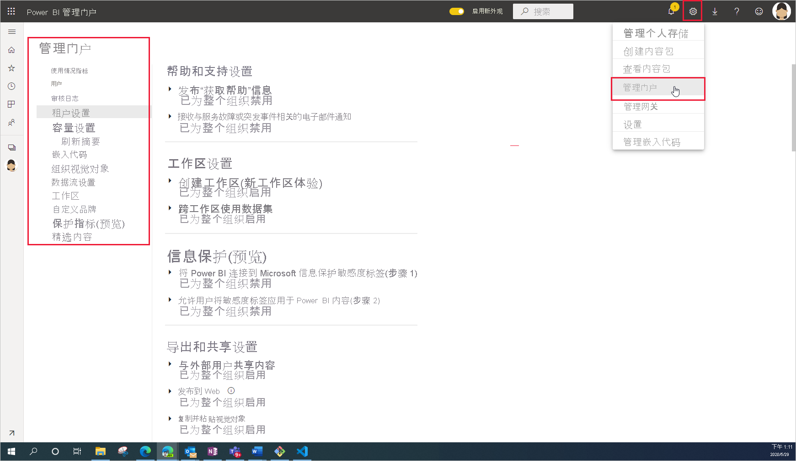

# 什么是 Power BI 管理

Power BI 管理是指管理组织范围内的设置，这些设置控制 Power BI 的工作方式。 分配了管理员角色的用户负责配置、监视和预配组织资源。 本文概述了管理角色、任务和工具，以帮助你入门。

## 与 Power BI 相关的管理员角色

有几个角色协同工作，为你的组织管理 Power BI。 大多数管理员角色都在 Microsoft 365 管理中心内或使用 PowerShell 进行分配。 创建容量时，会分配 Power BI Premium 容量和 Power BI Embedded 容量管理员角色。 要详细了解每个管理员角色，请参阅[关于管理员角色](/microsoft-365/admin/add-users/about-admin-roles?view=o365-worldwide)。 要了解如何分配管理员角色，请参阅[分配管理员角色](/microsoft-365/admin/add-users/assign-admin-roles?view=o365-worldwide)。

| **管理员类型** | **管理范围** | **Power BI 任务** |
| --- | --- | --- |
| 全局管理员 | Microsoft 365 | 对组织的所有管理功能具有无限制的访问权限 |
| | | 向其他用户分配角色 |
| 计费管理员 | Microsoft 365 | 管理订阅 |
| | | 购买许可证 |
| 许可证管理员 | Microsoft 365 | 为用户分配或删除许可证 |
| 用户管理员 | Microsoft 365 | 创建和管理用户和组 |
| | | 重置用户密码 |
| Power BI 管理员 | Power BI 服务 | 对 Power BI 管理任务具有完全访问权限|
| | | 启用和禁用 Power BI 功能 |
| | | 报告使用情况和性能 |
| | | 查看和管理审核 |
| Power BI Premium 容量管理员 | 单个 Premium 容量 | 向容量分配工作区|
| | | 管理用户对容量的权限 |
| | | 管理工作负载以配置内存用量 |
| | | 重启容量 |
| Power BI Embedded 容量管理员 | 单个 Embedded 容量 | 向容量分配工作区|
| | | 管理用户对容量的权限 |
| | | 管理工作负载以配置内存用量 |
| | | 重启容量 |

## 管理任务和工具

Power BI 管理员主要在 Power BI 管理门户中工作。 不过，你应该熟悉相关的工具和管理中心。 请查看上表，确定使用此处列出的工具执行任务所需的角色。

| **工具** | **典型任务** |
| --- | --- |
| [Power BI 管理门户](https://app.powerbi.com/admin-portal) | 获取和使用 Premium 容量 |
| | 确保服务质量 |
| | 管理工作区 |
| | 发布 Power BI 视觉对象 |
| | 验证用于在其他应用程序中嵌入 Power BI 的代码 |
| | 数据访问和其他问题疑难解答 |
| [MIcrosoft 365 管理中心](https://admin.microsoft.com) | 管理用户和组 |
| | 购买和分配许可证 |
| | 阻止用户访问 Power BI |
| [Microsoft 365 安全与合规中心](https://protection.office.com) | 查看和管理审核 |
| | 数据分类和跟踪 |
| | 数据丢失防护策略 |
| | 信息治理 |
| [Azure 门户中的 Azure Active Directory (AAD)](https://aad.portal.azure.com) | 配置对 Power BI 资源的条件访问 |
| | 设置 Power BI Embedded 容量 |
| [PowerShell cmdlets](/powershell/power-bi/overview) | 通过脚本管理工作区和 Power BI 的其他方面 |
| [管理 API 和 SDK](service-admin-reference.md) | 构建自定义管理工具。 例如，Power BI Desktop 可以使用这些 API 基于与管理相关的数据来构建报表。 |

## 后续步骤

现在你已了解 Power BI 管理所涉及的基础知识，请请参阅以下文章了解更多内容：

- [使用 Power BI 管理门户](service-admin-portal.md)
- [租户管理员设置指南](../guidance/admin-tenant-settings.md)
- [使用 PowerShell cmdlet](/powershell/power-bi/overview)
- [Power BI 管理常见问题](service-admin-faq.md)
- [为组织中的用户授权 Power BI 服务](service-admin-licensing-organization.md)
- 是否有任何问题? [尝试咨询 Power BI 社区](https://community.powerbi.com/)
- 建议？ [提出改进 Power BI 的想法](https://ideas.powerbi.com/)