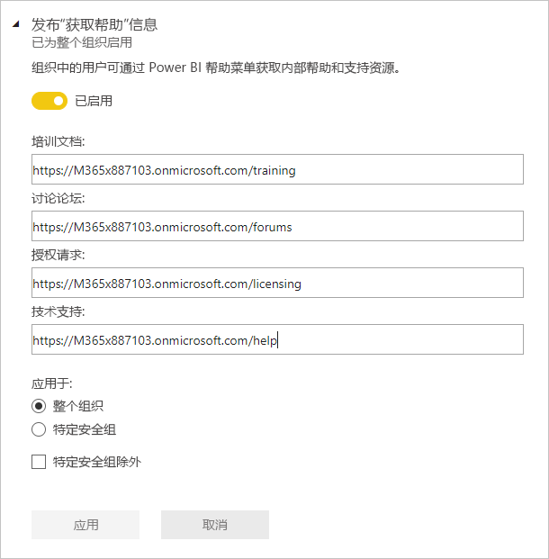
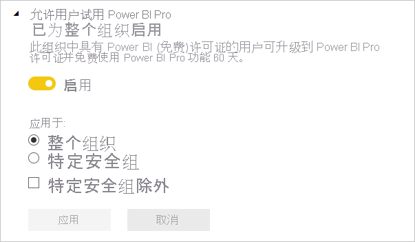
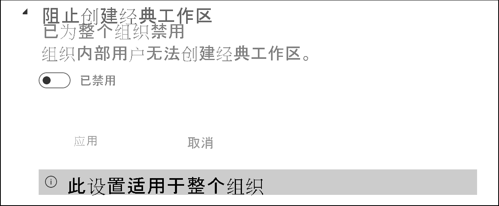
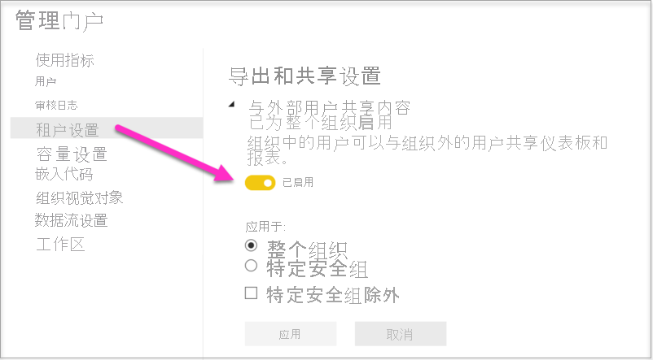
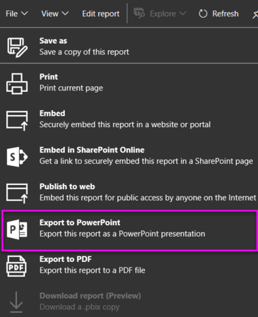
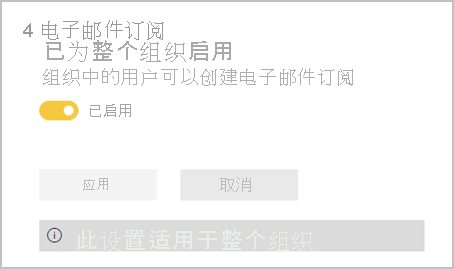
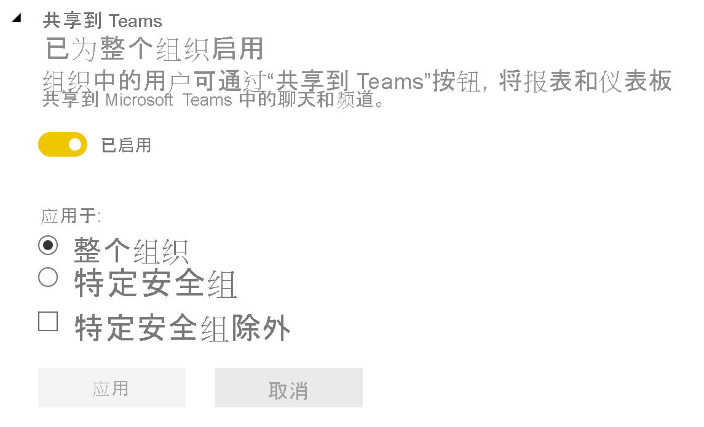
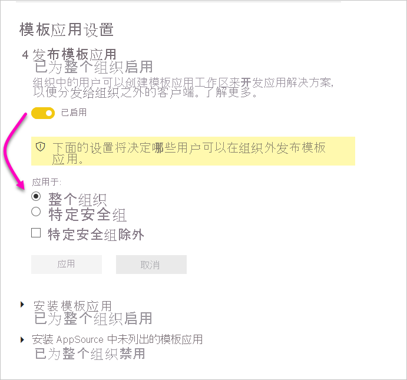
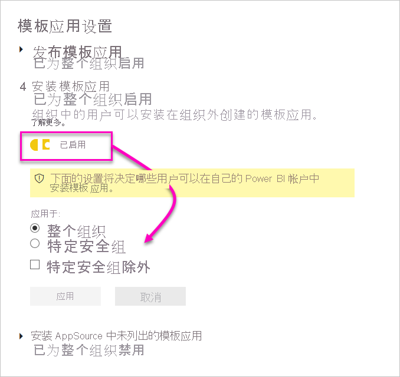

# 在管理门户中管理 Power BI

借助管理门户，用户可以管理组织中的 Power BI 设置。 门户包括诸如使用指标、对 Microsoft 365 管理中心的访问以及租户设置这类项目。

拥有 Power BI 服务管理员角色的全局管理员和用户可以访问完整的管理门户。 如果你不是这些角色之一，则只能在门户中看到“容量设置”。 若要详细了解 Power BI 服务管理员角色，请参阅[了解 Power BI 管理员角色](service-admin-role.md)。

## 如何访问管理门户

必须是全局管理员或 Power BI 服务管理员才能访问 Power BI 管理门户。 若要详细了解 Power BI 服务管理员角色，请参阅[了解 Power BI 管理员角色](service-admin-role.md)。 若要访问 Power BI 管理门户，请执行以下步骤：

1. 使用管理员帐户凭据登录到 [Power BI](https://app.powerbi.com)。

1. 在页眉中，选择“设置” > “管理门户”。

    

管理门户中有多个部分。 本文的其余部分提供了有关每个部分的信息。

* [使用情况指标](#usage-metrics)
* [用户](#users)
* [审核日志](#audit-logs)
* [租户设置](#tenant-settings)
* [容量设置](#capacity-settings)
* [嵌入代码](#embed-codes)
* [组织视觉对象](organizational-visuals.md#organizational-visuals)
* [Azure 连接（预览）](#azure-connections-preview)
* [工作区](#workspaces)
* [自定义品牌](#custom-branding)
* [保护指标](#protection-metrics)
* [特别推荐的内容](#featured-content)

## 使用情况指标

通过“使用指标”，你可以监视组织的 Power BI 使用情况。 它还显示了组织中的哪些用户和组在 Power BI 中最活跃。

> [!NOTE]
> 首次访问仪表板时，或在长时间未查看仪表板后再次进行访问之后，你可能会在我们加载仪表板时看到加载屏幕。

仪表板加载之后，你会看到两个部分的磁贴。 第一个部分包含单个用户的使用情况数据，第二个部分包含组的类似信息。

下面是每个磁贴中显示的内容的细分：

* 用户工作区中的所有仪表板、报表和数据集的非重复计数。
  
    

* 按可以进行访问的用户数划分的使用量最大的仪表板。 例如：你有一个与三个用户共享的仪表板。 你还将仪表板添加到了两个不同用户连接到的内容包。 仪表板的计数为 6 (1 + 3 + 2)。
  
    

* 用户连接到的最受欢迎内容。 此内容是用户可以通过“获取数据”过程访问的任何内容，如 SaaS 内容包、组织内容包、文件或数据库。

  
    

* 基于用户具有的仪表板数（他们自己创建的仪表板以及与他们共享的仪表板）的排名靠前用户视图。
  
    

* 排名靠前的用户视图（以用户拥有的报表数为依据）。
  
    

第二个部分显示相同类型的信息，不过是基于组。 使用此部分，可以查看组织中最活跃的组以及它们所使用的内容种类。

借助此信息，你可以深入了解人们如何在组织中使用 Power BI。

## 控制使用指标

使用指标报表是 Power BI 或全局管理员可以启用或禁用的一项功能。 管理员可以对哪些用户有权访问使用指标进行精细控制。 对于组织中的所有用户，默认情况下处于“打开”状态。

管理员还可以确定内容创建者是否可以查看使用指标中的每个用户数据。 

有关报表本身的详细信息，请参阅[监视 Power BI 仪表板和报表的使用指标](../collaborate-share/service-usage-metrics.md)。

### 内容创建者的使用指标

1. 在管理门户中，选择“租户设置” > “审核和使用情况设置” > “内容创建者的使用指标”。

    

1. 启用（或禁用）使用指标 >“应用”。

    

### 内容创建者的使用指标中的每个用户数据

默认情况下，每个用户的数据都启用了使用指标并在指标报表中包含帐户信息。 如果不希望某些或所有用户包含帐户信息，请为特定安全组或整个组织禁用此功能。 帐户信息随后会在报表中显示为“未命名”。

### 删除所有现有的使用指标内容

当禁用整个组织的使用指标时，管理员还可以选择以下一个或两个选项：

- **删除所有现有的使用指标内容**，可删除通过使用指标报表和数据集构建的所有现有报表和仪表板磁贴。 此选项可以删除组织中可能已在使用的所有用户对使用指标数据的所有访问内容。
- **删除当前使用指标内容中的所有现有每个用户数据** 此选项可以删除组织中可能已在使用的所有用户对使用指标数据的所有访问内容。 

请谨慎操作，因为删除现有的使用指标内容和每个用户指标内容是不可逆转的操作。

## 用户

可以在 Microsoft 365 管理中心中管理 Power BI 用户、组和管理员。 “用户”选项卡提供指向管理中心的链接。

## 审核日志

可以在 Office 365 安全与合规中心中管理 Power BI 审核日志。 “审核日志”选项卡提供指向安全与合规中心的链接。 若要了解详细信息，请参阅[跟踪 Power BI 中的用户活动](service-admin-auditing.md)。

若要使用审核日志，请确保[**创建内部活动审核和合规性的审核日志**](#create-audit-logs-for-internal-activity-auditing-and-compliance)设置已启用。

## 租户设置

“租户设置”可以对组织可用的功能进行细粒度控制。 如果你担心敏感数据、我们的某些功能可能不适合你的组织，或者你只需要为特定组提供特定的功能。

> [!NOTE]
> 控制 Power BI 用户界面中功能可用性的租户设置可帮助建立治理策略，但它们并不是一种安全措施。 例如，“导出数据”设置不会限制 Power BI 用户对数据集的权限。 对数据集具有读取访问权限的 Power BI 用户具有查询此数据集的权限，并且可以在不使用 Power BI 用户界面“导出数据”功能的情况下保留结果。

下图显示了“租户设置”选项卡上的几个设置。

> [!NOTE]
> 可能需要 15 分钟才会使设置更改对组织中的每个人生效。

设置可以有三种状态之一：

* **已为整个组织禁用**：组织中无人可以使用此功能。

    

* **已为整个组织启用**：组织中每个人均可以使用此功能。

    

* **针对组织的子集启用**：可以将设置应用于组织中允许使用此功能的特定安全组，而不是为整个组织启用此功能。

    还可以为除特定安全组之外的整个组织启用某功能。

    

    还可以组合仅为特定用户组启用该功能但同时为某个用户组禁用该功能的设置。 使用此方法确保即使某些用户属于允许的组，但仍没有访问该功能的权限。 应用对用户最具限制性的设置。

    

接下来的几节概述了不同类型的租户设置。

## 帮助和支持设置

### 发布“获取帮助”信息

管理员可以指定内部 URL 以覆盖 Power BI 帮助菜单上的链接的目标并进行授权升级。 如果设置了自定义 URL，则组织中的用户将转到内部帮助和支持资源，而不是默认目标。 可以自定义以下资源目标：

* 学习。 默认情况下，此帮助菜单链接指向[所有 Power BI 学习路径和模块的列表](https://docs.microsoft.com/learn/browse/?products=power-bi)。 若要改为将此链接定向到内部训练资源，请为训练文档设置自定义 URL。

* 社区。 若要将用户转到帮助菜单中的内部论坛（而不是 [Power BI 社区](https://community.powerbi.com/)），请设置讨论论坛的自定义 URL。

* 授权升级。 具有 Power BI（免费）许可证的用户可能有机会在使用服务时将其帐户升级为 Power BI Pro。 如果为授权请求指定内部 URL，则需要将用户重定向到内部请求和购买流并阻止自助购买。 如果要阻止用户购买许可证，但允许用户启动 Power BI Pro 试用版，请参阅[允许用户试用 Power BI Pro](#allow-users-to-try-power-bi-pro)，以区分购买和试用体验。

* 获取帮助。 若要将用户转到帮助菜单中的技术支持（而不是 [Power BI 支持](https://powerbi.microsoft.com/support/)），请设置技术支持的自定义 URL。

### 接收与服务故障或突发事件相关的电子邮件通知

如果此租户受到服务中断或突发事件的影响，已启用邮件的安全组将收到电子邮件通知。 了解有关[服务中断通知](service-interruption-notifications.md)的详细信息。

### 允许用户试用 Power BI Pro

“允许用户试用 Power BI Pro”设置在默认情况下处于启用状态，并提高了对用户如何获取 Power BI Pro 许可证的控制。 在已阻止自助购买的情况下，此设置允许用户启动 Power BI Pro 试用版。 最终用户体验取决于许可证设置的组合方式。 下表显示了从 Power BI（免费）到 Power BI Pro 的升级体验如何受到不同设置组合的影响：

| 自助购买设置 | 允许用户试用 Power BI Pro 设置 | 结束用户体验 |
| ------ | ------ | ----- |
| 已启用 | 已禁用 | 用户可以购买 Pro 许可证，但无法启动试用版 |
| 已启用 | 已启用 | 用户可以启动 Pro 的免费试用版，也可以升级到付费许可证 |
| 已禁用 | 已禁用 | 用户看到一条消息，需要联系 IT 管理员以请求许可证 |
| 已禁用 | 已启用 | 用户可以启动 Pro 试用版，但必须联系 IT 管理员以获取付费许可证 |

> [!NOTE]
> 可以在[帮助和支持设置](#help-and-support-settings)中添加授权请求的内部 URL。 如果设置了 URL，则它会覆盖默认购买体验。 可以在上表中所述的情况下购买许可证的用户将被重定向到内部 URL。

若要了解详细信息，请参阅[启用或禁用自助注册和购买](service-admin-disable-self-service.md)。

## 工作区设置

在“租户设置”中，管理门户有三部分用于控制工作区：

- [创建新的工作区体验](#create-the-new-workspaces)。
- [跨工作区使用数据集](#use-datasets-across-workspaces)。
- [阻止创建经典工作区](#block-classic-workspace-creation)。

### 创建新工作区

工作区是用户可在仪表板、报表和其他内容上开展协作的地方。 管理员使用“创建工作区(新工作区体验)”设置，指明组织中的哪些用户可以创建工作区。 管理员可以允许组织中的每个人都可以创建新工作区体验的工作区，也可以不允许任何人进行创建。 管理员还可以限制特定安全组的成员进行创建。 详细了解[工作区](../collaborate-share/service-new-workspaces.md)。

:::image type="content" source="media/service-admin-portal/power-bi-admin-workspace-settings.png" alt-text="创建新的工作区体验":::

对于基于 Microsoft 365 组的经典工作区，管理工作继续在管理门户和 Azure Active Directory 中进行。

> [!NOTE]
> “创建工作区(新工作区体验)”设置默认为：仅允许能够创建 Microsoft 365 组的用户创建新的 Power BI 工作区。 请务必在 Power BI 管理门户中设置值，以确保相应用户能够创建它们。

工作区列表

管理门户还有另一个设置部分是关于租户中的工作区。 在此部分中，可以对工作区列表进行排序和筛选，并显示每个工作区的详细信息。 有关详细信息，请参阅本文中的[工作区](#workspaces)。

发布内容包和应用

在管理门户中，还可以控制哪些用户有权将应用分发给组织。 有关详细信息，请参阅本文中的[向整个组织发布内容包和应用](#publish-content-packs-and-apps-to-the-entire-organization)。

### 跨工作区使用数据集

管理员可以控制组织中的哪些用户可以跨工作区使用数据集。 如果启用此设置，则用户仍然需要具有特定数据集的必需生成权限。

:::image type="content" source="media/service-admin-portal/power-bi-admin-datasets-workspaces.png" alt-text="跨工作区使用数据集":::

有关详细信息，请参阅[跨工作区使用数据集简介](../connect-data/service-datasets-across-workspaces.md)。

### 阻止创建经典工作区

管理员可以控制组织是否可以创建经典工作区。 启用此设置后，创建工作区的用户只能创建新工作区体验工作区。 

启用后，新创建的 Office 365 组将不会显示在 Power BI 工作区列表中。 现有经典工作区会继续显示在列表中。 禁用设置后，用户所属的所有 Office 365 组都会显示在工作区列表中。 详细了解[新工作区体验工作区](../collaborate-share/service-new-workspaces.md)。

## 导出和共享设置

### 与外部用户共享内容

组织中的用户可以与组织外部的用户共享仪表板、报表和应用。 详细了解[外部共享](../collaborate-share/service-share-dashboards.md#share-a-dashboard-or-report-outside-your-organization)。

下图显示了与外部用户共享时会显示的消息。

  

> [!IMPORTANT]
> 此选项控制 Power BI 中的用户是否可以通过 Power BI 邀请外部用户成为组织的 Azure Active Directory B2B (Azure AD B2B) 来宾用户。 启用后，在共享报表、仪表板和 Power BI 应用时，具有 Azure AD 来宾邀请者角色的用户可以添加外部电子邮件地址。 将邀请外部收件人作为 Azure AD B2B 来宾用户加入组织。 重要的是，如果禁用此设置，Power BI 的人员选取器 UI 继续显示已是组织的 Azure AD B2B 来宾用户的外部用户，并且可以向他们提供项目、工作区和应用的访问权限。

### 发布到 Web

作为 Power BI 租户的管理员，“发布到 Web”设置提供了用户可以为其创建嵌入代码以将报表发布到 Web 的选项。 此功能使报表及其数据可供 Web 上的任何用户使用。 详细了解如何[发布到 Web](../collaborate-share/service-publish-to-web.md)。

> [!NOTE]
> 只有 Power BI 管理员才能允许创建新的“发布到 Web”嵌入代码。 组织可能具有现有嵌入代码。 请参阅管理门户的[嵌入代码](service-admin-portal.md#embed-codes)部分，以查看当前发布的报表。

下图显示了启用“发布到 Web”设置时报表的“更多选项 (...)”菜单。

管理门户中的“发布到 Web”设置提供了用户可以为其创建嵌入代码的选项。

管理员可以将“发布到 Web”设置为“已启用”，并将“选择嵌入代码的工作方式”设置为“仅允许现有嵌入代码”。 在这种情况下，用户可以创建嵌入代码，但必须与 Power BI 管理员联系以允许他们这样做。

根据“发布到 Web”设置的内容，用户会在 UI 中看到不同的选项。

|功能 |为整个组织启用 |为整个组织禁用 |特定安全组   |
|---------|---------|---------|---------|
|报表“更多选项 (...)”菜单下的“发布到 Web”|为所有对象启用|向所有对象隐藏|仅向已授权的用户或组显示。|
|“设置”下的“管理嵌入代码”|为所有对象启用|为所有对象启用|为所有对象启用  仅向已授权的用户或组显示“删除”选项。*  为所有对象启用“获取代码”。* |
|管理门户中的“嵌入代码”|“状态”反映以下状态之一： * 活动 * 不支持 * 已阻止|状态显示“已禁用”|“状态”反映以下状态之一： * 活动 * 不支持 * 已阻止  如果未根据租户设置为某个用户授权，状态将显示为“侵权”。|
|现有的已发布报表|全部已启用|全部已禁用|继续向所有对象呈现报表。|

### 导出数据

组织中的用户可以从磁贴或可视化效果导出数据。 这会控制 Excel 中的“分析”、“导出到 .csv”、数据集下载 (.pbix) 和 Power BI 服务 Live Connect 功能。 详细了解如何[从磁贴或视觉对象导出数据](../visuals/power-bi-visualization-export-data.md)。

>[!NOTE]
> 在引入“导出至 Excel”设置之前，此设置还控制了将数据导出到 Excel 文件的操作。 有关详细信息，请参阅 [“导出至 Excel”下的注释](#export-to-excel)。

下图显示了从磁贴导出数据的选项。

> [!NOTE]
> 禁用“导出数据”还会阻止用户使用[“在 Excel 中分析”](../collaborate-share/service-analyze-in-excel.md)功能，同时也会阻止用户使用 Power BI 服务实时连接。

### 导出到 Excel

组织中的用户可将数据从可视化效果导出到 Excel 文件。

>[!IMPORTANT]
> 在引入“导出至 Excel”设置之前，导出到 Excel 文件的操作由“导出数据”设置进行控制。 因此，对于引入“导出至 Excel”设置之前就已存在的租户，在租户管理员首次查看“导出至 Excel”设置时，他们会看到该设置具有未应用的更改。 他们必须应用这些更改才能使新设置生效。 否则，导出到 Excel 文件的操作将继续由“导出数据”设置进行控制。

### 将报表导出为 PowerPoint 演示文稿或 PDF 文档

组织中的用户可以将 Power BI 报表导出为 PowerPoint 文件或 PDF 文档。 [了解详细信息](../consumer/end-user-powerpoint.md)

下图显示了在启用“将报表导出为 PowerPoint 演示文稿或 PDF 文档”设置时报表的“文件”菜单 。

### 打印仪表板和报表

组织中的用户可以打印仪表板和报表。 [了解详细信息](../consumer/end-user-print.md)

下图展示了“打印仪表板”选项。

下图展示了在“打印仪表板和报表”设置已启用时报表的“文件”菜单。

### 允许外部来宾用户编辑和管理组织中的内容

Azure AD B2B 来宾用户可以编辑和管理组织中的内容。 [了解详细信息](service-admin-azure-ad-b2b.md)

下图显示用于允许外部来宾用户编辑和管理组织中内容的选项。

在管理门户中，还可以控制哪些用户有权邀请外部用户加入组织。 有关详细信息，请参阅本文的[与外部用户共享内容](#export-and-sharing-settings)部分。

### 电子邮件订阅
组织中的用户可以创建电子邮件订阅。 详细了解[订阅](../collaborate-share/service-publish-to-web.md)。

### 特别推荐的内容

允许组织中的部分或全部报表作者在 Power BI 主页的“特别推荐”部分中特别推荐其内容。 新用户可在 Power BI 主页的顶部看到特别推荐的内容。 当用户添加“收藏夹”、“最常访问”和“最新动态”时，特别推荐的内容会使“主页”向下移动  。 

我们建议先从少量的推广开始。 允许整个组织在“主页”上特别推荐内容可能会使你难以跟踪所有推广的内容。 

启用特别推荐的内容后，还可以在管理门户中对其进行管理。 请参阅本文中的[管理特别推荐的内容](#manage-featured-content)，了解如何在域中控制特别推荐的内容。

## 内容包和应用设置

### 向整个组织发布内容包和应用

管理员使用此设置，以确定哪些用户可以向整个组织发布内容包和应用，而不是特定组。 详细了解[如何发布应用](../collaborate-share/service-create-distribute-apps.md)。

下图展示了创建内容包时可用的“我的整个组织”选项。

### 创建模板应用和组织内容包

组织中的用户可以创建模板应用和组织内容包，它们使用基于 Power BI Desktop 中一个数据源生成的数据集。 详细了解[模板应用](../connect-data/service-template-apps-create.md)。

### 将应用推送给最终用户

报表创建者可以直接与最终用户共享应用，而无需从 [AppSource](https://appsource.microsoft.com) 安装。 详细了解[如何自动为最终用户安装应用](../collaborate-share/service-create-distribute-apps.md#automatically-install-apps-for-end-users)。

## 集成设置

### 结合使用“在 Excel 中分析”功能和本地数据集

组织中的用户可以使用 Excel 查看本地 Power BI 数据集，并与其进行交互。 [了解详细信息](../collaborate-share/service-analyze-in-excel.md)

> [!NOTE]
> 禁用“导出数据”还会阻止用户使用“在 Excel 中分析”功能。

### 使用 ArcGIS Maps for Power BI

组织中的用户可以使用 Esri 提供的 ArcGIS Maps for Power BI 可视化效果。 [了解详细信息](../visuals/power-bi-visualization-arcgis.md)

### 使用 Power BI（预览版）的全局搜索

组织中的用户可以使用依赖于 Azure 搜索的的外部搜索功能。

## 精选表设置

在“租户设置”下，“允许连接到精选表”租户设置允许 Power BI 管理员控制组织中的哪些用户可以使用 Excel 数据类型库中的精选表。 

:::image type="content" source="media/service-admin-portal/admin-allow-connections-featured-tables.png" alt-text="与精选表的所有连接":::

如果将“导出数据”租户设置设置为“禁用”，则还会禁用与精选表的连接。

详细了解 [Excel 中的 Power BI 精选表](../collaborate-share/service-excel-featured-tables.md)。

## 共享到 Teams 租户设置

“共享到 Teams”设置位于 Power BI 管理门户的“租户设置”部分 。 该设置允许组织隐藏 Power BI 服务中的“共享到 Teams”按钮。 如果设置为“已禁用”，则用户在查看 Power BI 服务中的报表和仪表板时将看不到操作栏或上下文菜单中的“共享到 Teams”按钮。

详细了解[将 Power BI 内容共享到 Teams](../collaborate-share/service-share-report-teams.md)。

## R 视觉对象设置

### 与 R 视觉对象进行交互并共享

组织中的用户可以与使用 R 脚本创建的视觉对象进行交互并共享。 [了解详细信息](../visuals/service-r-visuals.md)

> [!NOTE]
> 此设置应用于整个组织，并且不能限制为特定组。

## 审核和使用情况设置

### 为内部活动审核和符合性创建审核日志

组织中的用户可以使用审核来监视组织中的其他用户在 Power BI 中执行的操作。 [了解详细信息](service-admin-auditing.md)

必须启用此设置，才能记录审核日志条目。 启用审核后，最多可能会延迟 48 小时才能查看审核数据。 如果无法立即查看数据，请稍后检查审核日志。 获取查看审核日志的权限和得以访问日志之间也存在类似的延迟。

> [!NOTE]
> 此设置应用于整个组织，并且不能限制为特定组。

### 内容创建者的使用指标

组织中的用户可以查看自己创建的仪表板和报表的使用情况指标。 [了解详细信息](../collaborate-share/service-usage-metrics.md)

### 内容创建者的使用指标中的每个用户数据

内容创建者的使用指标将公开正在访问内容的用户的显示名称和电子邮件地址。 [了解详细信息](../collaborate-share/service-usage-metrics.md)

默认情况下，每个用户的数据都启用了使用指标并在指标报表中包含内容创建者帐户信息。 如果不希望对所有用户收集此信息，请为指定安全组或整个组织禁用此功能。 已排除用户的帐户信息随后会在报表中显示为“未命名”。

## 仪表板设置

### 仪表板的数据分类

组织中的用户可以为仪表板标记指明仪表板安全级别的分类。 [了解详细信息](../create-reports/service-data-classification.md)

> [!NOTE]
> 此设置应用于整个组织，并且不能限制为特定组。

## 开发人员设置

### 在应用中嵌入内容

组织中的用户可以在软件即服务 (SaaS) 应用程序中嵌入 Power BI 仪表板和报表。 禁用此设置会阻止用户使用 REST API 将 Power BI 内容嵌入到其应用程序中。 [了解详细信息](../developer/embedded/embedding.md)

### 允许服务主体使用 Power BI API

在 Azure Active Directory (Azure AD) 中注册的 Web 应用将使用已分配的服务主体来访问 Power BI API，而无需用户登录。 若要允许应用使用服务主体身份验证，其服务主体必须包含在允许的安全组中。 [了解详细信息](../developer/embedded/embed-service-principal.md)

> [!NOTE]
> 服务主体继承其安全组中的所有 Power BI 租户设置的权限。 若要限制权限，请为服务主体创建专用的安全组并将其添加到相关已启用 Power BI 设置的“除特定安全组以外”列表。

## 数据流设置

### 创建和使用数据流

组织中的用户可以创建和使用数据流。 若要概览数据流，请参阅 [Power BI 中的自助式数据准备](../transform-model/service-dataflows-overview.md)。 若要启用高级容量中的数据流，请参阅[配置工作负载](service-admin-premium-workloads.md)。

> [!NOTE]
> 此设置应用于整个组织，并且不能限制为特定组。

## 模板应用设置

三种模板应用设置控制能否发布或安装模板应用。

### 发布模板应用

组织中的用户可以创建模板应用工作区。 控制哪些用户可以通过 [AppSource](https://appsource.microsoft.com) 或其他分发方法，将模板应用发布或分发给组织外部客户端。

### 安装 AppSource 上列出的模板应用

组织中的用户只能从 [AppSource](https://appsource.microsoft.com) 下载并安装模板应用。 控制哪些特定用户或安全组可以安装 AppSource 中的模板应用。

### 安装 AppSource 上未列出的模板应用

控制组织中哪些用户可以下载并安装 [AppSource](https://appsource.microsoft.com) 上未列出的模板应用。

## 容量设置

### Power BI Premium

使用“Power BI Premium”选项卡，可以管理已为组织购买的任何 Power BI Premium 容量（EM 或 P SKU）。 组织中的所有用户都可以看到“Power BI Premium”选项卡；但如果用户被分配为容量管理员或拥有分配权限，则只能看到其中的内容。 如果用户没有任何权限，则显示以下消息。

### Power BI Embedded

使用“Power BI Embedded”选项卡，可以查看已为客户购买的 Power BI Embedded (A SKU) 容量。 由于只能从 Azure 购买 A SKU，因此是在 Azure 门户中[管理 Azure 中的嵌入容量](../developer/embedded/azure-pbie-create-capacity.md)。

有关如何管理 Power BI Embedded (A SKU) 设置的详细信息，请参阅[什么是 Power BI Embedded](../developer/embedded/azure-pbie-what-is-power-bi-embedded.md)。

## 嵌入代码

管理员可以查看针对其租户生成的用于公开共享报表的嵌入代码。 此外，还可以撤消或删除代码。 [了解详细信息](../collaborate-share/service-publish-to-web.md)

## 组织视觉对象

[管理 Power BI 视觉对象管理员设置](organizational-visuals.md)中介绍了所有 Power BI 视觉对象管理员设置，包括 Power BI 视觉对象租户设置。

## Azure 连接（预览）

### 租户级存储（预览）

默认情况下，Power BI 中使用的数据存储在由 Power BI 提供的内部存储中。 通过数据流与 Azure Data Lake Storage Gen2 (ADLS Gen2) 的集成，可将数据流存储在组织的 Azure Data Lake Storage Gen2 帐户中。 有关详细信息，请参阅[数据流和 Azure Data Lake 集成（预览）](../transform-model/service-dataflows-azure-data-lake-integration.md)。

### 工作区级存储权限（预览）

默认情况下，工作区管理员无法连接自己的存储帐户。 借助此预览功能，可以启用允许工作区管理员连接其自己的存储帐户的设置。

## 工作区

作为管理员，可以在“工作区”选项卡上查看租户中存在的工作区。在此选项卡上，可以执行以下操作：

- 刷新工作区列表及其详细信息。
- 将有关工作区的数据导出到 .csv 文件。 
- 查看有关工作区的详细信息，包括 ID、用户和角色、仪表板、报表和数据集。
- 编辑具有访问权限的人员的列表。 这意味着你可以删除工作区。 你可以管理员身份将自己添加到工作区，然后打开工作区并将其删除。
- 编辑“名称”和“说明”字段。

管理员还可以控制用户创建新工作区体验工作区和经典工作区的能力。 有关详细信息，请参阅本文中的[工作区设置](#workspace-settings)。 

“工作区”选项卡上的表列对应于由 [Power BI 管理员 Rest API](/rest/api/power-bi/admin) 为工作区返回的属性。 个人工作区的类型是“PersonalGroup”，经典工作区的类型是“Group”，提供新工作区体验的工作区的类型是“Workspace”。 有关详细信息，请参阅[在新工作区中组织工作](../collaborate-share/service-new-workspaces.md)。

在“工作区”选项卡上，可看到每个工作区的*状态*。 下表提供有关这些状态的含义的更多详细信息。

|州省/自治区/直辖市  |说明  |
|---------|---------|
| **活动** | 普通工作区。 它不指示任何有关使用情况或所含内容的信息，仅指示工作区本身“正常”。 |
| **孤立** | 无管理员用户的工作区。 |
| **已删除** | 已删除的工作区。 如果需要，我们保留了足够的元数据用于还原工作区，最多可保留 90 天。 |
| **正在删除** | 正在删除但尚未消失的工作区。 用户可以删除自己的工作区，将工作区放入“正在删除”并最终放入“已删除”。 |

管理员还可以使用管理门户或 PowerShell cmdlet 来管理和恢复工作区。 

## 自定义品牌

作为管理员，可以为整个组织自定义 Power BI 的外观。 目前有三个主要选项：

* **上传徽标**：为获得最佳结果，请上传另存为 .png 的徽标，大小不超过 10 KB，且至少为 200 x 30 像素。

* **上传封面图像**：为获得最佳结果，请上传另存为 .jpg 或 .png 的封面图像，大小不超过 1 MB，且至少为 1920 x 160 像素。

* **选择主题颜色**：可以根据十六进制数 #、RGB、值或提供的调色板来选择主题。

有关详细信息，请参阅[为组织自定义品牌](https://aka.ms/orgBranding)。

## 保护指标

为 Power BI 启用信息保护后，数据保护指标将显示在管理门户中。 报表显示敏感度标签如何帮助保护你的内容。

## 管理特别推荐的内容

租户管理员可以在组织的 Power BI 主页上管理已推广到“特别推荐”部分的所有报表、仪表板和应用。

- 在管理门户中，选择“特别推荐的内容”。

可在其中大致了解特别推荐内容的人员、推荐时间及其所有相关元数据。 如果出现可疑问题，或者要清理“特别推荐”部分，可以按需删除已推广的内容。

有关启用特别推荐的内容的信息，请参阅本文中的[特别推荐的内容](#featured-content)。

## 后续步骤

[在组织中管理 Power BI](service-admin-administering-power-bi-in-your-organization.md)  
[了解 Power BI 管理员角色](service-admin-role.md)  
[在组织中审核 Power BI](service-admin-auditing.md)  

更多问题？ [尝试咨询 Power BI 社区](https://community.powerbi.com/)
