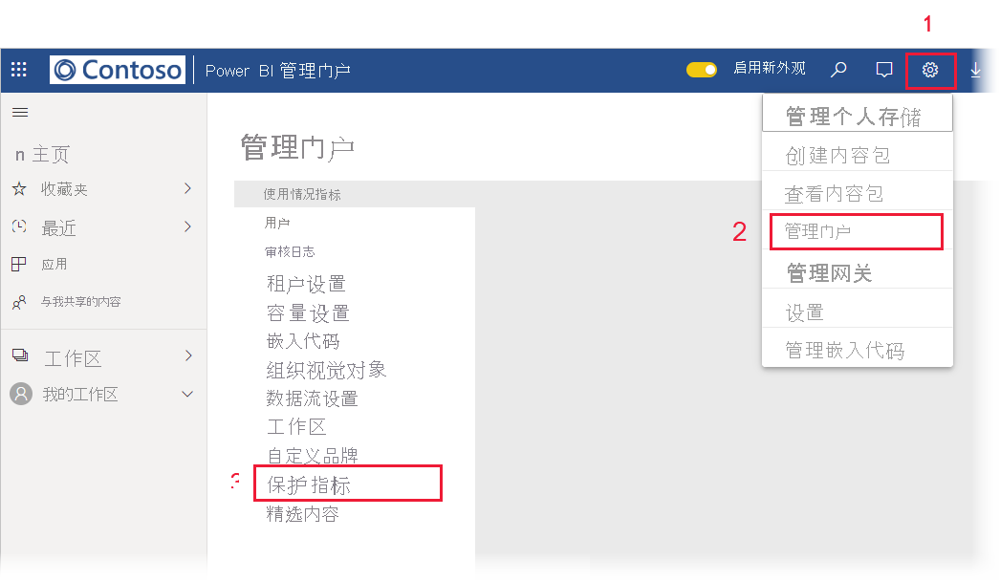

# 数据保护指标报表

## 什么是数据保护指标报表？
数据保护指标报表是一种专用报表，[Power BI 管理员](../service-admin-role.md)可以用于监视和跟踪其租户中的敏感度标签使用情况和采用情况。

 
该报表具有：
* 一个百分比堆积柱形图，显示最近 7 天、30 天或 90 天内租户中的每日敏感度标签使用情况。 使用此图表可轻松跟踪不同标签类型在一段时间内的相对使用情况。
* 圆环图，针对仪表板、报表、数据集和数据流显示租户中的敏感度标签使用情况的当前状态。
* 指向 Cloud App Security 门户的链接，该门户提供了 Power BI 警报、有风险的用户、活动日志和其他信息。 有关详细信息，请参阅[在 Power BI 中使用 Microsoft Cloud App Security 控件](./service-security-using-microsoft-cloud-app-security-controls.md)。

该报表每 24 小时刷新一次。

## 查看数据保护指标报表

必须拥有 [Power BI 管理员角色](../service-admin-role.md)才能打开和查看该报表。
要查看该报表，请转到“设置”>“管理门户”，然后选择“保护指标” 。

 
 
首次打开数据保护指标报表时，可能需要几秒钟进行加载。 标题为“数据保护指标(自动生成)”的报表和数据集会在专用环境中“我的工作区”下创建。 不建议在此处进行查看（这不是功能完备的报表）。 而是在管理门户中查看该报表，如上所述。

> [!CAUTION]
> 请不要以任何方式更改报表或数据集，因为新版报表会不时推出，如果你更新到新版本，对原始报表所做的任何更改都会被覆盖。

## 报表更新

数据保护指标报表的改进版本会定期发布。 打开该报表时，如果有新版本可用，则系统会询问你是否要打开新版本。 如果你选择“是”，新版报表会加载并覆盖旧版本。 对旧报表和/或数据集进行的任何更改都会丢失。 可以选择不打开新版本，但在这种情况下，将无法受益于新版本的改进。 
## 说明和注意事项
* 若要成功生成数据保护指标报表，必须对租户启用[信息保护](./service-security-enable-data-sensitivity-labels.md) 并且[应该应用了敏感度标签](./service-security-apply-data-sensitivity-labels.md)。 
* 若要访问 Cloud App Security 信息，组织必须具有相应的 [Cloud App Security 许可证](https://docs.microsoft.com/power-bi/admin/service-security-using-microsoft-cloud-app-security-controls#microsoft-cloud-app-security-licensing)。
* 如果决定与不是 Power BI 管理员的用户共享数据保护指标报表中的信息，请注意，此报表包含有关组织的敏感信息。
* 数据保护指标报表是一种特殊类型的报表，不会显示在“与我共享”、“最近动态”和“收藏夹”列表中。
* [外部用户（Azure Active Directory B2B 来宾用户）](../service-admin-azure-ad-b2b.md)无法使用数据保护指标报表。
## 后续步骤
* [Power BI 中的敏感度标签](./service-security-sensitivity-label-overview.md)
* [在 Power BI 中使用 Microsoft Cloud App Security 控件](service-security-using-microsoft-cloud-app-security-controls.md)
* [了解 Power BI 服务管理员角色](service-admin-role.md)
* [在 Power BI 中启用敏感度标签](service-security-enable-data-sensitivity-labels.md)