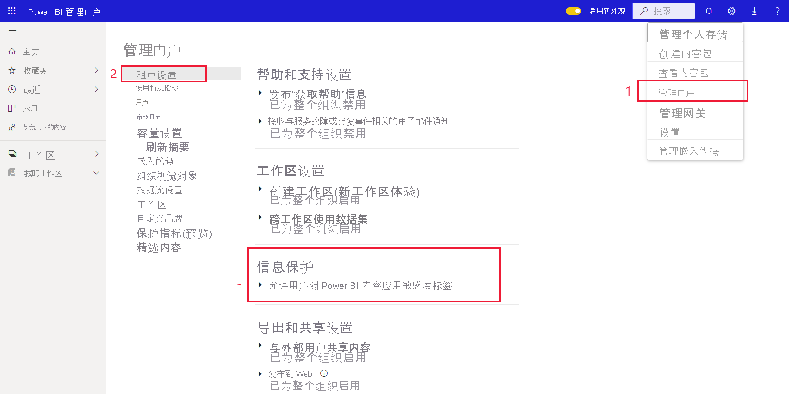
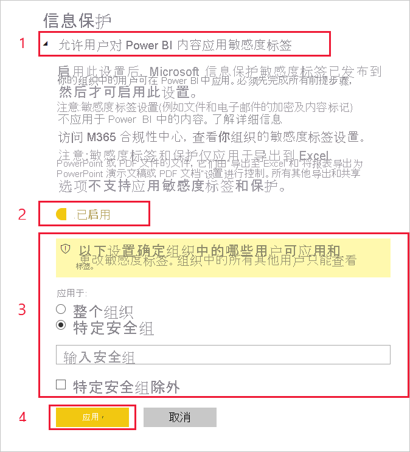

# 在 Power BI 中启用敏感度标签

为了在 Power BI 中使用 [Microsoft 信息保护敏感度标签](https://docs.microsoft.com/microsoft-365/compliance/sensitivity-labels)，必须在租户中启用这些标签。 本文将向 Power BI 租户管理员展示如何执行此操作。 有关 Power BI 中敏感度标签的概述，请参阅 [Power BI 中的敏感度标签](service-security-sensitivity-label-overview.md)。 有关在 Power BI 中应用敏感度标签的信息，请参阅[应用敏感度标签](./service-security-apply-data-sensitivity-labels.md) 

启用敏感度标签时：

* 组织中的指定用户和安全组可以对其 Power BI 报表、仪表板、数据集和数据流进行分类并[应用敏感度标签](./service-security-apply-data-sensitivity-labels.md)。
* 组织中的所有成员都可以查看这些标签。

启用敏感度标签需要 Azure 信息保护许可证。 有关详细信息，请参阅[授权](service-security-sensitivity-label-overview.md#licensing)。

## 启用敏感度标签

转到 Power BI 管理门户，打开“租户设置”窗格，并找到“信息保护”部分  。

在“信息保护”部分，执行以下步骤：
1. 打开“允许用户对 Power BI 内容应用敏感度标签”。
1. 启用切换。
1. 定义哪些用户可以在 Power BI 资产中应用和更改敏感度标签。 默认情况下，组织中的每个人都能够应用敏感度标签。 但是，可以选择仅为特定用户或安全组启用敏感度标签。 选择整个组织或特定安全组后，可以排除特定的用户或安全组子集。
   
   * 为整个组织启用敏感度标签时，例外情况通常是安全组。
   * 只为特定用户或安全组启用敏感度标签时，例外通常是特定的用户。  
    该方法可以防止某些用户在 Power BI 中应用敏感度标签，即使他们不属于有权执行此操作的组。

1. 点击“应用”。

> [!IMPORTANT]
> 只有拥有“创建”和“编辑”资产权限，以及在本部分中设置的相关安全组成员的 Power BI Pro 用户，才能设置和编辑敏感度标签 。 不属于本组的用户无法设置或编辑标签。  

## 故障排除

Power BI 使用 Microsoft 信息保护敏感度标签。 因此，如果在尝试启用敏感度标签时遇到错误信息，则可能是由下列原因之一造成的：

* 没有 Azure 信息保护[许可证](service-security-sensitivity-label-overview.md#licensing)。
* 敏感度标签尚未迁移到 Power BI 支持的 Microsoft 信息保护版本。 了解关于[迁移敏感度标签](https://docs.microsoft.com/azure/information-protection/configure-policy-migrate-labels)的详细信息。
* 组织中未定义 Microsoft 信息保护敏感度标签。 请注意，标签必须是已发布策略的一部分才能使用。 [了解敏感度标签的详细信息](https://docs.microsoft.com/Office365/SecurityCompliance/sensitivity-labels)，或访问 [Microsoft 安全与合规中心](https://sip.protection.office.com/sensitivity?flight=EnableMIPLabels)，了解如何为组织定义标签和发布策略。

## 注意事项和限制

有关 Power BI 中的敏感度标签限制的列表，请参阅 [Power BI 中的敏感度标签](service-security-sensitivity-label-overview.md#limitations)。

## 后续步骤

本文介绍如何在 Power BI 中启用敏感度标签。 以下文章提供了有关 Power BI 中的数据保护的进一步详细信息。 

* [Power BI 中的敏感度标签概述](service-security-sensitivity-label-overview.md)
* [如何在 Power BI 中应用敏感度标签](../collaborate-share/service-security-apply-data-sensitivity-labels.md)
* [在 Power BI 中使用 Microsoft Cloud App Security 控件](service-security-using-microsoft-cloud-app-security-controls.md)
* [保护指标报表](service-security-data-protection-metrics-report.md)