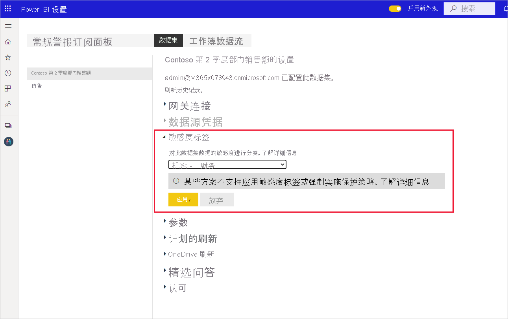

# 在 Power BI 中应用数据敏感度标签

报表、仪表板、数据集和数据流的 Microsoft 信息保护敏感度标签可以保护敏感内容免遭未经授权的数据访问和泄露。 使用数据敏感度标签正确标记数据，可确保只有经过授权的用户才能访问数据。 本文介绍如何向你的内容应用敏感度标签。

要能够在 Power BI 中应用敏感度标签，你需要满足以下条件：
* 必须具有 Power BI Pro 许可证，并对要应用标签的内容拥有编辑权限。
* 必须在具有应用数据敏感度标签权限的安全组内，如标题为[在 Power BI 中启用数据敏感度标签](../admin/service-security-enable-data-sensitivity-labels.md#enable-data-sensitivity-labels)的文章中所述。
* 必须满足所有[先决条件](../admin/service-security-data-protection-overview.md#requirements-for-using-sensitivity-labels-in-power-bi)和[许可要求](../admin/service-security-data-protection-overview.md#licensing)。

有关 Power BI 中数据敏感度标签的详细信息，请参阅 [Power BI 中的数据保护概述](../admin/service-security-data-protection-overview.md)。

## 应用敏感度标签

在租户上启用数据保护后，将在仪表板、报表、数据集和数据流列表视图中的敏感度列显示敏感度标签。

**在报表或仪表板上应用或更改敏感度标签**
1. 单击“其他选项(…)”。
1. 选择“设置”。
1. 在“设置”侧窗格中，选择相应的敏感度标签。
1. 保存设置。

下图演示了在报表上执行这些操作的步骤

**在数据集或数据流上应用或更改敏感度标签**

1. 单击“其他选项(…)”。
1. 选择“设置”。
1. 在“设置”侧窗格中，选择相应的敏感度标签。
1. 应用设置。

以下两张图片演示了在数据集上执行这些操作的步骤。

依次选择“其他选项(…)”和“设置” 。

在“设置”页面上，打开“敏感度标签”部分，选择所需的敏感度标签，然后单击“应用”。

## 删除敏感度标签
若要从报表、仪表板、数据集或数据流中删除敏感度标签，请按照[用于应用标签的相同过程](#applying-sensitivity-labels)操作，但在系统提示对数据的敏感度进行分类时，请选择“(无)”。 

## 导出文件中的数据保护

与敏感度标签相关的数据保护仅在将数据导出到 Excel、PowerPoint 和 PDF 文件时才会应用于数据。 不支持 Excel 中的分析、导出到 .csv、数据集下载 (.pbix)、Power BI 服务 Live Connect 或任何其他导出格式。 数据导出选项由 Power BI 租户管理员[导出设置](../service-admin-portal.md#export-and-sharing-settings)控制。

[从具有敏感度标签的报表中向 Excel、PowerPoint 或 PDF 文件导出数据](https://docs.microsoft.com/power-bi/consumer/end-user-export)时，所生成的文件会继承敏感度标签。 敏感度标签将在文件中可见，仅限具有足够权限的用户访问此文件。

## 注意事项和限制

以下列表提供了 Power BI 中敏感度标签的一些限制：

常规
* 敏感度标签只能应用于仪表板、报表、数据集和数据流。 它们当前不可用于[分页报表](../paginated-reports/report-builder-power-bi.md)和工作簿。
* Power BI 资产上的敏感度标签在工作区列表、世系、收藏夹、最近使用和应用视图中可见。这些标签目前在“与我共享”视图中不可见。 但请注意，应用于 Power BI 资产的标签（即使不可见）将始终保留在导出到 Excel、PowerPoint 和 PDF 文件中的数据上。
* 仅全球（公有）云中的租户支持敏感度标签。 其他云中的租户不支持敏感度标签。
* 模板应用不支持数据敏感度标签。 模板应用创建者设置的敏感度标签在提取和安装应用时被删除，应用使用者添加到已安装模板应用项目的敏感度标签在更新应用时丢失（重置为无）。
* Power BI 不支持[请勿转发](https://docs.microsoft.com/microsoft-365/compliance/encryption-sensitivity-labels?view=o365-worldwide#let-users-assign-permissions)、[用户定义](https://docs.microsoft.com/microsoft-365/compliance/encryption-sensitivity-labels?view=o365-worldwide#let-users-assign-permissions)和 [HYOK](https://docs.microsoft.com/azure/information-protection/configure-adrms-restrictions) 这三种保护类型的敏感度标签。 “请勿转发”和“用户定义”保护类型引用 [Microsoft 365 安全中心](https://security.microsoft.com/)或 [Microsoft 365 合规中心](https://compliance.microsoft.com/)内定义的标签。

**导出**
* 仅在将数据导出到 Excel、PowerPoint 和 PDF 文件时，才会强制执行标签和保护控件。 在将数据导出到 .csv 或 .pbix 文件、Excel 中的分析或任何其他导出路径时，不会强制执行标签和保护。
* 对导出的文件应用敏感度标签和保护不会向文件添加内容标记。 但是，如果标签配置为应用内容标记，则在 Office 桌面应用中打开文件时，Azure 信息保护统一标签客户端会自动应用这些标记。 在为桌面、移动或 Web 应用使用内置标签时，不会自动应用内容标记。 有关更多详细信息，请参阅 [Office 应用何时应用内容标记和加密](https://docs.microsoft.com/microsoft-365/compliance/sensitivity-labels-office-apps?view=o365-worldwide#when-office-apps-apply-content-marking-and-encryption)。
* 从 Power BI 导出文件的用户有权根据敏感度标签设置访问和编辑该文件。 导出数据的用户不会获得该文件的所有者权限。
* 如果在将数据导出到文件时无法应用标签，导出将失败。 要检查导出失败的原因是否为无法应用标签，请在标题栏的中心单击报表或仪表板名称，然后在打开的信息下拉菜单中查看是否显示“无法加载敏感度标签”。 如果安全管理员取消发布或删除了应用的标签，或出现了临时系统问题，则可能会发生这种情况。

## 后续步骤

本文介绍如何在 Power BI 中应用数据敏感度标签。 以下文章提供了有关 Power BI 中数据保护的详细信息。 

* [Power BI 中数据保护的概述](../admin/service-security-data-protection-overview.md)
* [在 Power BI 中启用数据敏感度标签](../admin/service-security-enable-data-sensitivity-labels.md)
* [在 Power BI 中使用 Microsoft Cloud App Security 控件](../admin/service-security-using-microsoft-cloud-app-security-controls.md)