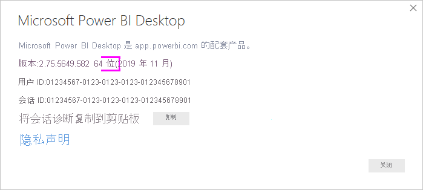
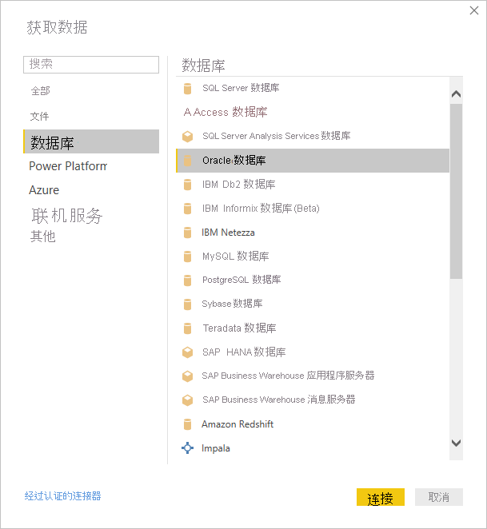
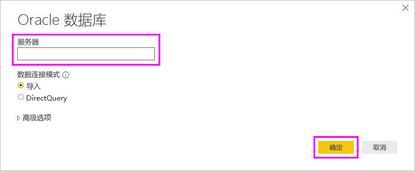

# 连接到 Oracle 数据库
要使用 Power BI Desktop 连接到 Oracle 数据库，必须在运行 Power BI Desktop 的计算机上安装正确的 Oracle 客户端软件。 使用的 Oracle 客户端软件取决于已安装的 Power BI Desktop 版本：32 位或 64 位。

支持的 Oracle 版本： 
- Oracle 9 及更高版本
- Oracle 客户端软件 8.1.7 及更高版本

> [!NOTE]
> 如果要为 Power BI Desktop、本地数据网关或 Power BI 报表服务器配置 Oracle 数据库，请参阅 [Oracle 连接类型](https://docs.microsoft.com/sql/reporting-services/report-data/oracle-connection-type-ssrs?view=sql-server-ver15)一文中的信息。 

## 确定安装了哪个版本的 Power BI Desktop
要确定所安装的 Power BI Desktop 版本，请选择“文件” > “帮助” > “关于”，然后查看“版本”行   。 下图中安装的是 64 位版本的 Power BI Desktop：

## 安装 Oracle 客户端
- 对于 32 位版本的 Power BI Desktop，请[下载并安装 32 位 Oracle 客户端](https://www.oracle.com/technetwork/topics/dotnet/utilsoft-086879.html)。

- 对于 64 位版本的 Power BI Desktop，请[下载并安装 64 位 Oracle 客户端](https://www.oracle.com/database/technologies/odac-downloads.html)。

> [!NOTE]
> 在 Oracle 客户端的安装过程中，请在安装向导中选择相应的复选框，确保启用“在计算机范围级别配置 ODP.NET 和/或 Oracle Providers for ASP.NET”。 某些版本的 Oracle 客户端向导默认选中此复选框，其他版本则不选中。 请确保选中此复选框，以便 Power BI 可以连接到 Oracle 数据库。

## 连接到 Oracle 数据库
安装了匹配的 Oracle 客户端驱动程序后，就可以连接到 Oracle 数据库。 请执行以下步骤来建立连接：

1. 从“开始”选项卡中，选择“获取数据” 。 

2. 从显示的“获取数据”窗口中，选择“更多”（如有必要），再选择“数据库” > “Oracle 数据库”，然后选择“连接”    。
   
   
2. 在出现的“Oracle 数据库”对话框中，提供服务器的名称，并选择“确定”  。 如果需要 SID，请使用以下格式进行指定：ServerName/SID，其中 SID 是数据库的唯一名称 。 如果 ServerName/SID 格式无效，则使用 ServerName/ServiceName，其中 ServiceName 是用于连接的别名  。

   

   > [!TIP]
   > 如果在此步骤中连接时遇到困难，请尝试在“服务器”字段中使用以下格式：(DESCRIPTION=(ADDRESS=(PROTOCOL=TCP)(HOST=host_name)(PORT=port_num))(CONNECT_DATA=(SERVICE_NAME=service_name)))
   
3. 要通过使用本机数据库查询导入数据，请将查询放在“SQL 语句”框中，可通过展开“Oracle 数据库”对话框的“高级选项”部分找到该框  。
   
   
4. 在“Oracle 数据库”对话框中输入 Oracle 数据库信息（包括任何可选信息，如 SID 或本机数据库查询）后，请选择“确定”以进行连接 。
5. 如果 Oracle 数据库需要数据库用户凭据，请在出现提示时，输入这些凭据。

## 故障排除

如果已从 Microsoft Store 下载 Power BI Desktop，则 Oracle 驱动程序问题可能导致你无法连接到 Oracle 数据库。 如果遇到此问题，则返回的错误消息为：未设置对象引用。 要解决此问题，请执行以下步骤之一：

* 从[下载中心](https://www.microsoft.com/download/details.aspx?id=58494)而不是 Microsoft Store 下载 Power BI Desktop。

* 要使用 Microsoft Store 中的版本，请在本地计算机上将 12.X.X\client_X 中的 oraons.dll 复制到 12.X.X\client_X\bin，其中 X 表示版本和目录号  。

如果在连接到 Oracle Database 时 Power BI Gateway 中出现“未设置对象引用”错误消息，请按照[管理数据源 - Oracle](service-gateway-onprem-manage-oracle.md) 中的说明进行操作。

如果使用 Power BI 报表服务器，请参阅 [Oracle 连接类型](https://docs.microsoft.com/sql/reporting-services/report-data/oracle-connection-type-ssrs?view=sql-server-ver15)一文中的指导。
