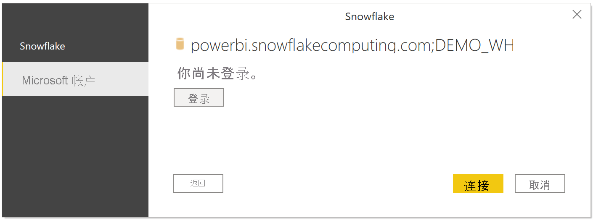

# 在 Power BI Desktop 中连接到 Snowflake 计算仓库
在 Power BI Desktop 中，你可以连接到 **Snowflake** 计算仓库，并可如同使用 Power BI Desktop 中任何其他数据源一样使用基础数据。 

## 连接到 Snowflake 计算仓库
要连接到 Snowflake 计算仓库，请从 Power BI Desktop 中的“开始”功能区选择“获取数据”    。 选择左侧类别中的“数据库”  ，然后便会看到“Snowflake”  。

在出现的 **Snowflake** 窗口中，将你的 Snowflake 计算仓库名称键入或粘贴到框中，然后选择“**确定**”。 请注意，可以选择将数据直接**导入**到 Power BI 中，或使用 **DirectQuery**。 可以了解有关[使用 DirectQuery](desktop-use-directquery.md) 的详细信息。 请注意，AAD SSO 仅支持 DirectQuery。

出现提示时，输入你的用户名和密码。

> [!NOTE]
> 一旦输入用户名和密码以连接特定 Snowflake  服务器，Power BI Desktop 在后续连接尝试中就会使用这些凭据。 可以通过“文件”>“选项和设置”>“数据源设置”  来修改这些凭据。
> 
> 

如果要使用 Microsoft 帐户选项，必须在 Snowflake 端配置 Snowflake AAD 集成。 要执行此操作，请参阅[有关该主题的 Snowflake 文档](https://docs.snowflake.net/manuals/user-guide/oauth-powerbi.html#power-bi-sso-to-snowflake)的“入门”部分。

连接成功后，将会出现“导航器”  窗口，并显示服务器上可用的数据。你可以从这些数据中选择要在 **Power BI Desktop** 中导入和使用的一个或多个元素。

你可以**加载**选定的表，该操作将把整个表格加载到 **Power BI Desktop**中，或者你也可以**编辑**查询，这将打开**查询编辑器**，以便筛选和优化要使用的数据集，然后将优化后的数据集加载到 **Power BI Desktop** 中。

## 后续步骤
你可以使用 Power BI Desktop 连接到各种数据。 有关数据源的详细信息，请参阅下列资源：

* [什么是 Power BI Desktop？](../fundamentals/desktop-what-is-desktop.md)
* [Power BI Desktop 中的数据源](desktop-data-sources.md)
* [使用 Power BI Desktop 调整和合并数据](desktop-shape-and-combine-data.md)
* [通过 Power BI Desktop 连接到 Excel 工作簿](desktop-connect-excel.md)   
* [直接将数据输入到 Power BI Desktop 中](desktop-enter-data-directly-into-desktop.md)   
