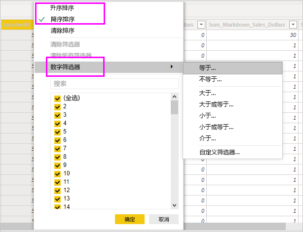

# 使用 Power BI Desktop 中的数据视图

数据视图  可帮助你检查、浏览和理解 Power BI Desktop  模型中的数据。 它与你在 Power Query 编辑器  中查看表、列和数据的方式不同。 在数据视图中，你所看到的数据是在将其加载到模型之后的样子。 

> [!NOTE]
> 由于数据视图将在数据加载到模型中后才显示数据，因此，如果所有数据源都基于 DirectQuery，则数据视图图标将不可见。 

进行数据建模时，有时想要查看表或列中的实际内容而不想在报表画布上创建视觉对象。 可能需要向下查看到行级别。 如果要创建度量值和计算列，或者需要识别数据类型或数据类别，此功能会非常有用。

让我们进一步了解数据视图中的一些元素。

1. **数据视图图标**。 选择此图标可进入数据视图。

2. **数据网格**。 此区域显示选中的表以及其中的所有列和行。 报表视图中的隐藏列显示为灰色  。右键单击列可获取相关选项。

3. **建模功能区**。 在此处可以管理关系、创建计算、更改列的数据类型、格式、数据类别。

4. **公式栏**。 输入度量值和计算列的数据分析表达式 (DAX) 公式。

5. **搜索**。 在模型中搜索表或列。

6. **字段列表**。 选择要在数据网格中查看的表或列。

## 在数据视图中进行筛选

还可以在数据视图中对数据进行筛选和排序。 每列显示标识排序方向的图表（若适用）。

可筛选列中的单个值或根据数据特点使用高级筛选功能。

> [!NOTE]
> 当创建 Power BI 模型所用区域设置与当前界面设置不同时，除文本字段以外，搜索框不会出现在数据视图用户界面的其他字段中。 例如，这适用于以美国英语创建，而在以西班牙语查看的模型。

## 后续步骤

可以使用 Power BI Desktop 执行各种操作。 有关其功能的详细信息，请参阅下列资源：

* [什么是 Power BI Desktop？](../fundamentals/desktop-what-is-desktop.md)
* [Power BI Desktop 的查询概述](../transform-model/desktop-query-overview.md)
* [Power BI Desktop 中的数据类型](desktop-data-types.md)
* [使用 Power BI Desktop 成型和合并数据](desktop-shape-and-combine-data.md)
* [Power BI Desktop 中的常见查询任务](../transform-model/desktop-common-query-tasks.md)
