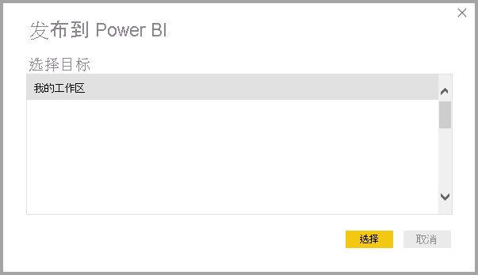

# 通过 Power BI Desktop 连接 Power BI 服务中的数据集

可以与 Power BI 服务  中的共享数据集建立实时连接，并根据同一数据集创建多个不同的报表。 可以在 Power BI Desktop 中创建完美的数据模型，并将其发布到 Power BI 服务。 然后，你和其他人可以从该通用数据模型创建多个不同的报表（在单独的 .pbix  文件中），并将它们保存到不同的工作区。 此功能称为“Power BI 服务实时连接”  。

此功能具有诸多优势（包括最佳做法），本文将对此进行介绍。 建议查看此功能的[注意事项和限制](#limitations-and-considerations)。

## 使用 Power BI 服务实时连接管理报表生命周期

Power BI 的普及带来了一个问题，就是报表、仪表板及其基础数据模型激增。 可以轻松地在 Power BI Desktop 中创建富有吸引力的报表，然后将其[发布](../create-reports/desktop-upload-desktop-files.md)到 Power BI 服务中，并能通过这些数据集创建出色的仪表板。 由于许多人都这么做，通常使用的是同一个或几乎相同的数据集，因此确定报表是以哪个数据集为依据且每个数据集的新近度就变得很困难。 为了应对这一挑战，我们提供了 Power BI 服务实时连接功能，以便你可以更轻松、一致地创建、共享和扩展通用数据集报表和仪表板。

### 创建并共享所有人都可以使用的数据集

假设 Anna 是团队中的业务分析师。 Anna 非常擅长创建良好的数据模型，通常称为数据集。 Anna 可以创建数据集和报表，然后将报表共享到 Power BI 服务中。

每个人都很喜欢 Anna 的报表和数据集。 问题也随之而来。 Anna 团队中的每个人都会尝试根据她的数据集创建自己的版本  ，然后将他们自己的报表与团队共享。 在 Power BI 服务中，你团队的工作区中突然之间就出现了大量以不同数据集为依据的报表。 哪一个是最新的？ 这些数据集是完全相同，还只是大致相同？ 区别在哪里？ 借助 Power BI 服务实时连接功能，一切都会有所改善。 在下一部分中，我们将了解其他人如何在其自己的工作区中将 Anna 发布的数据集用于其自己的报表，以及如何让所有人使用同一个已发布且经过审核的可靠数据集来生成自己的独一无二的报表。

### 使用实时连接功能连接 Power BI 服务数据集

Anna 创建一个报表并创建报表所基于的数据集。 随后 Anna 将该报表发布到 Power BI 服务。 报表将显示在 Power BI 服务的团队工作区中。 如果 Anna 将报表保存到新体验工作区  ， 则她可以设置“生成”权限  ，以使报表可供所有进出其工作区的人员查看和使用。

若要了解有关新体验工作区的详细信息，请参阅[工作区](../collaborate-share/service-new-workspaces.md)。

进出 Anna 工作区中的其他成员现在可以使用 Power BI 服务实时连接功能，与 Anna 共享的数据模型建立实时连接。 他们可以根据其原始数据集  在他们自己的新体验工作区  创建自己独一无二的报表。

下图展示了 Anna 是如何创建一个 Power BI Desktop 报表，并将其（包括它的数据模型）发布到 Power BI 服务中的。 然后，其他人可以使用 Power BI 服务实时连接功能连接到 Anna 的数据模型，并在其自己的工作区中根据 Anna 的数据集创建自己独一无二的报表。

> [!NOTE]
> 如果将数据集保存到[经典共享工作区](../collaborate-share/service-create-workspaces.md)，则只有该工作区的成员才能根据数据集生成报表。 要连接的数据集必须位于你所属的共享工作区中，才能建立 Power BI 服务实时连接。
> 
> 

## 使用 Power BI 服务实时连接的分步流程

现在，我们已经了解 Power BI 服务实时连接是多么实用，以及如何将此功能用作管理报表生命周期的最佳做法。接下来，我们逐步了解如何将 Anna 的优质报表和数据集变成她的 Power BI 同事可以使用的共享数据集。

### 发布 Power BI 报表和数据集

使用 Power BI 服务实时连接管理报表生命周期的第一步是，创建并共享同事想要使用的报表和数据集。 因此，Anna 必须先从 Power BI Desktop 发布  她的报表。 从 Power BI Desktop 的“主页”  功能区中选择“发布”  。

如果 Anna 未登录 Power BI 服务帐户，Power BI 将提示她执行此操作。

随后，Anna 可以选择要将报表和数据集发布到的目标工作区。 请记住，如果 Anna 将其保存到新体验工作区，则具有“生成”权限的任何人都可以访问该数据集。 发布后，“生成”权限在 Power BI 服务中进行设置。 如果将工作保存到经典工作区，则仅有权访问发布报表的工作区的成员才能使用 Power BI 服务实时连接访问报表的数据集。

此时便会开始发布，Power BI Desktop 会显示发布进度。

完成后，Power BI Desktop 会提示发布成功，并显示两个链接，一个链接用于转到 Power BI 服务访问报表本身，另一个链接用于获取有关报表的快速见解。

现在，你的报表及其数据集已位于 Power BI 服务中，你还可以推广  它。 推广意味着证明其质量和可靠性。 你甚至还可以在 Power BI 租户中要求中心机构对其进行*认证*。 凭借其中任何认可，当人们查找数据集时，你的数据集都将一直在列表的顶部显示。 有关更多信息，请参阅[推广数据集](service-datasets-promote.md)。

最后一步是为报表所基于的数据集设置“生成”权限。 “生成”权限可确定能够查看和使用数据集的人员。 可以在工作区中设置它，也可以在通过工作区共享应用时设置它。 有关详细信息，请参阅[共享数据集的生成权限](service-datasets-build-permissions.md)。

接下来，让我们来看一下有权访问报表和数据集发布到的工作区的其他同事如何连接数据集并生成自己的报表。

### 与已发布的数据集建立 Power BI 服务实时连接

若要与已发布的报表建立连接，并根据已发布的数据集创建自己的报表，请在 Power BI Desktop 的“主页”  功能区中选择“获取数据”  ，然后从左侧窗格选择“Power Platform”  ，并选择“Power BI 数据集”  。

如果尚未登录，Power BI 会提示你登录。 登录后，Power BI 会显示你所属的工作区。 可以选择包含要建立 Power BI 服务实时连接的数据集的工作区。

列表中的数据集包含你在任何工作区中具有“生成”权限的所有共享数据集。 可以搜索特定数据集并查看其名称、所有者、其所在的工作区以及上次刷新时间。 还可以在列表顶部看到认可认证或推广的数据集  。

选择“创建”  时，会建立与所选数据集的实时连接。 Power BI Desktop 将显示的字段及其值实时加载到 Power BI Desktop 实时。

现在，你和其他人可创建并共享自定义报表，且所有操作均基于同一数据库。 这是使一个有经验的人员创建正确格式的数据集（如 Anna 所做的）的一种很好的方法。 许多团队成员可以使用该共享数据集来创建自己的报表。

## 限制和注意事项

使用 Power BI 服务实时连接时，需要遵循几项限制和注意事项。

* 仅具有数据集“生成”权限的用户才能使用 Power BI 服务实时连接功能连接到已发布的数据集。
* 免费用户只能看到位于其“我的工作区”  和高级工作区中的数据集。
* 由于此连接为实时连接，因此会禁用左侧导航和建模。 每个报表中只能连接到一个数据集。 此行为与连接到 SQL Server Analysis Services  时的行为类似。
* 由于此连接是实时连接，因此会强制执行行级别安全性 (RLS) 和其他此类连接行为。 这与连接到 SQL Server Analysis Services 时相同。
* 如果所有者修改最初共享的 .pbix  文件，则将覆盖 Power BI 服务中共享的数据集和报表。 基于该数据集的报表不会被覆盖，但对数据集进行的任何更改都会在报表中反映。
* 工作区的成员无权替换最初共享的报表。 尝试执行此操作会导致出现警告，提示你重命名文件后再进行发布。
* 如果删除 Power BI 服务中的共享数据集，那么其他基于该数据集的报表将无法再正常运行或显示其视觉对象。
* 对于内容包，必须先创建内容包的副本，然后才能以此为基础将 .pbix  报表和数据集共享到 Power BI 服务中。
* 对于来自“我的组织”  的内容包，一旦复制，则无法替换在此服务上创建的报表或作为使用实时连接复制内容包的一部分创建的报表。 尝试执行此操作会导致出现警告，提示你重命名文件后再进行发布。 在这种情况下，只能替换已发布的实时连接的报表。
* 删除 Power BI 服务中的共享数据集意味着无法再从 Power BI Desktop 访问该数据集。
* 在 Power BI 服务上共享数据集的报表不支持使用 Power BI REST API 进行自动部署。
