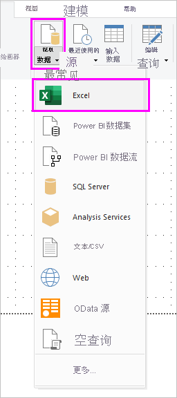
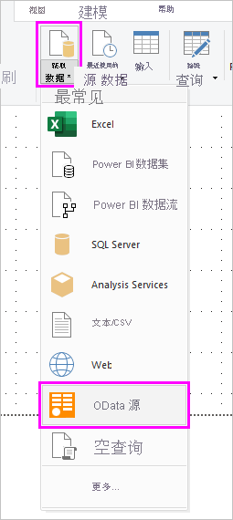
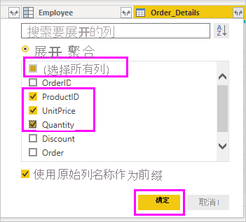
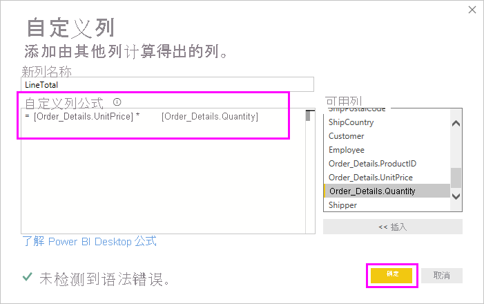
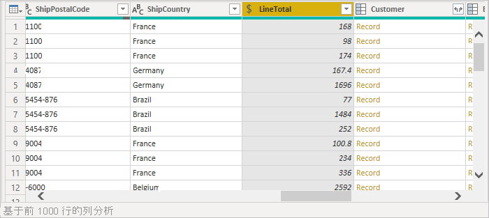
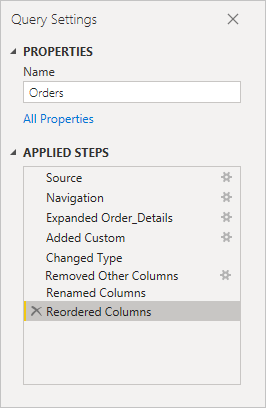
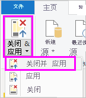
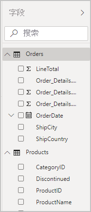

# 教程：分析来自 Excel 和 OData 源的销售数据

拥有多个数据源的数据是很常见的。 例如，可以拥有两个数据库，一个用于产品信息，另一个用于销售信息。 使用 Power BI Desktop  ，可以合并来自不同源的数据，以创建令人感兴趣的、引人注目的数据分析和可视化效果。

本教程中将合并来自两个数据源的数据：

* 包含产品信息的 Excel 工作簿
* 包含订单数据 OData 源

导入每个数据集并执行转换和聚合操作。 然后，使用两个源的数据生成具有交互式可视化效果的销售分析报告。 以后这些技术也可以应用于 SQL Server 查询、CSV 文件和 Power BI Desktop 中的其他数据源。

>[!NOTE]
>在 Power BI Desktop 中，有若干种完成任务的方法。 例如，可以右键单击某个列或单元格，或使用其上的“更多选项”菜单查看其他功能区选择  。 以下步骤描述了几种备用方法。

## 导入 Excel 产品数据

首先，将 Products.xlsx  Excel 工作簿中的产品数据导入 Power BI Desktop。

1. [下载 Products.xlsx Excel 工作簿](https://download.microsoft.com/download/1/4/E/14EDED28-6C58-4055-A65C-23B4DA81C4DE/Products.xlsx)，并将其保存为 Products.xlsx  。

1. 选择 Power BI Desktop 功能区的“主页”选项卡中的“获取数据”旁的箭头，然后从“最常见的”菜单选择“Excel”     。

   

   >[!NOTE]
   >你还可以选择“获取数据”  项本身，或者从 Power BI“开始”对话框中选择“获取数据”   ，再在“获取数据”对话框中选择“Excel”  或“文件”   > “Excel”   ，然后选择“连接”  。

1. 在“打开”  对话框中，导航到 Products.xlsx 文件并选择  该文件，然后选择“打开”  。

1. 在“导航器”  中，选择“产品”  表，然后选择“转换数据”  。

   

表预览将在“Power Query 编辑器”中打开，你可以在其中应用转换以清理数据。

>[!NOTE]
>你也可以通过以下方法打开 Power Query 编辑器：从 Power BI Desktop 中的“主页”  功能区选择“编辑查询”   > “编辑查询”  ，或者右键单击或选择“报表”  视图中任何查询旁的“更多选项”  ，然后选择“编辑查询”  。

## 清理产品列

合并的报表将使用 Excel 工作簿中的“ProductID”、“ProductName”、“QuantityPerUnit”和“UnitsInStock”列     。 可以删除其他列。

1. 在“Power Query 编辑器”中，选择“ProductID”  、“ProductName”  、“QuantityPerUnit”  和“UnitsInStock”  列。 可以使用 Ctrl 选择多个列，或使用 Shift 选择彼此相邻的列。

1. 右键单击任意所选标头。 从下拉菜单中选择“删除其他列”  。
   你还可以从“主页”  功能区选项卡中的“管理列”  组中选择“删除列”   > “删除其他列”  。

   

## 导入 OData 源的订单数据

接下来，从示例 Northwind 销售系统 OData 源导入订单数据。

1. 在“Power Query 编辑器”中，选择“新建源”，然后从“最常见的”菜单中选择“OData 源”    。

   

1. 在“OData 源”对话框中，粘贴 Northwind OData 源 URL `https://services.odata.org/V3/Northwind/Northwind.svc/` 。 选择“确定”。 

   

1. 在“导航器”  中，选择“订单”  表，然后选择“转换数据”  将数据加载到 Power Query 编辑器。

   

   >[!NOTE]
   >在导航器中  ，选择任何表名称即可查看预览，而不必选中复选框。

## 展开订单数据

在连接到具有多个表的数据源（例如，关系数据库或 Northwind OData 源）时，可以使用表引用来构建查询。 “订单”  表包含对多个相关表的引用。 使用展开操作，可以将相关相关“Order_Details”  表中的“ProductID”  、“UnitPrice”  和“数量”  列添加到主题（“订单”  ）表。

1. 在“订单”表中向右滚动，直到看到“Order_Details”列   。 它包含对另一个表的引用，而不是数据。

   

1. 选择“Order_Details”  列标题中的“展开”  图标（展开图标）。

1. 在下拉菜单中：

   1. 选择 **（选择所有列）** 以清除所有列。

   1. 选择“ProductID”  、“UnitPrice”  和“数量”  ，然后选择“确定”  。

      

展开“Order_Details”表后，会有三个新的嵌套表列替换“Order_Details”列   。 表中有新行用于放置每个订单的新增数据。

## 创建自定义的计算列

Power Query 编辑器可以用来创建计算和自定义字段以丰富你的数据。 你将创建自定义列，该列将单价乘以商品数量，以计算每个订单的行项的总价格。

1. 在 Power Query 编辑器的“添加列”功能区选项卡中，选择“自定义列”   。

   

1. 在“自定义列”  对话框中，在“新列名”字段中键入“LineTotal”   。

1. 在 = 后的“自定义列公式”字段中，输入 [Order_Details.UnitPrice] \*[Order_Details.Quantity]     。 你还可以从“可用列”  滚动框中选择字段名称，然后选择“<< 插入”  ，而不是键入它们。

1. 选择“确定”。 

   

   新“LineTotal”  字段显示为“订单”表中的最后一列  。

## 设置新字段的数据类型

Power Query 编辑器连接数据时，出于显示目的，它会猜测每个字段的数据类型。 标题图标指示分配给每个字段的数据类型。 还可以在“主页”功能区选项卡的“转换”组中查看“数据类型”    。

新“LineTotal”列的数据类型为“任意”，但它具有货币值   。 要分配数据类型，请右键单击“LineTotal”列标题，从下拉菜单中选择“更改类型”，然后选择“定点十进制数”    。

>[!NOTE]
>你还可以选择“LineTotal”  列，选择“主页”功能区选项卡的“转换”区域中“数据类型”旁的箭头    ，然后选择“定点十进制数”  。

## 清理订单列

要在报表中更轻松地使用模型，可以删除、重命名某些列以及对其重新排序。

报表使用以下列：

* **OrderDate**
* **ShipCity**
* **ShipCountry**
* **Order_Details.ProductID**
* **Order_Details.UnitPrice**
* **Order_Details.Quantity**
* **LineTotal**

选择这些列，并使用“删除其他列”，就像处理 Excel 数据一样  。 或者，可以选择未列出的列，右键单击其中某列，然后选择“删除列”  。

可以重命名前缀为“Order_Details”的列  使其更容易读取：

1. 双击或者点击并按住每个列标题，或者右键单击列标题并从下拉菜单中选择“重命名”  。

1. 删除每个名称的“Order_Details.”  前缀（从每个名称中）。

最后，若要更轻松地访问“LineTotal”  列，将其向左拖动，放到紧靠“ShipCountry”列的右侧  。

## 查看查询步骤

系统会记录你用于形成和转换数据的 Power Query 编辑器操作。 每个操作都显示在“应用的步骤”下的“查询设置”窗格右侧   。 可在“应用的步骤”中回退查看步骤，并在必要时编辑、删除或重新排列这些步骤  。 但是，更改前面的步骤会有风险，因为这可能会使后续步骤失效。

在 Power Query 编辑器左侧的“查询”列表中选择每个查询  ，在“查询设置”中查看“应用的步骤”   。 在应用以前的数据转换之后，两个查询的“应用的步骤”应如下所示  ：

 &nbsp;&nbsp; 

>[!TIP]
>基本的“应用的步骤”是以 Power Query 语言  编写的公式，也称为 [M 语言](https://docs.microsoft.com/powerquery-m/power-query-m-reference)。 若要查看和编辑该公式，请选择功能区“主页”  选项卡“查询”  组中的“高级编辑器”  。

## 导入转换的查询

如果对转换的数据感到满意且准备将其其导出到 Power BI Desktop“报表”视图，请在“主页”功能区选项卡的“关闭”组中选择“关闭并应用” > “关闭并应用”      。

数据加载后，查询将出现在 Power BI Desktop“报表”视图的“字段”列表中   。

## 管理数据集之间的关系

Power BI Desktop 不需要合并查询来建立报表。 但是，可以使用基于公共字段的数据集之间的关系，扩展和丰富报表。 Power BI Desktop 可以自动检测关系，或者你可以在 Power BI Desktop“管理关系”  对话框中创建关系。 有关详细信息，请参阅[在 Power BI Desktop 中创建和管理关系](../transform-model/desktop-create-and-manage-relationships.md)。

在本教程中，共享的 `ProductID` 字段会在 `Orders` 与 `Products` 数据集之间创建关系。

1. 在 Power BI Desktop“报表”视图中，在“主页”功能区选项卡的“关系”区域中选择“管理关系”     。

   

1. 在“管理关系”对话框中，可以看到 Power BI Desktop 已检测并列出“产品”和“订单”表之间的活动关系    。 若要查看关系，请选择“编辑”  。

   

   “编辑关系”  打开，其中显示有关关系的详细信息。  

   

1. Power BI Desktop 已正确自动探测到关系，因此你可以选择“取消”，然后选择“关闭”   。

在 Power BI Desktop 中，在左侧选择“模型”  以查看和管理查询关系。 双击连接两个查询的线上的箭头，以打开“编辑关系”对话框并查看或更改关系  。

若要从“模型”  视图返回到“报表”  视图，请选择“报表”  图标。

## 使用数据创建可视化效果

可以在 Power BI Desktop的“查看”视图中创建不同的可视化效果，以获取数据见解。 报表可以包含多个页面，而且每页可以包含多个视觉对象。 你可以与他人就可视化效果进行交互，以帮助分析和了解数据。 有关详细信息，请参阅[在 Power BI 服务的“编辑视图”中与报表进行交互](../create-reports/service-interact-with-a-report-in-editing-view.md)。

可以利用这两个数据集以及它们之间的关系，帮助可视化和分析销售数据。

首先，创建堆积柱形图，该图使用这两个查询的字段来显示每个订购产品的数量。

1. 从右侧“字段”窗格中的“订单”选择“数量”字段    ，或将其拖到画布上的空白区域。 创建了堆积柱形图，其中显示所有订购产品的总数量。

1. 要显示订购的每种产品的数量，请从“字段”窗格中的“产品”选择“ProductName”，或将其拖动到图表中    。

1. 若要按从最多订购到最少订购对产品排序，选择可视化效果右上角的“更多选项”省略号 (...)，然后选择“按数量排序”    。

1. 使用图表角部的图柄进行放大，使更多产品名称可见。

   

接下来，创建一个图，显示随时间推移 (OrderDate  ) 的订单美元金额 (LineTotal  )。

1. 在画布上未选择任何对象的情况下，从“字段”窗格中的“订单”选择“LineTotal”    ，或者将其拖到画布上的空白区域。 堆积柱形图显示所有订单的总美元金额。

1. 选择堆积图表，然后从“订单”中选择“OrderDate”，或将其拖到该图表   。 该图表现在显示每个订单日期的行合计。

1. 拖动角落以调整可视化效果的大小，以便能够看到更多数据。

   

   >[!TIP]
   >如果你只在图表上看到“年份”  并且只有三个数据点，则选择“可视化效果”  窗格的“轴”  字段中“OrderDate”  旁的箭头，然后选择“OrderDate”  而不是“日期层次结构”  。

最后，创建显示每个国家/地区的订单数量的地图可视化效果。

1. 在画布上未选择任何对象的情况下，从“字段”窗格中的“订单”选择“ShipCountry”    ，或者将其拖到画布上的空白区域。 Power BI Desktop 检测到数据是国家/地区名称。 然后，它会自动创建地图可视化效果，其中包含建立了订单的每个国家/地区的数据点。

1. 要使数据点大小反映每个国家/地区的订单金额，请将 LineTotal 字段拖动到地图上  。 还可以将其拖动到“可视化对象”窗格中“大小”下的“将数据字段拖到此处”    。 现在，地图上的圆圈大小反映每个国家/地区的订单美元金额。

   

## 与报表视觉效果进行交互以进一步分析

在 Power BI Desktop 中，可以与相互突出显示和筛选的视觉效果进行交互，从而发觉进一步的趋势。 有关详细信息，请参阅[在 Power BI 报表中进行筛选和突出显示](../create-reports/power-bi-reports-filters-and-highlighting.md)。

由于查询之间的关系，与一个可视化效果交互会影响页上的所有其他可视化效果。

在地图可视化效果中，选择“加拿大”  中间的圆圈。 对其他两个可视化效果进行筛选，以仅突出显示加拿大的行总计和订单数量。

选择“Quantity (按 ProductName)”图表产品，查看地图和日期图表筛选器，以反映产品数据  。 选择“LineTotal (按 OrderDate)”图表日期，查看地图和产品图表筛选器，以显示该日期的数据  。

>[!TIP]
>若要取消选择所选内容，再次选择它，或者选择其他可视化效果之一。

## 完成销售分析报表

完成的报表对来自 Products.xlsx  Excel 文件与视觉对象中 Northwind OData 源的数据进行组合，帮助分析不同国家/地区的订单信息、时间范围和产品。 报表准备就绪后，可以[将其上传到 Power BI 服务](../create-reports/desktop-upload-desktop-files.md)，将其与其他 Power BI 用户共享。

## 后续步骤

* [针对 Power BI 的 Microsoft Learn](https://docs.microsoft.com/learn/powerplatform/power-bi?WT.mc_id=powerbi_landingpage-docs-link)
* [观看 Power BI Desktop 视频](/power-bi/fundamentals/desktop-videos)
* [访问 Power BI 论坛](https://go.microsoft.com/fwlink/?LinkID=519326)
* [阅读 Power BI 博客](https://go.microsoft.com/fwlink/?LinkID=519327)
