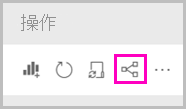
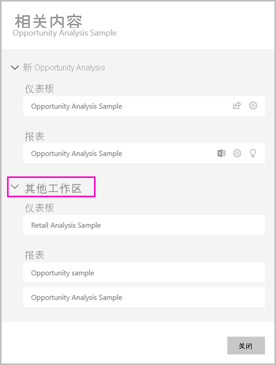

# 共享数据集

作为 Power BI Desktop 中数据模型的创建者，你创建的数据集可在 Power BI 服务中进行分发 。 然后，其他报表创建者可以将你的数据集作为自己报表的基础。 本文介绍如何共享数据集。 若要了解如何授予和删除对共享数据集的访问权限，请参阅[生成权限](service-datasets-build-permissions.md)。

## 共享数据集的步骤

1. 首先在 Power BI Desktop 的数据模型中创建 .pbix 文件。 如果计划为其他人提供此数据集来生成报表，你甚至可能无需在 .pbix 文件中设计报表。

    最佳做法是将 .pbix 文件保存到 Microsoft 365 组。

1. 将 .pbix 文件发布到 Power BI 服务中的[新的工作区体验](../collaborate-share/service-create-the-new-workspaces.md)。
    
    完成后，此工作区的其他成员可以在基于此数据集的其他工作区中创建报表。 使用工作区内容列表中数据集上的“管理权限”选项可向其他用户授予对数据集的访问权限。 

1. 也可以通过此工作区[发布应用](../collaborate-share/service-create-distribute-apps.md)。 进行创建时，在“权限”页上指定具有权限的人选及其权限范围。

    > [!NOTE]
    > 如果选择“整个组织”，则组织中的所有人都将不具生成权限。 这是一个已知问题。 应转而在“特定个人或组”中指定电子邮件地址。  如果想要整个组织都具有生成权限，请指定整个组织的电子邮件别名。

    

1. 选择“发布应用”，或如果应用已发布则选择“更新应用” 。

## 跟踪数据集使用情况

你在你的工作区中具有共享数据集时，你可能需要知道其他工作区中的基于该共享数据集的报表。

1. 在“数据集”列表视图中，选择“查看相关项”。

    

1. “相关内容”对话框显示所有相关项。 在此列表中，你可以查看此工作区和“其他工作区”中的相关项。
 
    

## 限制和注意事项
共享数据集的注意事项：

* 如果通过管理权限、共享报表或仪表板或者发布应用来共享数据集，则将授予对整个数据集的访问权限，除非[行级别安全性 (RLS)](../admin/service-admin-rls.md) 限制其访问权限。 报表作者可以使用在查看报表或与报表交互时自定义用户体验的功能，例如隐藏列、限制对视觉对象执行的操作等。 这些自定义用户体验不会限制用户可以访问数据集中的哪些数据。 在数据集中使用[行级别安全性 (RLS)](../admin/service-admin-rls.md)，以便每个人的凭据都可以确定他们可以访问的数据。

## 后续步骤

- [跨工作区使用数据集](service-datasets-across-workspaces.md)
- 是否有任何问题? [尝试咨询 Power BI 社区](https://community.powerbi.com/)
