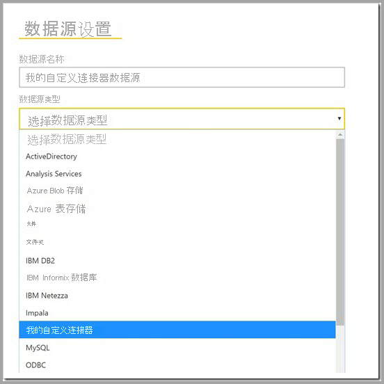

# 通过本地数据网关使用自定义数据连接器

[!INCLUDE [gateway-rewrite](../includes/gateway-rewrite.md)]

使用适用于 Power BI 的数据连接器，可以连接到应用程序、服务或数据源中的数据并访问这些数据。 可以开发自定义数据连接器并将其用于 Power BI Desktop 中。

要详细了解如何开发适用于 Power BI 的自定义数据连接器，请参阅[数据连接器 SDK GitHub 页面](https://aka.ms/dataconnectors)。 此站点包括有关 Power BI 和 Power Query 的入门信息和示例。

在使用自定义数据连接器的 Power BI Desktop 中生成报表时，可以使用本地数据网关从 Power BI 服务中刷新这些报表。

## 启用并使用此功能

如果安装 2018 年 7 月版或更高版本的本地数据网关，则会在本地数据网关应用中看到“连接器”选项卡  。 在“从文件夹加载自定义数据连接器”框中，选择可由运行网关服务的用户访问的文件夹  。 默认文件夹为 NT SERVICE\PBIEgwService  。 网关会自动加载该文件夹中的自定义连接器文件。 它们将出现在数据连接器列表中。

如果使用的是本地数据网关（个人模式），则可以将 Power BI 报表上传到 Power BI 服务并使用网关进行刷新。

对于本地数据网关，需要创建用于自定义连接器的数据源。 在 Power BI 服务的网关设置页面中，在选择网关群集时应该会看到一个选项，用于允许对此群集使用自定义连接器。 请确保群集中的所有网关均为 2018 年 7 月更新版本或更高版本，以便此选项可用。 请选择该选项，以允许对此群集使用自定义连接器。

启用此选项后，将看到自定义连接器作为可在此网关群集下创建的可用数据源。 使用新的自定义连接器创建数据源后，现在可以在 Power BI 服务中使用该自定义连接器刷新 Power BI 报表。

## 注意事项和限制

* 请确保所创建的文件夹可供后台网关服务访问。 通常情况下，无法访问用户的 Windows 文件夹或系统文件夹下的文件夹。 如果该文件夹不可访问，本地数据网关应用将显示一条消息。 此说明不适用于本地数据网关（个人模式）。
* 若要配合使用自定义连接器和本地数据网关，需要在自定义连接器的代码中实现“TestConnection”部分。 在 Power BI Desktop 上使用自定义连接器时，不需要此部分。 因此，可以使用适用于 Power BI Desktop 的连接器，但不能使用网关。 有关如何实现 TestConnection 部分的详细信息，请参阅[本文档](https://github.com/Microsoft/DataConnectors/blob/master/docs/m-extensions.md#implementing-testconnection-for-gateway-support)。
* 目前仅网关管理员（而非其他数据源用户）支持通过网关的 OAuth 自定义连接器。
* 如果自定义连接器位于网络驱动器上，请在本地数据网关应用上包括完全限定的路径。

## 后续步骤

* [管理数据源 - Analysis Services](service-gateway-enterprise-manage-ssas.md)  
* [管理数据源 - SAP HANA](service-gateway-enterprise-manage-sap.md)  
* [管理数据源 - SQL Server](service-gateway-enterprise-manage-sql.md)  
* [管理数据源 - Oracle](service-gateway-onprem-manage-oracle.md)  
* [管理数据源 - 导入/计划刷新](service-gateway-enterprise-manage-scheduled-refresh.md)
* [配置本地数据网关的代理设置](/data-integration/gateway/service-gateway-proxy)
* [使用 Kerberos 进行从 Power BI 到本地数据源的单一登录 (SSO)](service-gateway-sso-kerberos.md)  

更多问题？ 请尝试在 [Power BI 社区](https://community.powerbi.com/)中提问
