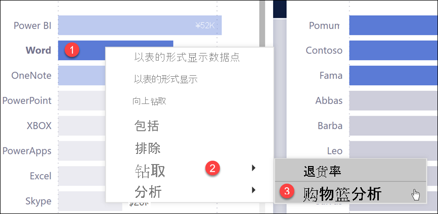
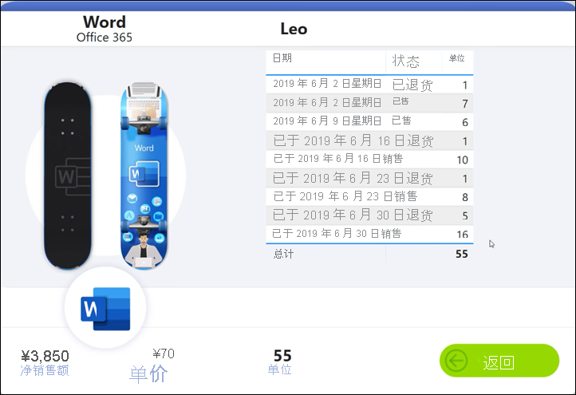
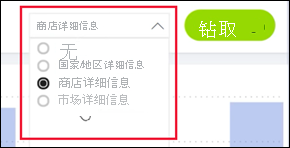

# Power BI 服务中的按钮
在收到的来自同事的报表中，你可能会注意到一些按钮并想知道如何使用它们。 有些按钮包含字词，有些按钮包含箭头，有些按钮包含图形，有些按钮甚至包含下拉菜单。 本文介绍如何识别按钮，以及如何确定按钮的作用。

## 如何识别按钮
按钮在报表页上有多种显示形式，如形状、图像或图标。 但如果在选择（单击）它时操作发生，则可能是按钮。

## 按钮类型
报表创建者将按钮添加到报表，以帮助你导航和浏览。 按钮有以下类型：后退、书签、钻取、页面导航、问答和 Web URL     。 

### 后退按钮 
后退按钮可能有一个箭头图标，当你选择它时，Power BI 会返回到上一页。  后退按钮通常与钻取结合使用。 下面是与钻取结合使用的后退按钮的示例。

1. 在条形图中选择“Word”。
1. 选择“钻取”，然后选择“市场篮分析” 。

    

    选择“市场篮分析”后，Power BI 将打开“市场篮分析”报表页，并使用在源页上所做的选择来筛选目标页上显示的内容。

    

    你现在位于已针对 Word 进行筛选的“市场篮分析”报表页。 若要返回到前一页，请选择后退按钮。 

## 书签按钮
报表设计者通常将书签添加到报表。 可从右上角选择“视图” > “书签”来查看报表书签的列表 。 当报表设计者添加书签按钮时，这只是一种导航到与该书签关联的特定报表页的替代方法。 页面将包含由书签捕获的已应用的筛选器和设置。 [详细了解 Power BI 中的书签](end-user-bookmarks.md)。 

在此示例中，该按钮包含书签图标和书签名称 Urban。 

选择书签按钮后，Power BI 会转到为该书签定义的位置和设置。  在这种情况下，书签位于“发展机会”报表页上，并且该页面针对 Urban 进行交叉筛选。

## 钻取按钮
Power BI 服务中有两种钻取方法。 钻取会将你转到其他报表页，该目标页上的数据将根据你在源页上设置的筛选条件和选择内容显示。

在报表中钻取的一种方法是右键单击视觉对象中的数据点，选择“钻取”，然后选择目标。 此方法已在标题为“后退按钮”的部分中介绍。 但有时，报表设计者改为使用钻取按钮，以使该操作更明显，并引起对重要见解的注意。  

钻取按钮可以有多个先决条件。 除非满足所有先决条件，否则按钮将不起作用。 我们来看一个示例。

下面是钻取按钮，它将转到”商店详细信息”页。 将鼠标悬停在按钮上会显示一个工具提示，以告知我们需要选择一个商店和一个产品。 在选择完成之前，按钮会保持非活动状态。

选择一个产品 (Word) 和一个商店 (Leo) 后，该按钮将更改颜色，以便告知我们它现在处于活动状态 。

选择钻取按钮将会转到“商店”报表页。 针对所选的“Word”和“Leo”筛选“商店”页 。

钻取按钮还可有下拉菜单，为你提供目标选择。 在源报表页上进行选择后，选择用于钻取的目标报表页。 在下面的示例中，我们将更改所选内容以钻取到“市场详细信息”报表页。 

## 页面导航

页面导航按钮会将你转到同一报表中的其他页面。 报表设计者通常会创建导航按钮来讲述故事或提供报表见解导览。 在下面的示例中，报表设计者在每个报表页上添加了一个按钮，该按钮会将你转到报表的第一页，即顶层摘要页。 此页面导航按钮非常有用，因为此报表中有多个页面。

## 问答按钮 
选择问答按钮将打开 Power BI 问答资源管理器窗口。 问答窗口显示在报表页顶部，可选择 X 来关闭该窗口。[了解问答](end-user-q-and-a.md)

## Web URL
Web URL 按钮会打开一个新的浏览器窗口。 报表设计者可添加此类型按钮作为链接到公司网站的引用源，甚至作为指向其他报表或仪表板的链接。 在下面的示例中，通过 Web URL 按钮，可以下载报表的源文件。 

由于该页在单独的窗口中打开，请关闭窗口或选择 Power BI 选项卡以返回到 Power BI 报表。

## 后续步骤
[书签](end-user-bookmarks.md)    
[向上钻取和向下钻取](end-user-drill.md)
