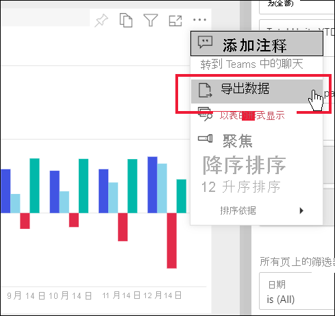

# 从视觉对象导出数据

[!INCLUDE[consumer-appliesto-yyny](../includes/consumer-appliesto-yyny.md)]

[!INCLUDE [power-bi-service-new-look-include](../includes/power-bi-service-new-look-include.md)]

若要查看用于创建视觉对象的数据，可以[在 Power BI 中显示该数据](end-user-show-data.md)或将这些数据导出到 Excel。 使用导出功能项要求被导出数据符合特定类型或许可证并且当前用户对该内容有编辑权限。 如果无法导出，请与 Power BI 管理员或 IT 技术支持联系。 

导出数据需要 Power BI Pro 许可证，或者要使用高级容量与你共享的仪表板或报表。 若要了解详细信息，请参阅[我有哪种许可证？](end-user-license.md)。

## Power BI 仪表板上的视觉对象

1. 启动 Power BI 仪表板。 这里，我们使用的是“市场营销和销售示例”****** 应用中的仪表板。 可以[从 AppSource.com 下载此应用](https://appsource.microsoft.com/en-us/product/power-bi/microsoft-retail-analysis-sample.salesandmarketingsample
)。

    

2. 将鼠标悬停在视觉对象上方以显示“更多选项”(…)，然后单击以显示“操作”菜单****。

    

3. 选择“导出到 .csv”****。

4. 接下来发生的情况取决于所使用的浏览器。 系统可能会提示你保存文件，或者你可能会在浏览器底部看到指向已导出文件的链接。 

    

5. 在 Excel 中打开文件。 

    > [!NOTE]
    > 如果你没有对数据的权限，将无法在 Excel 中导出或打开数据。  

    

## 报表中的视觉对象
你可以从报表中的视觉对象内导出 .csv 或 .xlsx (Excel) 格式的数据。 

1. 在仪表板上，选择磁贴以打开其所在的原始报表。  在此示例中，我们选择与上面相同的视觉对象，即“年初至今总单位数差额百分比”**。 

    

    由于此磁贴是从“销售和市场营销示例”** 报表创建的，即打开的报表。 此外，其将打开包含选定磁贴视觉对象的页面。 

2. 在报表中选择视觉对象。 注意右侧的“筛选器”**** 窗格。 此视觉对象已应用筛选器。 若要了解有关筛选器的详细信息，请参阅[在报表中使用筛选器](end-user-report-filter.md)。

    

3. 从可视化效果的右上角选择“更多操作(...)”****。 选择“导出数据”。

    

4. 你将看到用于导出汇总数据或基础数据的选项。 如果你使用的是“销售和市场营销示例”** 应用，将禁用“基础数据”****。 但你可能会遇到同时启用这两个选项的报表。 下面是有关不同点的说明。

    **汇总数据**：希望导出在当前视觉对象中看到的数据时可选择此选项。  这种类型的导出仅显示用于创建视觉对象当前状态的数据。 如果对视觉对象应用了筛选器，则也将筛选导出的数据。 例如，对于此视觉对象，导出将仅包括 2014 和中心区域的数据，并且仅包含以下四个制造商的数据：VanArsdel、Natura、Aliqui 和 Pirum。 如果视觉对象有聚合（sum、average 等），则导出也会聚合。 
  

    **基础数据**：如果你想要导出在视觉对象中看到的数据和**** 基础数据集中的其他数据，请选择此选项。  这可能包括数据集内包含但未在视觉对象中使用的数据。 如果对视觉对象应用了筛选器，则也将筛选导出的数据。  如果视觉对象有聚合（sum、average 等），则导出将删除聚合；实质上是展开数据。 

    

5. 接下来发生的情况取决于所使用的浏览器。 系统可能会提示你保存文件，或者你可能会在浏览器底部看到指向已导出文件的链接。 

    

    > [!NOTE]
    > 如果你没有对数据的权限，将无法在 Excel 中导出或打开数据。  

6. 在 Excel 中打开文件。 将导出的数据量与从仪表板上的同一个视觉对象导出的数据进行比较。 不同之处在于，此导出包括基础数据****。 

    

## 后续步骤

[显示用于创建视觉对象的数据](end-user-show-data.md)