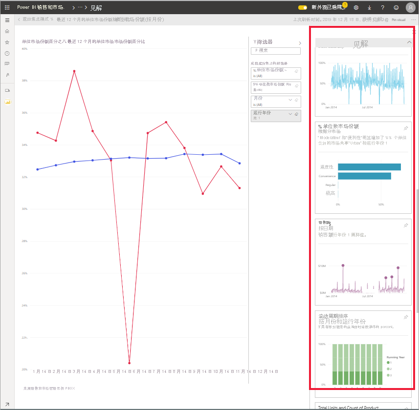

# Power BI 支持的见解类型

[!INCLUDE[consumer-appliesto-yyny](../includes/consumer-appliesto-yyny.md)]

可以要求 Power BI 浏览数据并找出令人感兴趣的趋势和模式。 这些趋势和模式以称为“见解”  的视觉对象形式呈现。 

若要了解如何使用见解，请参阅 [Power BI 见解](end-user-insights.md)

## 见解的工作原理
Power BI 快速搜索数据集的不同子集。 在搜索时，Power BI 会应用一组复杂的算法来发现可能有意义的见解。 Power BI 使用者  可以对仪表板磁贴运行见解。

## 一些术语
Power BI 使用统计算法来发现见解。 本文的下一节会将列出并介绍这些算法。 在讨论算法之前，这里有一些可能不熟悉的术语的定义。 

* **度量值**：度量值是可以用于进行计算的定量（数值）字段。 常见计算有求和、平均值和最小值。 例如，如果我们的公司制造并销售滑板，则我们的度量值可能是每年销售的滑板数和平均利润。  
* **维度**：维度是分类（文本）数据。 维度描述人员、物体、项目、产品、位置和时间。 在数据集中，维度是一种将*度量值*分组为有用类别的方法。 对于我们的滑板公司，一些维度可能包括按型号、颜色、国家/地区或市场营销活动查看销售额（一种度量值）。   
* **相关性**：相关性可告诉我们事物的行为如何相关。  如果它们的增加和减少模式相似，则它们是正相关。 如果它们的模式相反，则它们是负相关。 例如，如果每次开展电视市场营销活动时，我们的红色滑板销售额增加，则红色滑板销售额和电视市场活动是正相关。
* **时序**：时序是一种将时间显示为连续数据点的方法。 这些数据点可以递增，如秒、小时、月或年。  
* **连续变量**：连续变量可以是其最小限值与最大限值之间的任何值，否则它是离散变量。 示例包括温度、重量、年龄和时间。 连续变量可以包含值的小数或一部分。 由于我们无法销售半个滑板，售出的蓝色滑板总数是离散变量。  

## 可以发现哪些类型的见解？
这些是 Power BI 使用的算法。 

### 类别离群值（上/下）
突出显示一个或两个类别的值比其他类别大得多的情况。  

### 更改时序中的点
突出显示数据时序中的趋势明显变化的情况。

### 关联
当针对数据集中的类别或值进行绘制时，检测多个度量值显示相似模式或趋势的情况。

### 低方差
检测维度的数据点不偏离平均值的情况，因此，“方差”较低。 假设你有度量值“销售额”和维度“区域”。 跨区域查看时，你会发现数据点和（数据点的）平均值之间几乎没有差异。 当所有区域的销售额方差低于阈值时，就会触发见解。 换句话说，所有地区的销售额都非常近似。

### 多数（主要因素）
查找当总值由另一个维度分解时，其多数可能归因于单一因素的情况。  

### 时序中的整体趋势
检测时序数据中的向上或向下趋势。

### 时序中的季节性
查找时序数据中的周期模式，例如每周、每月或每年的季节性。

### 稳定份额
突出显示子值的份额相对于跨连续变量的整体父值有父子关联的情况。 稳定份额见解适用于包含一个度量值、一个维度和另一个日期/时间维度的上下文。 如果特定维度值（例如，“东北地区”）在相应日期/时间维度内占总销售额的百分比稳定，就会触发此见解。

稳定份额见解类似于低方差见解，因为它们都与某个值在整个时间内没有太多差异有关。 但是，稳定份额见解度量的是整个时间内总体百分比  没有太多差异，而低方差见解度量的是整个维度内绝对度量值没有太多差异。

### 时序离群值
针对跨时序的数据，检测特定日期或时间值明显不同于其他日期/时间值的情况。

## 后续步骤
[Power BI 见解](end-user-insights.md)

更多问题？ [尝试参与 Power BI 社区](https://community.powerbi.com/)

