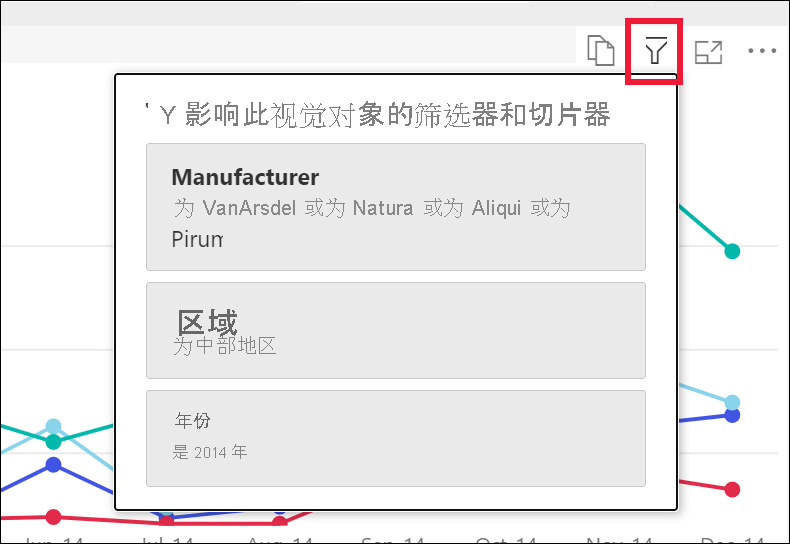

# 在面向使用者的 Power BI 服务中查看报表 

[!INCLUDE[consumer-appliesto-yyny](../includes/consumer-appliesto-yyny.md)]

[!INCLUDE [power-bi-service-new-look-include](../includes/power-bi-service-new-look-include.md)]

报表由一页或多页的视觉对象组成。 报表是由 Power BI 设计者  创建，[并直接与使用者  共享](end-user-shared-with-me.md)或作为[应用](end-user-apps.md)的一部分共享。 

打开报表有许多不同的方式，我们将介绍其中两种：从“主页”打开以及从“仪表板”打开。 

<!-- add art-->

## 从 Power BI 主页打开报表
让我们打开一个已直接与你共享的报表，然后打开一个已作为应用一部分共享的报表。

   

### 打开已与你共享的报表
Power BI 设计器可以直接与你共享单个报表，方法是通过电子邮件中的链接或将其自动添加到 Power BI 内容  。 通过此方式共享的报表会显示在导航窗格上的“与我共享”容器中，以及“主页”画布上的“与我共享”部分中   。

1. 打开 Power BI 服务 (app.powerbi.com)

2. 从导航窗格中选择“主页”  ，以显示“主页”画布。  

   
   
3. 向下滚动，直至看到“与我共享”为止  。 查找报表图标 。 此屏幕截图中有一个仪表板和一个报表。 该报表的名称为“销售和市场营销示例”  。 
   
   

4. 只需选择报表卡片即可打开该报表  。

   

5. 请注意左侧的选项卡。  每个选项卡表示一个报表页  。 当前已打开“增长机会”页面  。 选择“YTD 类别”选项卡以打开该报表页  。 

   

6. 请注意右侧的“筛选器”窗格  。 已应用于此报表页或整个报表的筛选器将显示在此处。

7. 将鼠标悬停在报表视觉对象上可显示多个图标和“更多选项”(…)  。若要查看应用于特定视觉对象的筛选器，请选择筛选器图标。 我们在此处选择了“总单位数（按滚动周期和区域）”折线图的筛选器图标  。

   

6. 现在，我们看到的是整个报表页。 若要更改页面的显示（缩放），请从右上角选择“视图”下拉列表，然后选择“实际大小”  。

   

   

可通过多种方式与报表进行交互，从而发现见解并做出业务决策。  使用左侧的目录，可阅读有关 Power BI 报表的其他文章。 

### 打开属于应用一部分的报告
如果你收到了来自同事或 AppSource 的应用，则可以从导航窗格上的“主页”页面和“应用”容器中获取这些应用  。 [应用](end-user-apps.md)是仪表板和报表的集合，这些仪表板和报表通过 Power BI 设计器捆绑到一起  。

### 先决条件
若要继续操作，请下载“销售和营销”应用。
1. 在浏览器中，导航到 appsource.microsoft.com。
1. 搜索“销售和营销”，然后选择“Microsoft 示例 - 销售和营销”  。
1. 选择“立即获取” > “继续” > “安装”以在应用容器中安装应用    。 

可以从应用容器或主页打开应用。
1. 从导航窗格中选择“主页”，返回到“主页”页面  。

7. 向下滚动，直至看到“我的应用”为止  。

   

8. 选择新的“销售和市场营销”  应用，将其打开。 根据应用设计器设置的选项，应用将打开一个仪表板或一个报表  。 此应用打开的是仪表板。  

## 从仪表板中打开报表
可以从仪表板中打开报表。 大多数仪表板磁贴[磁贴](end-user-tiles.md)都是从报表固定的  。 选择磁贴将打开用于创建此磁贴的报表。 

1. 从仪表板中，选择一个磁贴。 在此示例中，我们已选择“本年累计单位总计…”  柱形图磁贴。

    

2.  关联的报表将打开。 请注意，我们处于“本年累计类别”页上  。 这是包含我们从仪表板中选择的柱形图的报表页。

    

> [!NOTE]
> 并非所有磁贴都会打开报表。 如果你选择了[使用问答创建](end-user-q-and-a.md)的磁贴，则问答屏幕将打开。 如果选择[使用仪表板“添加磁贴”小组件创建的](../create-reports/service-dashboard-add-widget.md)磁贴，可能出现几种不同的情况：可能会播放视频、打开网站等  。  

##  其他打开报表的更多方法
能够熟练地导航 Power BI 服务之后，即可找到最适合自己的工作流。 下面是访问报表的其他几种方法：
- 从导航窗格中使用[收藏夹](end-user-favorite.md)和[最近](end-user-recent.md)    
- 使用[相关视图](end-user-related.md)    
- 在电子邮件中，有人[与你共享](../collaborate-share/service-share-reports.md)或你已[设置警报](end-user-alerts.md)时    
- 从你的[通知中心](end-user-notification-center.md)    
- 来自工作区
- 其他更多方法

## 后续步骤
[打开并查看仪表板](end-user-dashboard-open.md)    
[报表筛选器](end-user-report-filter.md)

