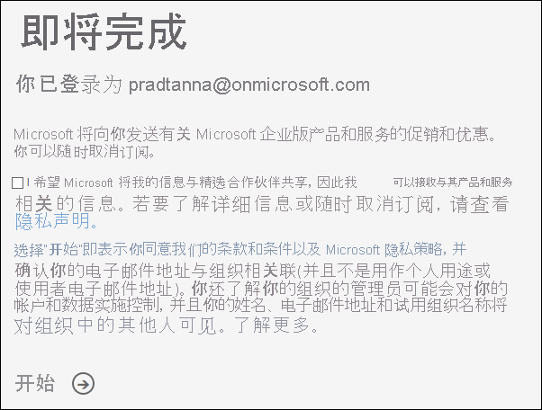

# 登录 Power BI 服务

[!INCLUDE[consumer-appliesto-yynn](../includes/consumer-appliesto-yynn.md)]

## Power BI 帐户
首先需要一个帐户，然后才能登录 Power BI。 有两种方法可用于获取 Power BI 帐户。 第一种是组织为其员工购买 Power BI 许可证。 第二种是[个人注册免费试用版或个人许可证](../fundamentals/service-self-service-signup-for-power-bi.md)。 本文涵盖第一种方案。

## 首次登录

### 第 1 步：打开 Power BI 服务
Power BI 服务在浏览器中运行。 

- 如果收到了同事的电子邮件，其中包含指向仪表板或报表的链接，请选择此链接打开此报表或打开此仪表板。

        

- 否则，打开偏好的浏览器并输入 app.powerbi.com。

        

### 第 2 步：键入你的电子邮件地址
首次登录时，Microsoft 会检查是否已有 Microsoft 365 帐户。 在下面的示例中，Pradtanna 已经拥有可用于其他 Microsoft 服务的许可证。 

输入密码。 这是你的 Microsoft 365 帐户密码。 它与其他 Microsoft 产品（如 Outlook 和 Office）使用的电子邮件和密码相同。  根据帐户的设置方式，系统可能还会提示你输入发送到电子邮件或移动设备的验证码。   

有时，全局管理员会向你分配许可证，并向你发送一封含有此信息的电子邮件。 在收件箱中查找欢迎电子邮件，然后按照说明进行首次登录。 使用此同一电子邮件帐户进行登录。 
 
### 步骤 3：查看条款和条件
查看条款和条件，如果同意，请选中该复选框，然后选择“开始”。

### 第 4 步：查看主页登陆页面
首次访问之后，Power BI 会打开“主页”登陆页面。 如果“主页”未打开，请从导航窗格中选择它。 

在“主页”上，可以看到有权使用的所有内容。 起初，“主页”上可能不会有太多内容，但不要担心，在你开始与同事一起使用 Power BI 时，内容会发生变化。 还记得你的同事通过电子邮件与你共享的那个报表吗？ 它位于“与我共享”标题下面的主页登陆页面。

如果不希望 Power BI 打开“主页”，可以改为[设置要打开的“特色”仪表板或报表](end-user-featured.md)。 

## 安全地与内容交互
作为使用者，其他人会与你共享内容，而你会与该内容交互以浏览数据并进行业务决策。  进行筛选、切片、订阅、导出和调整大小时，不要担心 — 你的工作不会影响基础数据集或原始共享内容（仪表板和报表）。 Power BI 是供你进行探索和试验的安全空间。 这并不意味着无法保存更改 — 可以保存。 但这些更改只会影响你的内容视图。 还原为原始默认视图如同单击按钮一样简单。

## 注销 Power BI 服务
关闭或注销 Power BI 时，更改会保存，因此可以就在离开的位置处继续。

若要关闭 Power BI，请关闭所使用的浏览器选项卡。 

 

如果共享计算机，则建议在每次关闭 Power BI 时注销。  若要注销，请从右上角选择个人资料图片，然后选择“注销”。  

 

## 疑难解答和注意事项
- 如果已作为个人注册了 Power BI，请通过用于注册的电子邮件地址登录。

- 有些人对 Power BI 使用多个帐户。 如果是这样，在登录时，系统将提示你从列表中选择一个帐户。 

## 后续步骤
[查看 Power BI 应用](end-user-app-view.md)
