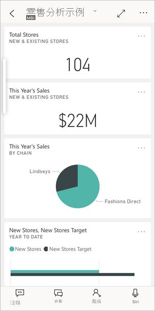

# 快速入门：浏览 Power BI 移动应用中的仪表板和报表
在此快速入门中，可快速了解 Power BI 移动应用，并浏览示例仪表板和报表。 本文展示了 iOS 版 Power BI 应用，但可以在其他设备上轻松地沿用相关操作。

适用于：

|  |  |  |  |
|:--- |:--- |:--- |:--- |
| iPhone | iPad | Android | Windows 10 |

>[!NOTE]
>我们将于 2021 年 3 月 16 日终止对使用 Windows 10 移动版的手机提供 Power BI 移动应用支持。 [了解详细信息](/legal/powerbi/powerbi-mobile/power-bi-mobile-app-end-of-support-for-windows-phones)

仪表板是公司的生命周期和流程的门户。 它是用于监视业务的当前状态的一个概览性的单一区域。 报表是数据的交互式视图，其中的视觉对象表示该数据中不同的发现和见解。 

## 先决条件

* 注册 Power BI：如果未注册 Power BI，请[免费注册](https://app.powerbi.com/signupredirect?pbi_source=web)后再进行操作。
* 为设备安装 Power BI 应用：从 [App Store](https://apps.apple.com/app/microsoft-power-bi/id929738808) (iOS) 或 [Google play](https://play.google.com/store/apps/details?id=com.microsoft.powerbim&amp;amp;clcid=0x409) (Android) 下载 Power BI 移动应用**。
* 下载零售分析示例：本快速入门中的第一步是在 Power BI 服务中下载零售分析示例。 [了解如何将示例下载](./mobile-apps-download-samples.md)到 Power BI 帐户中以开始使用。 请务必选择“零售分析”示例。

完成先决条件并将零售分析示例下载到 Power BI 帐户后，便可以开始学习本快速教程。

## 在移动设备上查看仪表板
1. 在设备上，打开 Power BI 应用，并使用在浏览器中的 Power BI 服务所用的同一 Power BI 帐户凭据登录。
 
1. 现在，请点击“工作区”图标 ，选择“我的工作区”，然后点击“零售分析示例”将其打开 。

    
   
    Power BI 仪表板在移动设备上看起来与在 Power BI 服务中略有不同。 所有磁贴宽度相同，从顶部到底部一个接一个排列。

6. 向下滚动并点击"今年销售额，去年销售额"实心折线图。

    

    它在焦点模式下打开。

7. 在焦点模式下，在图表中点击“4 月”。 4 月的值将显示在图表顶部。

    

8. 点击右上角的“报表”图标  （在 Android 设备上，此图标可能位于屏幕顶部）。 与此磁贴相关的报表在横向模式中打开。

    

9. 点击气泡图中的黄色“040 - 少年”气泡。 请注意它如何突出显示其他图表中的相关值。 

    

10. 向上轻扫以查看横跨底部的工具栏，然后点击“更多选项”(...)。

    

11. 向下滚动列表，然后选择“批注”。

    

12. 在“批注”工具栏上，点击笑脸图标，然后点击要在其中添加一些笑脸的报表页。
 
    

13. 现在，点击右上角的“共享”。

14. 选择所需报表共享方式。  

    

    你可以与组织内外的任何人共享此快照。 如果他们在你的组织中，且具有他们自己的 Power BI 帐户，那么他们也能打开零售分析示例报表。

## 清理资源

完成本快速入门后，可以根据需要删除零售分析示例仪表板、报表和数据集。

1. 打开 Power BI 服务（[Power BI 服务](https://app.powerbi.com)）并登录。

2. 在导航窗格中，选择“我的工作区”。

3. 选择“仪表板”选项卡，然后单击“垃圾箱”。

    

    现在，单击“报表”选项卡，然后执行相同操作。

4. 现在，选择“数据集”选项卡，单击“更多选项”(...)，然后选择“删除” 。 

    

## 后续步骤

本快速入门介绍了移动设备上的示例仪表板和报表。 详细了解 Power BI 服务中的工作。 

> [!div class="nextstepaction"]
> [快速入门：了解 Power BI 服务](../end-user-experience.md)