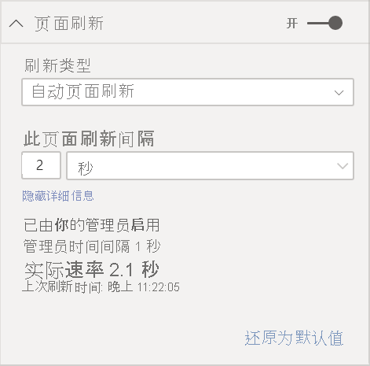
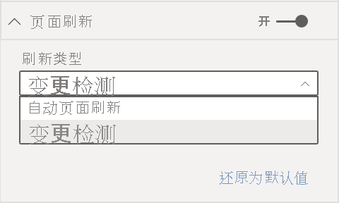
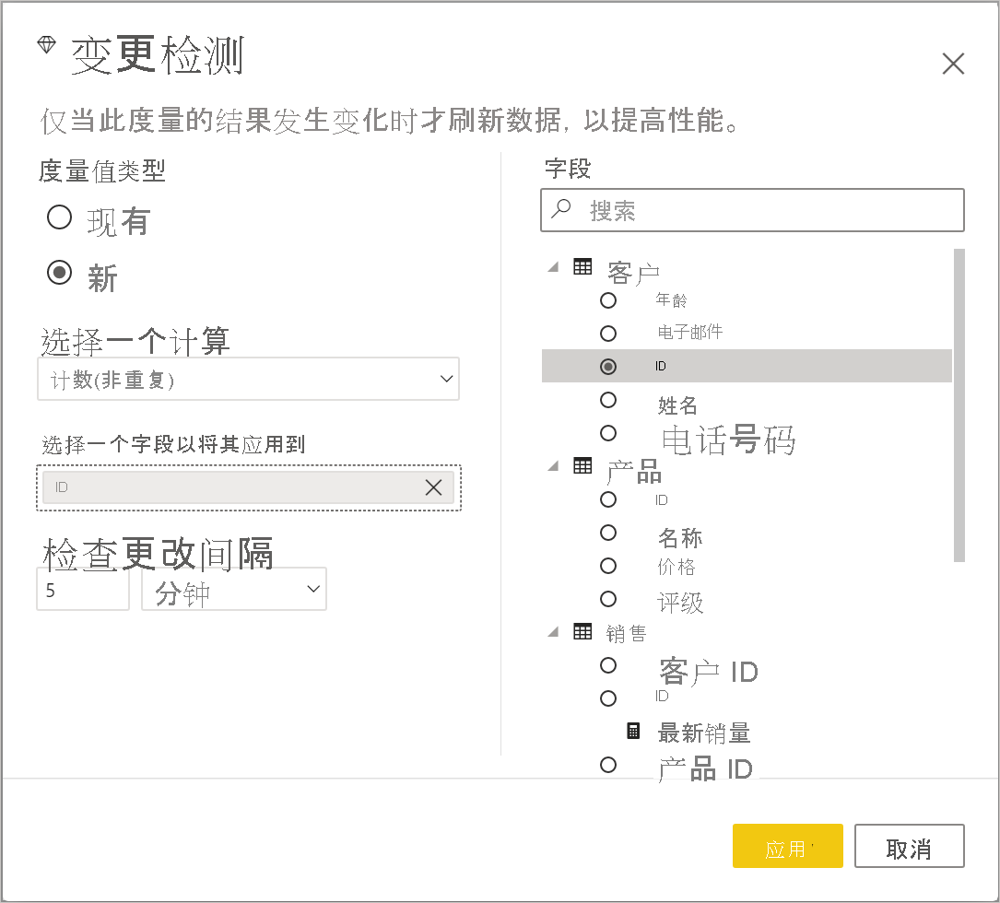
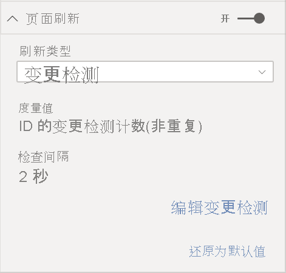
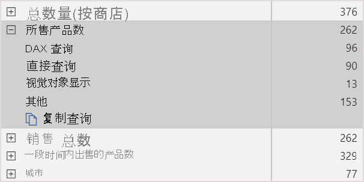
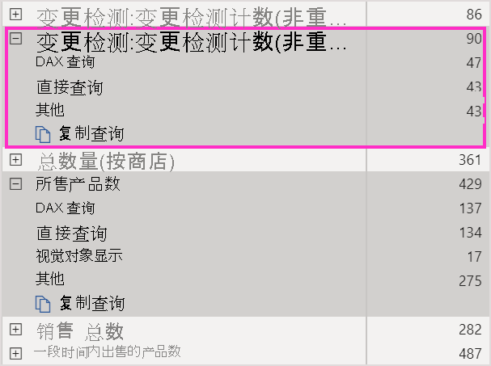
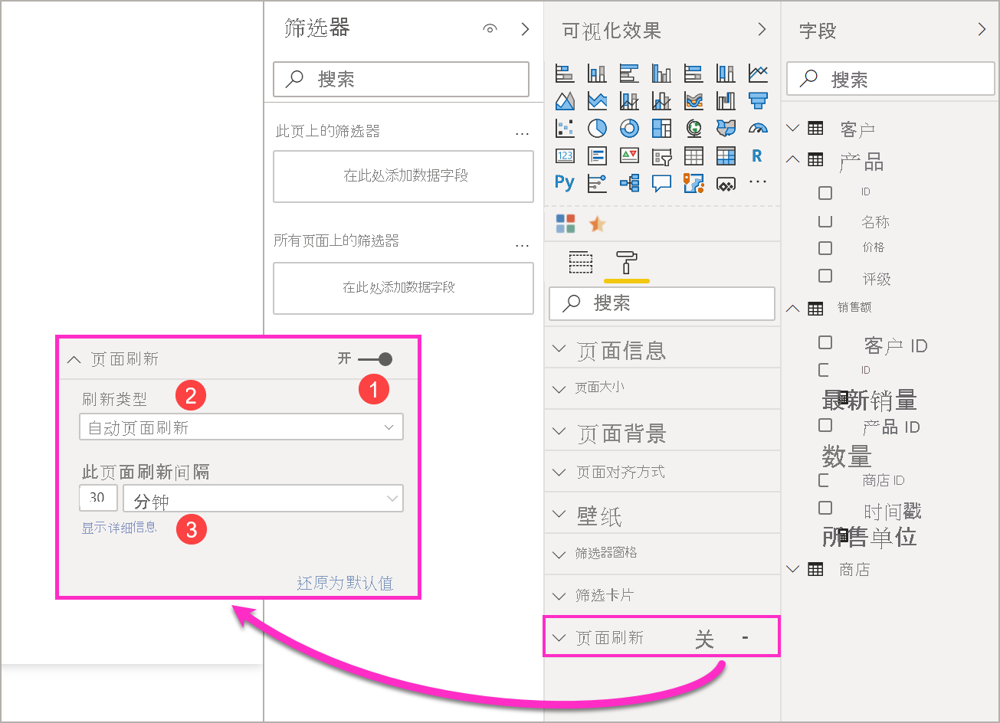
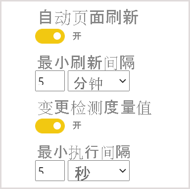

# Power BI 中的自动页面刷新

当监视关键事件时，请务必在源数据更新后尽快刷新数据。 例如，在制造行业，需要了解机器何时出现故障或即将出现故障，这一点很重要。 如果你正在监控社交媒体情绪等信号，你会希望即刻了解突然发生的变化。

借助 Power BI 中的自动页面刷新，活动报表页能够以预定义的频率针对 [DirectQuery 源](../connect-data/desktop-directquery-about.md)查询新数据。

## 刷新类型

使用自动页面刷新时，有两种刷新类型可用：固定间隔和更改检测。

### 固定间隔

通过此刷新类型，你可以基于固定间隔（如 1 秒或 5 分钟）更新报表页中的所有视觉对象。 当达到该特定间隔时，该页中的所有视觉对象都会向数据源发送更新查询并相应地进行更新。

### 更改检测

通过此刷新类型，你可以基于检测数据中的更改而不是特定的刷新间隔来刷新页面上的视觉对象。 具体而言，此度量值会对 [DirectQuery 源](../connect-data/desktop-directquery-about.md)的更改进行轮询。 除了定义度量值外，还必须选择 Power BI Desktop 检查更改的频率。 发布到服务时，此刷新类型仅在作为高级容量一部分的工作区中受支持。

## 在 Power BI Desktop 中创作带有自动页面刷新的报表

自动页面刷新仅适用于 [DirectQuery 源](../connect-data/desktop-directquery-about.md)，因此它仅在连接到 DirectQuery 数据源时才可用。 此限制适用于这两种自动页面刷新类型。

若要在 Power BI Desktop 中使用自动页面刷新，请选择要为其启用自动页面刷新的报表页面。 在“可视化效果”窗格中，选择“格式设置”按钮（油漆滚筒），然后在接近窗格底部的位置找到“页面刷新”部分  。

1. 打开或关闭页面刷新。
2. 刷新类型
3. 输入和信息（取决于刷新类型）

仅当连接到 [DirectQuery 源](../connect-data/desktop-directquery-about.md)时，“页面刷新”卡才可用。 若要启用自动页面刷新，切换需要处于“启用”状态。 所需的输入和提供的信息将取决于所选的刷新类型。

### 固定间隔设置

选择“自动页面刷新”作为刷新类型时，需要提供所需的刷新间隔。 默认值为 30 分钟。 （最小刷新间隔为 1 秒。）报表将按设置的间隔开始刷新。

单击显示详细信息时，Power BI 将提供以下详细信息：

- 管理员是否启用了该功能（仅在登录到 Power BI 帐户时）
- 管理员允许的最小时间间隔（仅在登录到 Power BI 帐户时）
- 实际刷新速率（通常比所选间隔长）
- 上次刷新时间

### 更改检测设置

选择“更改检测”作为刷新类型时，系统会显示“添加更改检测”的链接 。 你还可以从功能区中的“建模”选项卡访问“更改检测”窗口。 然后单击“页面刷新”部分中的“更改检测”图标 。 最后，你可以在“值”框中右键单击或选择任何值旁边的下拉箭头，然后从菜单中选择“更改检测”。

打开窗口后，系统会显示“度量值类型”选项，你可以在其中选择现有度量值或从头开始创建新度量值。 选择现有度量值时，只需从字段列表中选择所需的度量值，或将其拖放到“选择现有度量值”部分即可。 创建新度量值时，你可以在计数、非重复计数、最小值、最大值和总和之间为度量值选择一种计算方式。 例如，可以使用非重复计数来计算客户 ID，并且仅在将新客户添加到列表中时刷新。 选择度量值后，必须定义 Power BI 检查更改的频率。 这是 Power BI 计算度量值和轮询更改的间隔。 单击“应用”后，字段列表中将显示带有更改检测图标的新度量值。

然后，返回到页面刷新部分，你将看到用于更改检测的度量值的信息以及用于参考的已定义间隔。

> [!NOTE]
> 每个模型只允许具有一个更改检测度量值。

## 确定刷新间隔

启用自动页面刷新时，Power BI Desktop 会不断向 DirectQuery 源发送查询。 发送查询后，返回数据之前会有延迟。 因此，对于较短的刷新间隔，应确认查询在配置的间隔内成功返回查询的数据。 如果在间隔内未返回数据，则视觉对象的更新频率将低于配置的频率。

这些注意事项适用于两种刷新类型：固定间隔和更改检测。 主要区别在于，对于更改检测，只有一个查询以固定的时间间隔返回到源，并且仅在更改检测度量值的值更改时才会触发视觉对象刷新。

最佳做法是，刷新间隔应至少符合预期的新数据到达频率：

* 如果新数据以 20 分钟的间隔频率到达源，那么刷新间隔不能小于 20 分钟。
* 如果新数据每秒到达一次，则将间隔设置为 1 秒。

对于低刷新间隔（如 1 秒），请考虑以下因素：

- DirectQuery 数据源的类型
- 查询在其上创建的负载
- 报表查看器与容量数据中心之间的距离

通过使用 Power BI Desktop 中的[性能分析器](desktop-performance-analyzer.md)以及在页面刷新部分的示详细信息菜单中查看获取固定间隔刷新类型，从而估计返回时间。 可以使用性能分析器检查每个视觉对象查询是否有足够的时间从源返回结果。 还可以决定将时间用在何处。 根据性能分析器的结果，可以对数据源进行调整，也可以在报表中试用其他视觉对象和度量值。

此图显示了性能分析器中 DirectQuery 源的结果：

思考下此数据源的一些其他特征：

- 数据以 2 秒的频率到达
- 性能分析器显示最大查询 + 显示时间大约为 4.9 秒（4,688 毫秒）
- 数据源配置为每秒处理大约 1,000 个并发查询
- 预计大约 10 个用户可以同时查看报表

这会得到以下公式：

- **5 个视觉对象 x 10 个用户 = 大约 50 个查询**

此计算结果显示负载比数据源可以支持的负载要多得多。 数据以 2 秒的速率到达，因此此值应为刷新频率。 但是，由于查询大约需要 5 秒钟才能完成，因此应将其设置为超过 5 秒。

另请注意，在将报表发布到服务时，此结果可能会有所不同。 出现这种差异的原因是，报表将使用在云中托管的 Azure Analysis Services 实例。 可能需要相应地调整刷新频率。

考虑到查询和刷新计时，Power BI 只有在所有剩余刷新查询全部完成后，才会运行下一个刷新查询。 因此，即使刷新间隔时间短于处理查询所用的时间，Power BI 也只会在剩余查询完成后才再次刷新。

对于更改检测刷新类型，这些注意事项仍然适用。 此外，[性能分析器](desktop-performance-analyzer.md)将显示更改检测度量值查询的结果，即使它与报表中的任何视觉对象均不匹配。 我们为你提供了此功能，以便你能够按照前面提到的相同指导对此类特定类型的度量值进行故障排除。 此刷新类型的主要区别在于，只有一个查询将发送到数据源，而不是来自所有视觉对象的所有查询。 如果多个用户正在查看报表，情况仍然如此。

对于我们之前讨论的相同情况：

- 用于 5 个视觉对象的 1 个更改检测度量值仅生成一个用于任何数量的查看器的查询

- 当更改检测度量值触发更新时，假设与之前的情况相同：5 个视觉对象 x 10 个用户 = 大约 50 个查询

总之，在使用更改检测时，只有一个查询发送到数据源，直到检测到更改。 发生这种情况时，将应用用于固定间隔刷新类型的相同逻辑，为生成相同查询数量的所有用户更新所有视觉对象。 这种方法在长时间运行时应该更有效。

现在，我们来看看如何才能以容量管理员的身份检测和诊断性能问题。 还可以查看本文后面的[常见问题解答](#frequently-asked-questions)部分，以获取有关性能和故障排除的更多问题和答案。

## Power BI 服务中的自动页面刷新

还可为已发布到 Power BI 服务的报表设置自动页面刷新，前提是数据源为 [DirectQuery](../connect-data/desktop-directquery-about.md)。

若要为 Power BI 服务中的报表配置自动页面刷新，则步骤类似于 Power BI Desktop。 在 Power BI 服务中配置时，自动页面刷新还支持[嵌入式 Power BI](../developer/embedded/embedding.md) 内容。 此图显示了 Power BI 服务的“页面刷新”配置：

1. 打开或关闭页面刷新。
2. 刷新类型
3. 输入和信息（取决于刷新类型）

> [!NOTE]
> 将启用了自动页面刷新的报表从 Power BI Desktop 发布到服务时，必须在“数据集设置”菜单中为 DirectQuery 数据源提供凭据。 可以设置凭据，以便报表查看器可使用自己的标识访问此数据源，同时遵从在源上设置的任何安全性。 对于更改检测度量值，将始终使用作者的凭据进行对其评估。

### 页面刷新间隔

Power BI 服务中允许的页面刷新类型和间隔受报表的工作区类型影响。 这适用于以下方案：

* 将报表发布到启用了自动页面刷新的工作区
* 编辑工作区中已有的页面刷新间隔
* 直接在服务中创建报表

Power BI Desktop 对刷新间隔没有限制，刷新间隔可以是 1 秒。 但是，在将报表发布到 Power BI 服务时，会应用某些限制，这在以下部分中进行了介绍。

### 对刷新间隔的限制

在 Power BI 服务中，基于发布报表的工作区、是否使用高级服务以及高级容量管理设置来对自动页面刷新应用限制。

为了阐明这些限制的工作原理，我们先了解一些容量和工作区背景知识。

容量是重要的 Power BI 概念。 它们表示用于托管和交付 Power BI 内容的一组资源（存储、处理器和内存）。 容量可以是共享容量，也可以是专用容量。 共享容量与其他 Microsoft 客户共享。 专用容量完全提交给单个客户。 有关专用容量的介绍，请参阅[管理高级容量](../admin/service-premium-capacity-manage.md)。

在共享容量中，工作负载可在与其他客户共享的计算资源上运行。 由于容量需要共享资源，因此会施加限制以确保“公平竞争”，如设置最大模型大小 (1 GB) 和每日最大刷新频率（每天 8 次）。

Power BI 工作区驻留在容量范围内。 它们表示安全性、协作和部署容器。 每个 Power BI 用户都有一个称为“我的工作区”的个人工作区。 可创建其他工作区来启用协作和部署。 它们称为“工作区”。 默认情况下，工作区（包括个人工作区）在共享容量中创建。

下面介绍了两个工作区方案的一些详细信息：

共享工作区。 对于常规工作区（不属于高级容量的工作区），自动页面刷新的最小间隔为 30 分钟（允许的最小间隔）。 更改检测刷新类型在共享容量中不可用。

高级工作区。 自动页面刷新在高级工作区（同时适用于固定间隔和更改检测）中的可用性取决于高级管理员为 Power BI Premium 容量设置的工作负载设置。 有两个变量可能会影响你对自动页面刷新的设置：

 - 功能启用/禁用。 如果容量管理员已禁用该功能，你将无法在已发布的报表中设置任何类型的页面刷新。 固定间隔和更改检测可以单独打开和关闭。

 - 最小刷新间隔。 为固定间隔启用自动页面刷新时，容量管理员需要设置最小刷新间隔（默认值为五分钟）。 如果你的间隔低于最小值，Power BI 服务将覆盖你的间隔，以遵循容量管理员设置的最小间隔。

 - **最小执行间隔**。 启用更改检测时，容量管理员需要设置最小执行间隔（默认值为五秒）。 如果你的间隔低于最小值，Power BI 服务将覆盖你的间隔，以遵循容量管理员设置的最小间隔。

此表详细介绍了提供此功能的位置，以及针对每种容量类型和[存储模式](../connect-data/service-dataset-modes-understand.md)的限制：

| 存储模式 | 专用容量 | 共享容量 |
| --- | --- | --- |
| DirectQuery | 支持 FI：是  支持 CD：是  **最小值**：1 秒  管理员覆盖：是 | 支持 FI：是  支持 CD：否  **最小值**：30 分钟  管理员覆盖：否 |
| 导入 | 支持 FI：否  支持 CD：否  **最小值**：不适用  管理员覆盖：不适用 | 支持 FI：否  支持 CD：否  **最小值**：不适用  管理员覆盖：不适用 |
| 混合模式（DirectQuery + 其他数据源） | 支持 FI：是  支持 CD：是  **最小值**：1 秒  管理员覆盖：是 | 支持 FI：是  支持 CD：否  **最小值**：30 分钟  管理员覆盖：否 |
| 实时连接 AS | 支持 FI：否  支持 CD：否  **最小值**：不适用  管理员覆盖：不适用 | 支持 FI：否  支持 CD：否  **最小值**：不适用  管理员覆盖：不适用 |
| 实时连接 PBI | 支持 FI：否  支持 CD：否  **最小值**：不适用  管理员覆盖：不适用 | 支持 FI：否  支持 CD：否  **最小值**：不适用  管理员覆盖：不适用 |

*表格图例：*
1. FI：固定间隔
2. CD：更改检测

## 注意事项和限制

在 Power BI Desktop 或 Power BI 服务中使用自动页面刷新时，需注意以下几点：

* 自动页面刷新不支持导入、LiveConnect 和推送存储模式。  
* 支持具有至少一个 DirectQuery 数据源的复合模型。
* Power BI Desktop 对刷新间隔没有限制。 对于固定间隔和更改检测刷新类型，间隔可为每秒钟。 将报表发布到 Power BI 服务时，会应用某些限制，如本文[前面](#restrictions-on-refresh-intervals)所述。
* 每个数据集只能有一个更改检测度量值。
* 在 Power BI 租户中，最多只能有 10 个具有更改检测度量值的模型。

### 性能诊断

自动页面刷新适用于监视方案和浏览快速变化的数据。 但有时可能会对容量或数据源施加过多负载。

为了防止数据源上的负载过大，Power BI 具有以下安全措施：

- 所有自动页面刷新查询都以较低的优先级运行，以确保交互式查询（如页面负载和交叉筛选视觉对象）优先。
- 如果查询未在下一个刷新周期之前完成，Power BI 不会发出新的刷新查询，直到上一个查询完成为止。 例如，如果刷新间隔为 1 秒，并且查询平均 4 秒执行一次，则 Power BI 每隔 4 秒才会有效地发出一次查询。

在以下两个方面仍会遇到性能瓶颈：

1. 容量。 查询首先会命中高级容量，高级容量将折叠从报表可视化效果生成的 DAX 查询并将其评估为源查询。
2. DirectQuery 数据源。 然后，上一步中的已转换查询将针对源运行。 源可以是 SQL Server 实例、SAP Hana 源等。

使用管理员可用的 [Premium Capacity Metrics 应用](../admin/service-admin-premium-monitor-capacity.md)，可以可视化低优先级查询使用的容量大小。

低优先级查询包括自动页面刷新查询和模型刷新查询。 目前没有办法区分来自自动页面刷新和模型刷新查询的负载。

如果你注意到使用低优先级查询时容量过载，可以执行以下几个操作：

- 请求更大的高级 SKU。
- 请求报表所有者减少刷新间隔时间。
- 在容量管理门户中，可以：
   - 禁用该容量的自动页面刷新。
   - 增加最小刷新间隔时间，这将对该容量中的所有报表产生影响。

### 常见问题解答

我是报表作者。**我在 Power BI Desktop 上将报表刷新间隔定义为 1 秒，但在发布报表后，报表未在服务中刷新。**

* 确保为该页面启用了自动页面刷新。 由于此设置是针对每个页面的，因此需要确保报表中要刷新的每个页面上都启用了此设置。
* 检查是否已上传到具有附加高级容量的工作区。 如果尚未执行此操作，刷新间隔将锁定为 30 分钟的固定间隔，且无法进行更改检测。
* 如果报表位于高级工作区中，请询问管理员是否已为附加容量启用了此功能。 此外，请确保容量的最小刷新间隔等于或小于报表的间隔。 这分别适用于固定间隔和更改检测

我是容量管理员。**我更改了自动页面刷新间隔设置，但这些更改没有反映出来。换句话说，报表未按预期频率进行刷新，或者不刷新，即使我启用了自动页面刷新也是如此。**

* 在容量管理 UI 中所做的自动页面刷新设置更改需要最多 5 分钟的时间才会传播到报表中。
* 除了为容量启用自动页面刷新外，还需要为要启用的报表页面启用自动页面刷新。
* 两种刷新类型都是单独管理的，因此请确保启用的刷新类型已打开。

我的报表在混合模式下运行。 **（混合模式意味着报表具有 DirectQuery 连接和“导入”数据源。）某些视觉对象不会刷新。**

- 如果视觉对象引用“导入”表，那么这是预期行为。 “导入”不支持自动页面刷新。
- 请参阅本节中的第一个问题。

我的报表在服务中正常刷新，但随后突然停止。

* 尝试刷新页面，查看问题是否能自行解决。
* 请咨询你的容量管理员。管理员可能已关闭该功能或提高了最小刷新间隔。 （请参阅本节中的第二个问题。）

我是报表作者。**我的视觉对象未按我指定的频率刷新。它们的刷新频率更低。**

* 如果查询运行时间较长，刷新间隔将会延迟。 自动页面刷新会等待所有查询完成，然后才会运行新查询。
* 容量管理员设置的最小刷新间隔可能大于你在报表中设置的最小刷新间隔。 要求容量管理员降低最小刷新间隔。

是否从缓存中执行自动页面刷新查询？

* 否。 所有自动页面刷新查询将绕过任何缓存的数据。

**我的更改检测度量值未触发任何更新**

* 确保为页面打开更改检测。 由于此设置是针对每个页面的，因此需要确保报表中要刷新的每个页面上都启用了此设置。
* 检查是否已上传到具有附加高级容量的工作区。 如果尚未执行此操作，更改检测将不起作用。
* 如果报表位于高级工作区中，请询问管理员是否已为附加容量启用了此功能。 此外，请确保容量的最小执行间隔等于或小于报表的间隔。
* 检查前面提到的所有项之后，在 Power BI Desktop 中或在编辑模式下检查度量值是否发生更改。 为此，请将其拖动到画布中，并查看值是否更改。 如果没有，则度量值可能不是轮询数据源更改的最佳选择。

## 后续步骤

有关详细信息，请参阅以下文章：

* [在 Power BI 中使用 DirectQuery](../connect-data/desktop-directquery-about.md)
* [在 Power BI Desktop 中使用复合模型](../transform-model/desktop-composite-models.md)
* [使用性能分析器检查报表元素性能](desktop-performance-analyzer.md)
* [部署和管理 Power BI Premium 容量](../guidance/whitepaper-powerbi-premium-deployment.md)
* [Power BI Desktop 中的数据源](../connect-data/desktop-data-sources.md)
* [在 Power BI Desktop 中调整和合并数据](../connect-data/desktop-shape-and-combine-data.md)
* [通过 Power BI Desktop 连接到 Excel 工作簿](../connect-data/desktop-connect-excel.md)   
* [直接将数据输入到 Power BI Desktop 中](../connect-data/desktop-enter-data-directly-into-desktop.md)   
