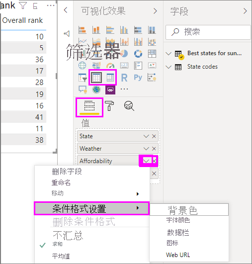
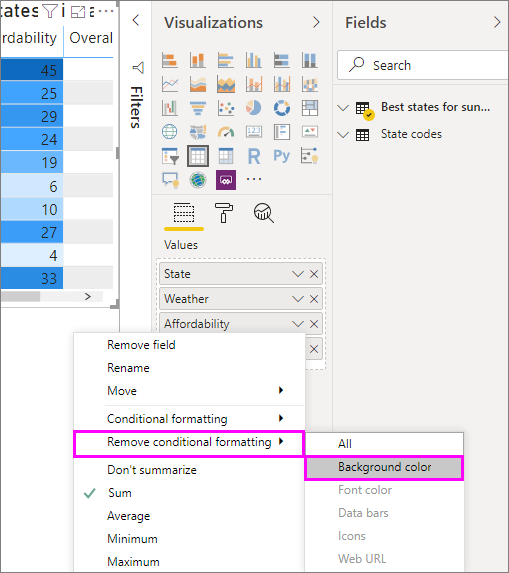
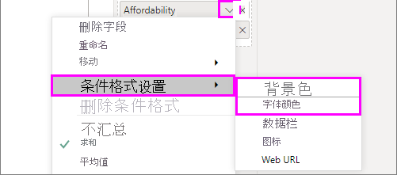
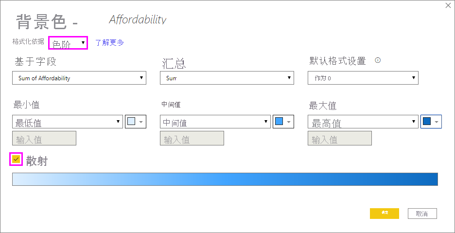
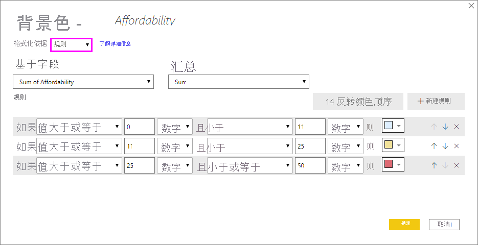
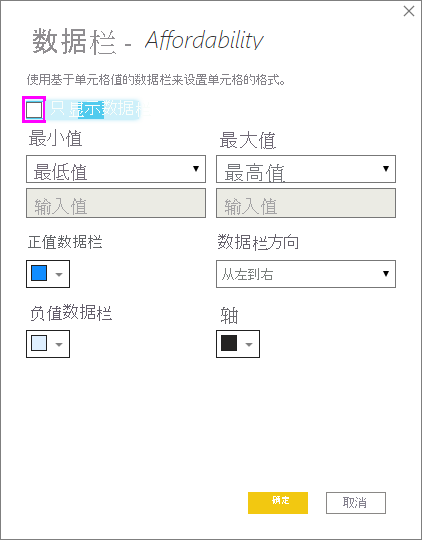
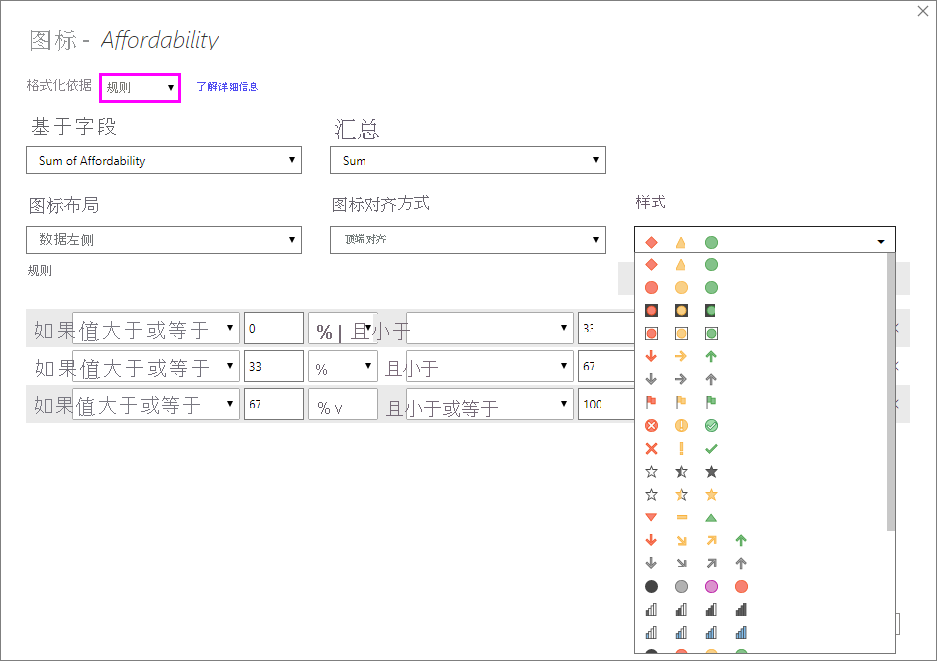

# 使用表格中的条件格式设置 

通过 Power BI Desktop 中表格的条件格式设置，你可以根据单元格值指定自定义单元格背景色，包括使用渐变色。 还可以用数据栏、KPI 图标或 web 链接来表示单元格值。 可以将条件格式应用到任何文本或数据字段，只要你基于具有数字、颜色名称或十六进制代码的字段，或 web URL 值来设置格式即可。 

若要应用条件格式，请在 Power BI Desktop 中选择“表”和“矩阵”可视化效果 。 在“可视化效果”窗格的“字段”部分中，右键单击或选择要进行格式设置的“值”井中字段旁边的向下箭头  。 选择“条件格式”，然后选择要应用的格式设置类型。

> [!NOTE]
> 条件格式将覆盖任何应用于有条件格式的单元的自定义背景或字体颜色。

若要从可视化效果中删除条件格式，请从字段的下拉菜单中选择“删除条件格式”，然后选择要删除的格式类型。

以下各节介绍了每个条件格式选项。 可以将多个选项组合到一个表列里。

## 设置背景或字体颜色

若要设置背景或字体颜色，请为字段选择“条件格式”，然后从下拉菜单中选择“背景颜色”或“字体颜色”  。 

“背景颜色”或“字体颜色”对话框将会打开，并在标题中显示正在进行格式设置的字段的名称 。 在选择条件格式选择后，选择“确定”。 

“背景颜色”和“字体颜色”选项相同，但分别影响单元格背景颜色和字体颜色 。 可以将相同或不同的条件格式应用到字段的字体设置和背景设置。 如果将字段的字体和背景设置为相同的颜色，则该字体会与背景融为一体，因此表列只显示颜色。

## 按色阶设置颜色

若要按色阶设置单元格背景或字体颜色，请在“背景颜色”或“字体颜色”的“格式设置依据”字段中选择“色阶”   。 在“基于字段”下，选择要作为格式设置基础的字段。 可基于当前字段或模型中具有数字或颜色数据的任何字段设置格式。 

在“汇总”下，指定要用于所选字段的聚合类型。 在“默认格式设置”下，选择要用于空白值的格式。 

在“最小值”和“最大值”下，选择是要基于最低和最高字段值，还是是要基于输入的自定义值应用配色方案 。 下拉然后选择要应用到最小值和最大值的色卡。 选择“散射”复选框，以指定“中心”值和颜色 。 

“可购性”列上按色阶设置背景格式的示例表如下：

“可购性”列上按色阶设置字体格式的示例表如下：

## 按规则切换颜色

若要按规则设置单元格背景或字体颜色，请在“背景颜色”或“字体颜色”的“格式设置依据”字段中选择“规则”   。 再次强调，“基于字段”显示格式设置基于的字段，“汇总”显示字段的聚合类型 。 

在“规则”下，输入一个或多个值范围，并设置每个值范围的颜色。 每个值范围都有 If 值条件、and 值条件和一种颜色 。 单元格背景或每个值范围中的字体都以给定的颜色着色。 以下示例具有三个规则：

“可购性”列上基于规则设置背景颜色格式的示例表如下：

## 根据颜色值着色

如果具有使用颜色名称或十六进制值数据的字段或度量值，则可以使用条件格式自动将这些颜色应用于列的背景或字体颜色。 还可以使用自定义逻辑向字体或背景应用颜色。

该字段可以使用 [https://www.w3.org/TR/css-color-3/](https://www.w3.org/TR/css-color-3/) 处的 CSS 颜色规范中列出的任何颜色值。 这些颜色值可以包括：
- 3、6 或 8 位十六进制代码，例如 #3E4AFF。 确保代码的开头包含 # 符号。 
- RGB 或 RGBA 值，如 RGBA(234, 234, 234, 0.5)。
- HSL 或 HSLA 值，如 HSLA(123, 75%, 75%, 0.5)。
- 颜色名称，如 Green、SkyBlue 或 PeachPuff。 

下表具有与每个状态关联的颜色名称： 

若要根据字段值对“颜色”列进行格式设置，请为“颜色”字段选择“条件格式”，然后选择“背景颜色”或“字体颜色”    。 

在“背景颜色”或“字体颜色”对话框中，从“格式设置依据”下拉字段中选择“字段值”   。

“颜色”字段上基于颜色字段值设置背景颜色格式的示例表如下 ：

如果还使用“字段值”设置列的“字体颜色”，则结果为“颜色”列中的纯色  ：

## 基于计算设置颜色

可以创建计算，基于你选择的业务逻辑条件输出不同的值。 创建公式通常比在条件格式对话框中创建多个规则更快。 

例如，以下公式基于现有的“可购性”列值将十六进制颜色值应用到新的“可购性排名”列 ：

若要应用颜色，请为“可购性”列选择“背景颜色”或“字体颜色”条件格式，并基于“可购性排名”列的“字段值”进行格式设置    。 

“可购性”背景颜色基于计算的“可购性排名”的示例表如下所示 ：

可以创建多个版本，只需动用你的想象力和一些计算即可。

## 添加数据栏

若要基于单元格值显示数据栏，请为“可购性”字段选择“条件格式”，然后从下拉菜单中选择“数据栏”  。 

在“数据栏”对话框中，默认情况下“仅显示数据条”选项处于未选中状态，因此表格单元格同时显示数据条和实际值 。 若要仅显示数据栏，请选择“仅显示栏”复选框。

可以指定“最小”和“最大”值、数据栏颜色和方向，以及轴颜色 。 

将数据栏应用到“可购性”列的示例如下所示：

## 添加图标

若要显示基于单元格值的图标，请为字段选择“条件格式”，然后从下拉菜单中选择“图标” 。 

在“图标”对话框中的“格式设置依据”下，选择“规则”或“字段值”   。 

若要按规则设置格式，请选择“基于字段”、“汇总”方法、“图标布局”、“图标对齐”、“图标样式”和一个或多个“规则”     。 在“规则”下，输入一个或多个包含 If 值条件和 and 值条件的规则，并选择要应用于每个规则的图标 。 

若要按字段值设置格式，请选择“基于字段”、“汇总”方法、“图标布局”和“图标对齐”   。

以下示例基于三个规则添加图标：

选择“确定”。 将图标根据规则应用到“可购性”列的示例如下所示：

## 格式设置为 web URL

如果有包含网站 URL 的列或度量值，可以使用条件格式将这些 URL 作为活动链接应用到字段。 例如，下表有一个“网站”列，其中包含每个状态的网站 URL：

若要将每个状态名称显示为指向其网站的实时链接，请为“状态”字段选择“条件格式”，然后选择“Web URL”  。 在“Web URL”对话框中的“基于字段”下，选择“网站”，然后选择“确定”   。 

“Web URL”格式应用到“状态”字段后，每个状态名称都是指向其网站的活动链接 。 下面的示例表中，“Web URL”格式应用到“状态”列，条件“数据栏”和“背景格式设置”应用到“可购性”列    。 

## 总计和小计

从 2020 年 4 月发行版开始，可以对表和矩阵视觉对象应用条件格式规则，以便进行总计和小计。 

可通过使用条件格式中的“应用于”下拉框来应用条件格式规则，如下图所示。

必须手动设置条件格式规则的阈值和范围。 对于矩阵，值是指矩阵层次结构的最低可见级别。

## 注意事项和限制
使用条件表格式设置时需要牢记几个注意事项：

- 条件格式仅适用于表或矩形视觉对象的值，不适用于任何小计、总计或“共计”行。 
- 不包含分组的任何表都显示为不支持条件格式设置的单个行。
- 如果数据包含 NaN 值，则无法应用具有自动最大/最小值的渐变格式，或具有百分比规则的基于规则的格式设置。 NaN 表示“不是数字”，最常见的原因是被零除错误。 可以使用 [DIVIDE() DAX 函数](/dax/divide-function-dax)来避免这些错误。
- 条件格式需要对值应用聚合或度量值。 因此“按值着色”示例中显示了“最先”或“最后”。 如果要针对 Analysis Services 多维数据集生成报表，则将无法使用属性进行条件格式设置，除非多维数据集所有者生成了提供值的度量值。

## 后续步骤

有关颜色格式设置的详细信息，请参阅 [ Power BI 中的颜色格式设置提示和技巧](../visuals/service-tips-and-tricks-for-color-formatting.md)