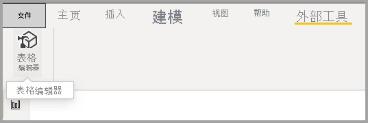
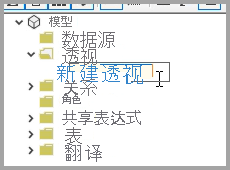
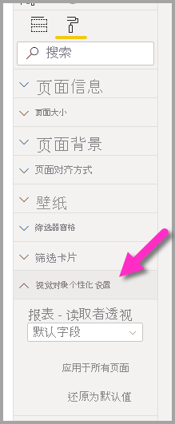
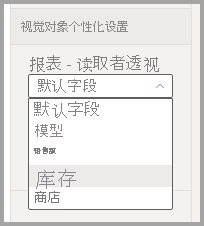
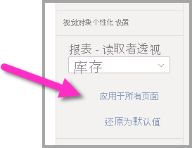

# 允许用户在报表中个性化设置视觉对象

[!INCLUDE [applies-to](../includes/applies-to.md)] [!INCLUDE [yes-desktop](../includes/yes-desktop.md)] [!INCLUDE [yes-service](../includes/yes-service.md)]

当你与广泛用户共享报表时，某些用户可能想要查看特定视觉对象的略有不同的视图。 他们可能想要交换轴上的内容，更改视觉对象类型，或在工具提示中添加一些内容。 很难让一个视觉对象满足每个人的要求。 利用这项新功能，你可以让使用者浏览和个性化设置视觉对象，所有这一切都可在报表阅读视图中实现。 他们可以按所需方式调整视觉对象，并将其另存为书签以供稍后访问。 他们无需具有报表的编辑权限，也无需返回到报表作者进行更改。

:::image type="content" source="media/power-bi-personalize-visuals/power-bi-personalize-visual.png" alt-text="个性化设置视觉对象":::
 
## 报表使用者可以更改的内容

利用此功能，使用者可以通过临时浏览 Power BI 报表上的视觉对象进行深入了解。 若要了解使用者如何使用此功能，请参阅[个性化报表中的视觉对象](../consumer/end-user-personalize-visuals.md)。 此功能非常适合希望为其报表读者启用基本浏览方案的报表创建者。 下面是报表读者可以进行的修改：

- 更改可视化效果类型
- 交换度量值或维度
- 添加或删除图例
- 比较两个或多个度量值
- 更改聚合等

此功能不仅允许新的探索功能。 它还包括使用者捕获和共享其更改的方式：

- 捕获他们的更改
- 共享他们的更改
- 重置他们对报表的所有更改
- 重置他们对视觉对象的所有更改
- 清除他们最近的更改

## 使用透视查看更有着重点的视图

对于个性化视觉对象，你可以使用透视来选择可提供更有着重点的视图的模型子集。 选择子集对于使用大型数据模型很有帮助，使你能够专注于可管理的字段子集，并且不会让报表读者因面对该大型模型中的完整字段集合而感到不知所措。 

使用透视时，请牢记下列注意事项：

* 透视的用途不是为了作为一种安全机制，而是作为一个可为最终用户提供更好体验的工具。 透视的所有安全性都从基础模型继承。

* 支持表格和多维模型中的透视。 但是，对于多维模型中的透视，只能将透视设置为与报表的基础多维数据集的透视相同。

* 在从模型中删除透视之前，请务必确认该透视未在个性化视觉对象体验中使用。 

若要使用透视，必须为报表启用个性化视觉对象。 还必须至少创建一个透视，其中包括希望最终用户与之交互的维度和度量值，以获得个性化视觉对象体验。

若要创建透视，请使用可以从以下位置下载的[表格编辑器](https://tabulareditor.com/)：表格编辑器下载

安装“表格编辑器”后，在“Power BI Desktop”中打开报表，然后从功能区的“外部工具”选项卡中启动“表格编辑器”，如下图所示   。

在“表格编辑器”中，右键单击“透视”文件夹以创建新的透视。

可以双击文本以重命名透视。

接下来，在“表格编辑器”中打开“表”文件夹，右键单击要在透视中显示的字段，以将字段添加到透视中。

对要添加到透视的每个字段重复此过程。 无法在透视中添加重复字段，因此已添加到透视的任何字段都将禁用添加它的选项。

添加所有需要的字段后，请确保在“表格编辑器”和 Power BI Desktop 中保存设置。

将新的透视保存到模型并保存 Power BI Desktop 报表后，导航到页面的“格式”窗格，其中显示了“个性化视觉对象”这一新部分 。

“报表 - 读取者透视”的选项最初设置为“默认字段” 。 选择下拉箭头后，可看到已创建的其他透视。

设置报表页的透视后，该页面的个性化视觉对象体验将筛选为所选透视。 选择“应用于所有页面”，可以将透视设置应用于报表中的所有现有页面。

## 启用预览功能

由于此功能处于预览阶段，因此需要首先打开此功能开关。 转到“文件” > “选项和设置” > 选项”  。 在“全局设置”>“预览功能”中，确保选中“个性化设置视觉对象”  。

:::image type="content" source="media/power-bi-personalize-visuals/power-bi-preview-personalize-visual.png" alt-text="启用“个性化设置视觉对象”":::

可能需要重启 Power BI Desktop 才能在当前文件的“设置”中看到该选项。

## 启用“在报表中进行个性化设置”

打开预览开关后，需要为希望使用者能够为其个性化设置视觉对象的报表专门启用此开关。

可以在 Power BI Desktop 或 Power BI 服务中启用此功能。

### 在 Power BI Desktop 中

若要在 Power BI Desktop 中启用此功能，请转到“文件” > “选项和设置” > “选项” > “当前文件” > “报表设置”    。 确保已启用“个性化设置视觉对象(预览)”。

:::image type="content" source="media/power-bi-personalize-visuals/power-bi-report-settings-personalize-visual.png" alt-text="启用“在报表中进行个性化设置”":::

### 在 Power BI 服务中

要在 Power BI 服务中启用该功能，请转到报表“设置”。

:::image type="content" source="media/power-bi-personalize-visuals/power-bi-report-service-settings-personalize-visual.png" alt-text="Power BI 服务中的报表设置":::

启用“个性化设置视觉对象(预览)” > 选择“保存” 。

:::image type="content" source="media/power-bi-personalize-visuals/power-bi-report-service-personalize-visual.png" alt-text="在服务中启用“个性化设置视觉对象”":::

## 选择可以进行个性化设置的视觉对象

为给定的报表启用此设置时，默认情况下，该报表中的所有视觉对象都可以进行个性化设置。 如果你不希望个性化设置所有视觉对象，可以按视觉对象启用或禁用此设置。

选择视觉对象 > 在“可视化效果”窗格中选择“格式”> 展开“视觉对象标头”  。

:::image type="content" source="media/power-bi-personalize-visuals/power-bi-format-visual-header-personalize.png" alt-text="选择视觉对象标头":::
 
滑动“个性化设置视觉对象” >  “开启”或“关闭”  。

:::image type="content" source="media/power-bi-personalize-visuals/power-bi-format-visual-personalize-on-off.png" alt-text="开启或关闭“个性化设置视觉对象”":::

## 限制和已知问题

目前，该功能有几个需要注意的限制。

- 此功能不支持嵌入方案，包括发布到 Web。
- 用户浏览不会自动保留。 需要将视图另存为个人书签，以便捕获所做的更改。
- 适用于 iOS 和 Android 平板电脑的 Power BI 移动应用和 Power BI Windows 应用均支持此功能；适用于手机的 Power BI 移动应用则不支持。 但所有 Power BI 移动应用都将接受在 Power BI 服务的个人书签中保存的任何视觉对象更改。

还存在一些待解决的已知问题：

- 不支持添加层次结构；需要添加单个子项。
- 不能将日期层次结构更改为日期，反之亦然。 
- 对于个人书签，你可能会收到根据你选择的序列略有不同的结果。 由于我们不会捕获报表的完整状态，而只捕获所做的修改，因此可能存在差异。 解决方法是选择“重置为默认值”，然后选择要查看的书签。 

## 后续步骤

[个性化报表中的视觉对象](../consumer/end-user-personalize-visuals.md)。     

尝试体验全新的视觉对象个性化设置。 在 [Power BI Ideas 网站](https://ideas.powerbi.com/forums/265200-power-bi)上，提供有关此功能的反馈，以及如何继续改进它。 

更多问题？ [尝试参与 Power BI 社区](https://community.powerbi.com/)
