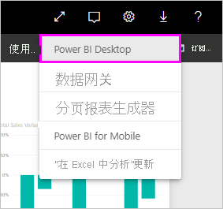
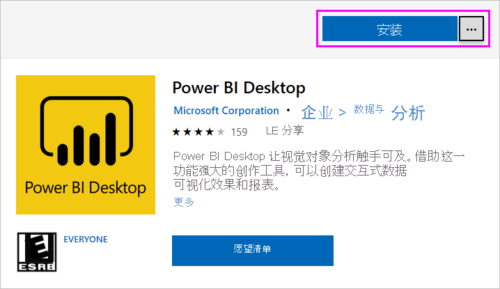
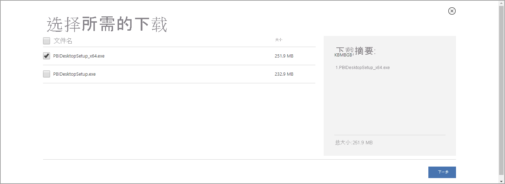

# <a name="get-power-bi-desktop"></a>获取 Power BI Desktop
使用 Power BI Desktop，用户可以构建高级查询、模型以及使数据可视化的报表。 通过 Power BI Desktop，可以生成数据模型、创建报表，并通过发布到 Power BI 服务共享工作。 Power BI Desktop 可免费下载。

可以通过两种方法获取 Power BI Desktop，以下部分将介绍这两种方法：

* [作为 Microsoft Store 的应用安装](#install-as-an-app-from-the-microsoft-store)。
* [直接下载，作为可执行文件下载并安装在计算机上](#download-power-bi-desktop-directly)。

这两种方法都会将最新版本的 Power BI Desktop 获取到计算机上，但值得注意的是这两种方法存在一些区别，以下部分将具体介绍。


> [!IMPORTANT]
> 每月更新并发布 Power BI Desktop，在其中包含客户反馈和新增功能。 仅支持 Power BI Desktop 的最新版本；将要求联系 Power BI Desktop 支持的客户升级到最新版本。 可以从 [Windows 应用商店](https://aka.ms/pbidesktopstore)获取 Power BI Desktop 的最新版本，也可以在计算机上以单个可执行文件的形式[下载](https://www.microsoft.com/download/details.aspx?id=58494)并安装所有受支持的语言。


## <a name="install-as-an-app-from-the-microsoft-store"></a>作为 Microsoft Store 的应用安装
可以通过多种方法从 Microsoft Store 获取最新版 Power BI Desktop。 

1. 使用以下其中一个选项打开 Microsoft Store 的 Power BI Desktop 页面：

   - 打开浏览器，直接转到 Microsoft Store 的 [Power BI Desktop 页面](https://aka.ms/pbidesktopstore)。

    - 在 [Power BI 服务](./service-get-started.md)中，选择右上角的“下载”图标，然后选择“Power BI Desktop” 。

      

   - 转到 [Power BI Desktop 产品页面](https://powerbi.microsoft.com/desktop/)，然后选择“免费下载”。
  
2. 登录到 Microsoft Store 的 Power BI Desktop 页面后，选择“安装” 。

     

从 Microsoft Store 获取 Power BI Desktop 有以下几个优点：

* **自动更新**：Windows 在后台自动下载已发布的最新版本，因此你使用的始终是最新版本。
* **较小的下载量**：Microsoft Store 可确保只将每次更新中更改的组件下载到计算机，从而减少每次更新的下载量。
* **不需要管理员权限**：直接下载包并安装后，必须成为管理员才能成功完成安装。 如果从 Microsoft Store 获取 Power BI Desktop，则不需要管理员权限。
* **已启用 IT 推出**：通过适用于企业的 Microsoft Store，可以更轻松地将 Power BI Desktop 部署或推出到组织中的所有人

* **语言检测**：Microsoft Store 版本包括所有受支持的语言，并会在每次启动时检查计算机上使用的语言。 此语言支持还会影响在 Power BI Desktop 中创建的模型的本地化。 例如，内置日期层次结构与创建 .pbix 文件时 Power BI Desktop 使用的语言相匹配。

从 Microsoft Store 安装 Power BI Desktop 时，存在以下注意事项和限制：

* 如果使用 SAP 连接器，可能需要将 SAP 驱动程序文件移动到 Windows\System32 文件夹。
* 通过 Microsoft Store 安装 Power BI Desktop 的过程不会从 .exe 版本复制用户设置。 可能需要重新连接到最新数据源并重新输入数据源凭据。 

> [!NOTE]
> Power BI 报表服务器版 Power BI Desktop 与本文中介绍的版本分开安装，并且安装步骤也不同。 要了解报表服务器版 Power BI Desktop，请参阅[为 Power BI 报表服务器创建 Power BI 报表](../report-server/quickstart-create-powerbi-report.md)一文。
> 
> 

## <a name="download-power-bi-desktop-directly"></a>直接下载 Power BI Desktop
  
  要从下载中心下载 Power BI Desktop 可执行文件，请在[下载中心](https://www.microsoft.com/download/details.aspx?id=58494)页面选择“下载”。 然后，指定要下载的 32 位或 64 位安装文件。

  

### <a name="install-power-bi-desktop-after-downloading-it"></a>下载后安装 Power BI Desktop
下载完成后，系统会提示你运行安装文件。

从 2019 年 7 月版本开始，Power BI Desktop 将作为一个单独的 .exe 安装包提供，其中包含所有受支持的语言，并为 32 位和 64 位版本提供单独的 .exe 文件。 从 2019 年 9 月版本开始，.msi 包已终止，需要 .exe 可执行文件才能安装。 这一方法使分发、更新和安装（尤其是对于管理员来说）变得更为轻松和方便。 还可以使用命令行参数自定义安装过程，如[在安装期间使用命令行选项](#using-command-line-options-during-installation)中所述。

启动安装包后，Power BI Desktop 会当作一个应用程序进行安装，并在桌面上运行。


> [!NOTE]
> 不支持在同一台计算机上安装下载的 (MSI) 版本（已弃用）和 Microsoft Store 版 Power BI Desktop（有时称为“并行”安装）。 手动卸载 Power BI Desktop，然后再从 Microsoft Store 进行下载。
> 

## <a name="using-power-bi-desktop"></a>使用 Power BI Desktop
启动 Power BI Desktop 时，会显示欢迎屏幕。


如果你是第一次使用 Power BI Desktop（即安装并非升级），则系统会提示你填写表单或登录到 Power BI 服务，然后才能继续。

你可以在此处开始创建数据模型或报表，然后在 Power BI 服务上与他人共享。 请查看[后续步骤](#next-steps)部分，获取帮助你开始使用 Power BI Desktop 的指南链接。

## <a name="minimum-requirements"></a>最低要求
下表提供了运行 Power BI Desktop 的最低要求：

> [!IMPORTANT]
> 2021 年 1 月 31 日之后，Windows 7 将不再支持 Power BI Desktop。 在此日期之后，Windows 8 或较新版本的 Windows 将支持 Power BI Desktop（仅针对最新版本的 Power BI Desktop）。 

* Windows 7/Windows Server 2008 R2 或更高版本
* .NET 4.5
* Internet Explorer 10 或更高版本
* 内存 (RAM)：可用内存至少为 1 GB，建议为 1.5 GB 或以上。
* 显示器：分辨率至少需要为 1440x900 或 1600x900 (16:9)。 不支持使用 1024x768 或 1280x800 等较低分辨率，因为某些控件（如关闭启动屏幕）需要更高的分辨率才能显示。
* Windows 显示设置：如果将显示设置设为将文本、应用和其他项的大小更改为 100% 以上，可能看不到某些需要与之交互的对话框，从而无法继续使用 Power BI Desktop。 如果遇到此问题，请在 Windows 中依次转到“设置” > “系统” > “显示”，检查显示设置，再使用滑块将显示设置恢复为 100%  。
* CPU：建议使用 1 千兆赫 (GHz) 64 位 (x64) 处理器。

> [!NOTE]
> 建议使用 Windows 的客户端版本，例如，使用 Windows 10 而不使用 Windows Server。 例如，Power BI Desktop 不支持使用 Internet Explorer 增强的安全配置，因为它会阻止 Power BI Desktop 登录到 Power BI 服务。

## <a name="considerations-and-limitations"></a>注意事项和限制

我们希望你能获得超棒的 Power BI Desktop 使用体验。 使用 Power BI Desktop 时可能会遇到问题，本部分介绍了解决这些问题的解决方案或建议。 

### <a name="using-command-line-options-during-installation"></a>在安装期间使用命令行选项 

安装 Power BI Desktop 时，可以使用命令行开关设置属性和选项。 对于管理或辅助整个组织的 Power BI Desktop 安装的管理员来说，这些设置非常有用。 这些选项适用于 .msi 和 .exe 安装。 


|命令行选项  |行为  |
|---------|---------|
|-q、-quiet、-s、-silent     |无提示安装         |
|-passive     |安装过程中只显示进度栏         |
|-norestart     |隐藏计算机重启要求         |
|-forcerestart     |安装后重启计算机而不发出提示         |
|-promptrestart     |如果需要重启计算机，会提示用户（默认）         |
|-l<>、-log<>     |将安装记录到特定文件，在 <> 中指定文件         |
|-uninstall     |卸载 Power BI Desktop         |
|-repair     |修复安装（如果当前尚未安装，则进行安装）         |
|-package、-update     |安装 Power BI Desktop（只要未指定 -uninstall 或 -repair，这就是默认操作）         |

还可以使用以下语法参数（这些参数是使用“property = value”语法指定的）：

|参数  |含义  |
|---------|---------|
|ACCEPT_EULA     |需要值 1 才能自动接受 EULA         |
|ENABLECXP     |值 1 表示加入用来捕获产品使用情况遥测数据的客户体验计划         |
|INSTALLDESKTOPSHORTCUT     |值 1 表示将快捷方式添加到桌面         |
|INSTALLLOCATION     |安装位置的文件路径         |
|LANGUAGE     |区域设置代码（例如 en-US、de-DE、pr-BR），用于强制使用应用程序的默认语言。 如果未指定语言，Power BI Desktop 会显示 Windows OS 语言。 可以在“选项”对话框中更改此设置。         |
|REG_SHOWLEADGENDIALOG     |值 0 表示禁止显示在登录到 Power BI Desktop 之前显示的对话框。         |
|DISABLE_UPDATE_NOTIFICATION     |如果值为 1，则禁用更新通知。         |


例如，可以使用以下选项和参数运行 Power BI Desktop，以便使用德语安装（无任何用户界面）： 

```-quiet LANG=de-DE ACCEPT_EULA=1```

### <a name="installing-power-bi-desktop-on-remote-machines"></a>在远程计算机上安装 Power BI Desktop

如果要使用需要 Windows 安装程序文件（.msi 文件）的工具将 Power BI Desktop 部署到你的用户，则可以从 Power BI Desktop 安装程序 .exe 文件中提取 .msi 文件。 使用第三方工具，例如 WiX 工具集。

> [!NOTE]
> 作为第三方产品，WiX 工具集选项可能会发生更改，恕不另行通知。 查看相关文档了解最新信息，并联系其用户邮件列表以获取帮助。

1. 在下载了 Power BI Desktop 安装程序的计算机上，安装最新版 [WiX 工具集](https://wixtoolset.org/)。
2. 以管理员身份打开命令行窗口，并导航到安装了 WiX 工具集的文件夹。
3. 运行以下命令： 
    
    ```Dark.exe <path to Power BI Desktop installer> -x <output folder>```

    例如：

    ``` Dark.exe C:\PBIDesktop_x64.exe -x C:\output```

    输出文件夹包含一个名为“AttachedContainer”的文件夹，其中包含 .msi 文件。

不支持将安装从 .exe 升级到从 .exe 提取出的 .msi。   若要完成此升级，首先需要卸载拥有的旧版 Power BI Desktop。

### <a name="issues-when-using-previous-releases-of-power-bi-desktop"></a>无法使用旧版 Power BI Desktop

有些用户在使用 Power BI Desktop 的过时版本时，可能会遇到类似以下消息的错误消息： 

无法将已保存的数据库还原到模型 

通常，更新到 Power BI Desktop 的当前版本可解决此问题。

### <a name="disabling-notifications"></a>禁用通知
建议更新到最新版 Power BI Desktop，以利用功能、性能、稳定性和其他改进方面的进步优势。 一些组织可能不希望用户更新到每个新版本。 若要禁用通知，可按以下步骤操作来修改注册表：

1. 在注册表编辑器中，导航到“HKEY_LOCAL_MACHINE\SOFTWARE\Microsoft\Microsoft Power BI Desktop”注册表项。
2. 使用以下名称在该注册表项中创建新的“REG_DWORD”条目：DisableUpdateNotification。
3. 将新条目的值设置为“1”。
4. 重启计算机使更改生效。

### <a name="power-bi-desktop-loads-with-a-partial-screen"></a>Power BI Desktop 在加载时未占据整个屏幕

在某些情况下（包括特定屏幕分辨率配置），一些用户可能会发现 Power BI Desktop 呈现的内容包含大块黑色区域。 这通常是由于最新操作系统更新所致（它们影响了项目的呈现方式），并不是 Power BI Desktop 内容呈现方式的直接结果。 遵循以下步骤来解决此问题：

1. 按“开始”键，再在随即显示的搜索栏中输入“模糊”。
2. 在出现的对话框中，选择选项：让 Windows 修复模糊应用。
3. 重启 Power BI Desktop。

在后续 Windows 更新发布后，此问题可能就会得到解决。 
 

## <a name="next-steps"></a>后续步骤
安装 Power BI Desktop 之后，以下内容可帮助你快速启动和运行：

* [什么是 Power BI Desktop？](desktop-what-is-desktop.md)
* [Power BI Desktop 中的查询概述](../transform-model/desktop-query-overview.md)
* [Power BI Desktop 中的数据源](../connect-data/desktop-data-sources.md)
* [连接到 Power BI Desktop 中的数据](../connect-data/desktop-connect-to-data.md)
* [在 Power BI Desktop 中调整和合并数据](../connect-data/desktop-shape-and-combine-data.md)
* [Power BI Desktop 中的常见查询任务](../transform-model/desktop-common-query-tasks.md)