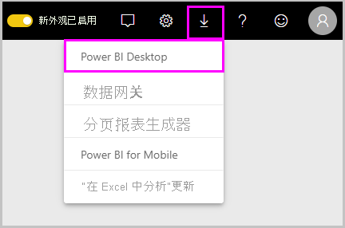
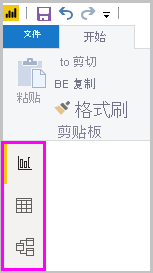
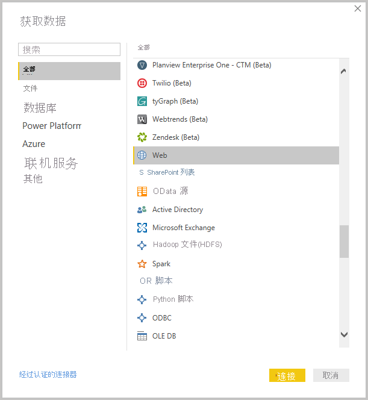
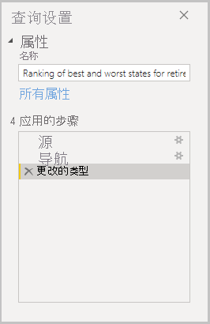
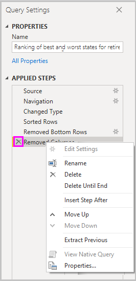
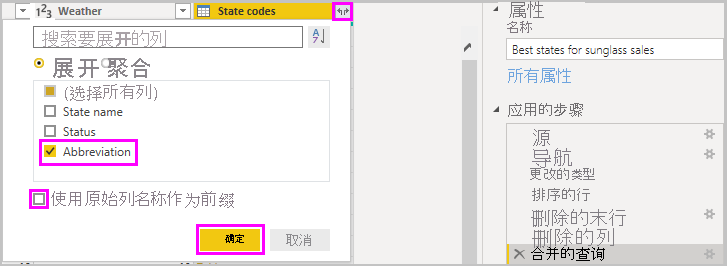
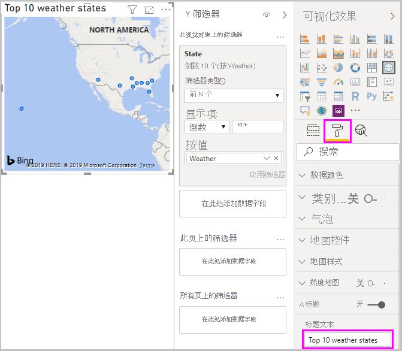
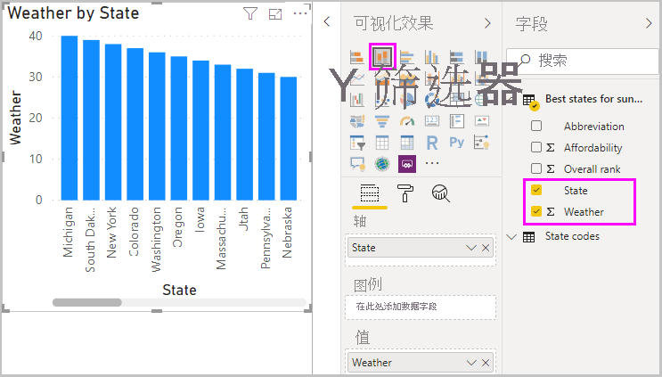
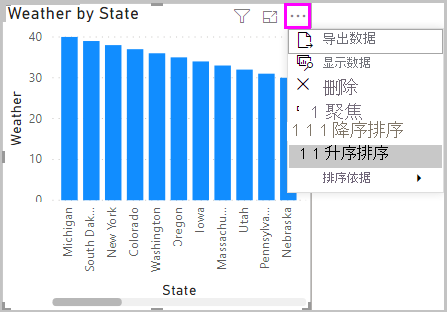
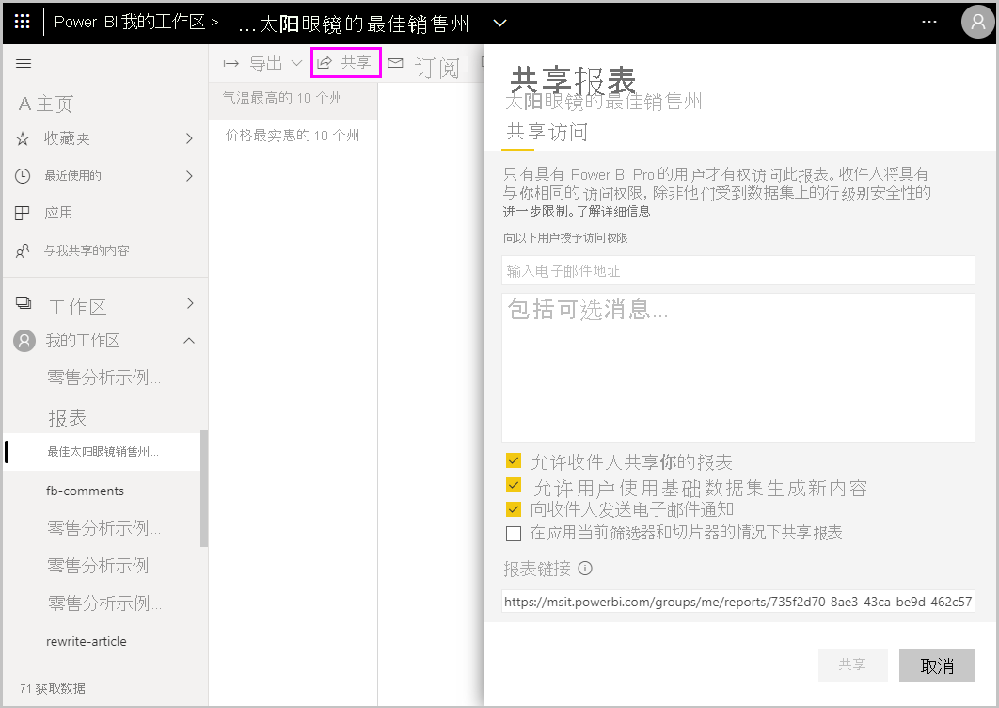

# Power BI Desktop 入门
欢迎使用 Power BI Desktop 入门指南。 本教程介绍 Power BI Desktop 的工作原理和功能，并介绍如何生成可靠的数据模型和奇妙的报表来提升你的商业智能。

要快速了解 Power BI Desktop 的工作原理及其使用方式，只需花几分钟浏览一下本指南中的屏幕。 要更深入地了解，可通读各个部分，执行相关步骤，创建自己的 Power BI Desktop 文件并将其发布到 [Power BI 服务](https://app.powerbi.com/)以与他人共享。

还可观看 [Power BI Desktop 入门](https://www.youtube.com/watch?v=Qgam9M8I0xA)视频，并下载 [财务示例](https://go.microsoft.com/fwlink/?LinkID=521962) Excel 工作簿按视频进行操作。

## Power BI Desktop 工作原理
使用 Power BI Desktop，可以：
1. 连接到数据，包括多个数据源。
1. 借助可生成见解深刻、令人信服数据模型的查询来调整数据。
1. 使用数据模型创建可视化效果和报表。 
1. 共享报表文件以供他人使用、用作基础文件和共享。 可像任何其他文件一样共享 Power BI Desktop“.pbix”  文件，但最具吸引力的方法是将其上传到 [Power BI 服务](https://preview.powerbi.com/)。 

Power BI Desktop 集成了久经考验的 Microsoft 查询引擎、数据建模和可视化技术。 数据分析师和其他人员可以创建查询、数据连接、模型和报表集合，并轻松与他人共享。 通过组合 Power BI Desktop 和 Power BI 服务，数据世界的新见解将更易于建模、生成、共享和扩展。

Power BI Desktop 会集中、简化并效率化设计与创建商业智能存储库和报表的程序，这些程序可能是散乱、不相关且棘手的。
准备好要试一试吗？ 现在就开始吧。

> [!NOTE]
> 对于必须保留在本地的数据和报表，Power BI 提供一个单独的专业版本，名为 [Power BI 报表服务器](../report-server/get-started.md)。 Power BI 报表服务器使用单独的专业版 Power BI Desktop，该版本名为用于 Power BI 报表服务器的 Power BI Desktop，并且仅适用于 Power BI 的报表服务器版本。 本文介绍标准版 Power BI Desktop。

## 安装并运行 Power BI Desktop
要下载 Power BI Desktop，请前往 [Power BI Desktop 下载页面](https://powerbi.microsoft.com/desktop)，然后选择“免费下载”  。 或者对于下载选项，选择[查看下载或语言选项](https://www.microsoft.com/download/details.aspx?id=58494)。 

还可从 Power BI 服务下载 Power BI Desktop。 在顶部菜单栏中选择“下载”图标，然后选择“Power BI Desktop”   。

在 Microsoft Store 页面上，选择“获取”，然后按照提示在计算机上安装 Power BI Desktop  。 从 Windows“开始”菜单或从 Windows 任务栏中的图标启动 Power BI Desktop  。

Power BI Desktop 首次启动时，会显示“欢迎”屏幕  。

在“欢迎”屏幕中，可获取数据，查看最近使用的源，打开最近使用的报表，打开其他报表，或选择其他链接     。 还可选择在启动时是否始终显示“欢迎”屏幕  。 选择关闭图标可关闭“欢迎”屏幕  。

Power BI Desktop 左侧为三个 Power BI Desktop 视图的图标：  “报表”、  “数据”和  “关系”。 左侧的黄色栏指示当前视图，可通过选择任一图标来更改视图。 

“报表”视图为默认视图  。 

Power BI Desktop 还包括“Power Query 编辑器”，它将在在单独的窗口中打开  。 在“Power Query 编辑器”中，可生成查询和转换数据，然后将经过细化的数据模型加载到 Power BI Desktop 以创建报表  。

## 连接到数据
安装 Power BI Desktop 后，便可连接到不断扩展的数据世界。 要查看多种可用的数据源，请在 Power BI Desktop 的“主页”选项卡中选择“获取数据” > “更多”，然后在“获取数据”窗口中，滚动浏览“所有”数据源的列表      。 在本快速教程中，你将连接到几个不同的“Web”数据源  。

假设你是一家太阳镜零售商的数据分析师。 你希望帮助客户在四季阳光充足的州销售太阳镜。 Bankrate.com [最佳和最糟退休州](https://www.bankrate.com/retirement/best-and-worst-states-for-retirement/)页面上提供了关于本主题的有趣数据。

在 Power BI Desktop 的“主页”选项卡中，选择“获取数据” > “Web”以连接到 Web 数据源    。 

在“来自 Web”对话框中，将地址 https:\//www.bankrate.com/retirement/best-and-worst-states-for-retirement/ 粘贴到“URL”字段中，然后选择“确定”     。 

如果出现提示，请在“访问 Web 内容”屏幕上，选择“连接”以使用匿名访问   。 

Power BI Desktop 的查询功能开始运行并与 Web 资源联系。 “导航器”窗口返回它在网页上找到的内容，在本例中，它返回一个名为“最佳和最糟退休州排名”的表和一个文档   。 你对该表有兴趣，因此选择它以查看预览。

此时，你可以选择“加载”来加载该表，也可以选择“转换数据”以在表中进行更改，然后再加载   。

如果选择“转换数据”，Power Query 编辑器将会启动，并显示表的代表性视图  。 “查询设置”窗格在右侧，你也可以通过如下操作来显示它：在 Power Query 编辑器的“视图”选项卡上，选择“查询设置”    。 

有关连接到数据的详细信息，请参阅[连接到 Power BI Desktop 中的数据](../connect-data/desktop-connect-to-data.md)。

## 调整数据
现在你已经连接到数据源，你可以调整数据以符合需求。 要调整数据，请在加载和呈现数据时为 Power Query 编辑器提供调整数据的分步说明  。 调整不会影响原始数据源，只会影响数据的这一特定视图。 

> [!NOTE]
> 本指南中使用的表数据可能随时更改。 因此，你需要遵循的步骤可能有所不同，这就要求你在调整步骤或结果方面具有创造性，这也体现了学习的乐趣。 

调整可能意味着转换数据，例如，重命名列或表、删除行或列，或者更改数据类型  。 Power Query 编辑器在“查询设置”窗格中的“已应用步骤”下依次捕获这些步骤   。 每当此查询连接到数据源时，都会执行这些步骤，这样，数据将始终以指定的方式进行调整。 每当你在 Power BI Desktop 中使用查询时，或任何人使用你的共享查询（例如在 Power BI 服务中）时，都会执行此过程。 

注意，“查询设置”中的“已应用步骤”已经包含了一些步骤   。 你可以选择每个步骤来查看其在 Power Query 编辑器中的效果。 一开始，你指定了一个 Web 源，然后在“导航器”窗口中预览了表  。 在第三步中，更改了类型，Power BI 在导入时识别了整数数据，并自动将原始 Web“文本”数据类型更改为了“整数”     。 

如果需要更改数据类型，请选择一列或多列进行更改。 按住“Shift”键可选择多个相邻的列，按住“Ctrl”键可选择非相邻列   。 右键单击列标题，选择“更改类型”，然后在菜单中选择新数据类型；或者在“主页”选项卡的“转换”组中，下拉“数据类型”旁边的列表，然后选择新数据类型     。

> [!NOTE]
> Power BI Desktop 中的 Power Query 编辑器使用功能区或右键单击菜单来执行可用任务。 大部分可在“主页”或功能区的“转换”选项卡上选择的任务，也可以通过右键单击一个项目并在出现的菜单中进行选择来实现   。

现在，你可以对数据应用自己的更改和转换，并在“已应用步骤”中查看  。 

例如，对于太阳镜销售，你最想了解的是天气排名，因此，你决定按照“天气”列而不是“整体排名”来对表进行排序   。 下拉“天气”标头旁边的箭头，并选择“升序排序”   。 数据现在按照天气排名排序，并且“已应用步骤”中会出现“已对行排序”这一步骤   。 

你不是很想把太阳镜卖给天气最糟糕的州，所以你决定将它们从表中删除。 从“主页”选项卡的“减少行”组，选择“删除行” > “删除最后几行”     。 在“删除最后几行”对话框中，输入“10”，然后选择“确定”   。 

将从表中删除最后 10 行天气最糟糕的州，并且“已应用步骤”中会出现“已删除最后几行”这一步骤   。

你认为表中包含太多不必要的信息，决定删除“可购性”、“犯罪”、“文化”和“健康”列     。 选择要删除的各列的标头。 按住“Shift”键可选择多个相邻的列，按住“Ctrl”键可选择非相邻列   。 

然后，从“主页”选项卡的“管理列”组中，选择“删除列”    。 你还可右键单击其中一个选定的列标头，然后在菜单中选择“删除列”  。 此操作将删除选定的列，并且“已应用步骤”中会出现“已删除列”   。

再想想，“可购性”可能与太阳镜的销售有关  。 你希望恢复该列。 通过选择步骤旁边的“X”删除图标，可以轻松撤消“已应用步骤”窗格中的最后一步   。 现在重新执行步骤，仅选择要删除的列。 为了获得更大的灵活性，可以分步删除每一列。 

你可以右键单击“已应用步骤”窗格中的任何步骤，然后选择删除它、对其进行重命名、在序列中上移或下移，或在其后添加或删除步骤  。 对于中间步骤，如果更改可能会影响后续步骤并中断查询，Power BI Desktop 将向你发出警告。  

例如，如果不再希望根据“天气”对表进行排序，可以尝试删除“已对行排序”步骤   。 Power BI Desktop 会警告你删除此步骤可能会导致查询中断。 按天气排序后，你删除了最后 10 行，因此，如果删除排序，将删除不同的行。 如果选择“已对行排序”步骤，并尝试在此添加新的中间步骤，也会出现警告  。  

最后，将表标题更改为关于太阳镜销售，而不是退休。 在“查询设置”窗格中的“属性”下，将旧的标题替换为“最佳太阳镜销售州”    。

完成后的已调整数据查询如下所示：

有关调整数据数据的详细信息，请参阅[在 Power BI Desktop 中调整和合并数据](../connect-data/desktop-shape-and-combine-data.md)。

## 合并数据
有关各州的那份数据很有趣，而且适用于生成其他分析工作和查询。 但是有一个问题：大多数数据使用两个字母的州代码缩写，而不是完整名称。 要使用该数据，需要通过某种方式来将州名与其缩写关联。

你很幸运。 另一个公共数据源可以做到这一点，但你需要对数据进行大量的调整，然后才能将数据合并到太阳镜表。 

要将州缩写数据导入 Power Query 编辑器，请在功能区“主页”选项卡上的“新建查询”组中，选择“新增源” > “Web”     。 

在“来自 Web”对话框中，输入州缩写站点的 URL：https:\//en.wikipedia.org/wiki/List_of_U.S._state_abbreviations   。

在“导航器”窗口中，选择“美国各州、联邦地区、领地及其他区域的代码和缩写”表，然后选择“确定”    。 该表将在 Power Query 编辑器中打开。

删除“区域的名称和状态”、“区域 2 的名称和状态”，以及“ANSI”之外的所有列    。 要仅保留这些列，请按住“Ctrl”  并选择相应的列。 然后，右键单击其中一个列标头并选择“删除其他列”，或者在“主页”选项卡的“管理列”组中，选择“删除其他列”     。 

下拉“区域 2 的名称和状态”列标头旁边的箭头，并选择“筛选器” > “等于”    。 在“筛选行”对话框中，下拉“等于”旁边的“输入或选择值”字段，然后选择“州”     。 

选择“或”，然后在第二个“等于”字段旁边，选择“州(联邦)”    。 选择“确定”。  

删除了“联邦地区”和“岛”这样的额外值后，现在就有了一个包含 50 个州及其官方双字母缩写形式的列表   。 你可以重命名列以便更好理解，例如“州名”、“状态”和“缩写”，方法是右键单击列标头并选择“重命名”     。

注意，所有这些步骤都记录在“查询设置”窗格中的“已应用步骤”下   。

调整后的表现在如下所示：

在“查询设置”的“属性”字段中，将表重命名为“州代码”    。 

“州代码”表调整完成后，你可以将这两个表合并为一个表   。 由于你现在拥有的表是你向数据应用查询之后的结果，因此它们也称为“查询”  。 有两种主要方法可合并查询：合并和追加   。 

当你有一列或多列要添加到另一个查询时，你可合并这些查询  。 当你有其他数据行要添加到现有查询时，你可追加查询  。

在本例中，你希望将“州代码”查询合并到“最佳太阳镜销售州”查询    。 要合并查询，请切换到“最佳太阳镜销售州”查询，方法是从 Power Query 编辑器左侧的“查询”窗格中选择它   。 然后在功能区“主页”选项卡中的“合并”组中，选择“合并查询”    。

在“合并”窗口中，下拉字段，可从其他可用查询中选择“州代码”   。 在每个表中选择要匹配的列，在本例中，为“最佳太阳镜销售州”查询中的“州”和“州代码”查询中的“州名”     。 

如果出现“隐私级别”对话框，请选择“忽略此文件的隐私级别检查”，然后选择“保存”    。 选择“确定”。  

“最佳太阳镜销售州”表的右侧将出现一个名为“州代码”的新列   。 它包含与“最佳太阳镜销售州”查询合并的“州代码”查询。 合并后的表中的所有列都压缩到“州代码”列中  。 你可以展开合并后的表并仅包含所需的列  。 

要展开合并后的表，并选择要包含的列，请选择列标头中的“展开”图标  。 在“展开”对话框中，仅选择“缩写”列   。 取消选中“使用原始列名作为前缀”，然后选择“确定”   。 

> [!NOTE]
> 你可以尝试一下如何引入“州代码”表  。 尝试一下，如果不喜欢结果，只需从“查询设置”窗格中的“已应用步骤”列表中删除该步骤   。 这就像是个自由重做的机会，你可以不限次数地任意执行，直到展开过程看起来是你要的方式为止。

有关调整及合并数据步骤的更完整说明，请参阅[在 Power BI Desktop 调整和合并数据](../connect-data/desktop-shape-and-combine-data.md)。

现在，你在单个查询表中合并了两个数据源，每个数据源都已根据需要进行调整。 此查询可以作为许多其他有趣数据连接的基础，例如各州的人口统计、财富水平或娱乐机会。

到目前为止，你有足够的数据在 Power BI Desktop 内创建有趣的报表。 由于这是一个里程碑，请在“Power Query 编辑器”中应用更改，并将其加载到 Power BI Desktop 中，方法是：在功能区的“主页”选项卡中选择“关闭并应用”   。 你还可以仅选择“应用”，以确保在 Power Query 工作时使查询在 Power Query 编辑器处于打开状态  。 

将表加载到 Power BI Desktop 后，你可以对其进行更多更改，并重新加载模型以应用所做的任何更改。 要从 Power BI Desktop 重新打开“Power Query 编辑器”，请在 Power BI Desktop 功能区的“主页”选项卡上选择“编辑查询”    。 

## 生成报表
在 Power BI Desktop“报表”视图中，你可以生成可视化效果和报表  。 “报表”视图包含六个主要区域  ：

1. 功能区位于顶部，它显示与报表和可视化效果相关联的常见任务。
2. 画布区域位于中间，可在其中创建和排列可视化效果。
3. 页面选项卡区域位于底部，它用于选择或添加报表页。
4. “筛选器”窗格，可在其中筛选数据可视化效果  。
5. “可视化效果”窗格，可在其中添加、更改或自定义可视化效果，并应用钻取  。
6. “字段”窗格，它显示查询中的可用字段  。 你可以将这些字段拖放到画布、“筛选器”窗格或“可视化效果”窗格，以创建或修改可视化效果   。

通过选择窗格顶部的箭头，可以展开和折叠“筛选器”、“可视化效果”和“字段”窗格    。 折叠窗格可在画布上提供更多空间来生成炫酷的视觉化效果。 

要创建简单的可视化效果，只需在“字段”列表中选择任意字段，或将字段从“字段”列表拖到画布上  。 例如，将“州”字段从“最佳太阳镜销售州”拖到画布上，看看会发生什么   。

看一下！ Power BI Desktop 识别到“州”字段包含地理位置数据并自动创建了基于地图的可视化效果  。 可视化效果在数据模型中显示了 40 个州的数据点。 

“可视化效果”窗格显示有关可视化效果的信息，并允许你对其进行修改  。 

1. 图标显示创建的可视化效果的类型。 你可以通过选择不同的图标来更改所选可视化效果的类型，或通过选择未选定现有可视化效果的图标来创建新的可视化效果。 
2. 可利用“可视化效果”窗格中的“字段”选项将数据字段拖动到“图例”和窗格中的其他字段    。 
3. 可利用“格式”选项将格式设置和其他控件应用到可视化效果  。 

“字段”和“格式”区域中的可用选项取决于你拥有的可视化效果和数据类型   。

你希望地图可视化效果仅显示天气最佳的前 10 个州。 要仅显示前 10 个州，请在“筛选器”窗格中，将鼠标悬停在“州为(所有)”上并展开出现的箭头   。 在“筛选器类型”下，下拉并选择“前 N 个”   。在“显示项目”下，选择“最后”，因为你希望显示数字级别最低的项目，并在下一个字段中输入“10”    。

在“字段”窗格中，将“天气”字段拖动到“按值”字段中，然后选择“应用筛选器”     。 

现在，地图可视化效果中仅显示天气最佳的前 10 个州。 

通过以下方式可重新设置可视化效果标题：在“可视化效果”窗格中选择“格式”图标，选择“标题”，并在“标题文本”下键入“天气最佳的前 10 个州”      。 

要添加显示天气最佳的前 10 个州的名称及其从 1 到 10 的排名，请选择画布的空白区域，然后在“可视化效果”窗格中选择“柱状图”图标   。 在“字段”窗格中，选择“州”和“天气”    。 柱状图显示了查询中的 40 个州，从最高到最低的数字级别或者从最糟到最佳天气进行排名。 

要切换排序顺序以使数字 1 第一个出现，请在可视化效果的右上角选择“更多选项”省略号，然后在菜单中选择“升序排序”   。 

要将表限制为前 10 个州，请应用与地图可视化效果相同的后 10 筛选器。 

以与地图可视化效果相同的方式重新命名可视化效果。 同样在“可视化效果”窗格的“格式”部分，将“Y 轴” > “轴标题”从“天气”更改为“天气排名”，使其更易于理解       。 然后，将“Y 轴”选择器切换到“关闭”，并将“数据标签”切换到“打开”     。 

现在，天气最佳的前 10 个州按排名顺序显示，并显示其数字排名。 

你可以为“可购性”和“总体排名”字段提供类似或其他可视化效果，或将多个字段合并为一个可视化效果   。 你可以创建各种相关报表和可视化效果。 这些“表”和“折线和簇状柱形图”可视化效果显示天气最佳的前 10 个州以及其可购性和总体排名   ：

你可以在不同的报表页上显示不同的可视化效果。 要添加新页面，请选择页面栏上现有页面旁边的 + 符号，或在功能区的“主页”选项卡中选择“插入” > “新页面”     。 要重命名某个页面，请在页面栏中双击该页面的名称，或右键单击它并选择“重命名页面”，然后键入新名称  。 要切换到报表的其他页面，请从页面栏中选择该页面。 

你可以通过“主页”选项卡的“插入”组将文本框、图像和按钮添加到报表页   。要设置可视化效果的格式设置选项，请选择可视化效果，然后在“可视化效果”窗格中选择“格式”图标   。 要配置页面大小、背景和其他页面信息，请选择未选定可视化效果的“格式”图标  。

创建好页面和可视化效果后，选择“文件” > “保存”，可保存报表   。 

有关报表的详细信息，请参阅 [Power BI Desktop 中的报表视图](../create-reports/desktop-report-view.md)。

## 共享工作
现在，你已经有了一个 Power BI Desktop 报表，可以与他人共享。 有几种方法可以共享你的工作。 你可以像任何其他文件一样分发“.pbix”文件报表，你可以从 Power BI 服务上传“.pbix”文件，也可以直接从 Power BI Desktop 发布到 Power BI 服务   。 必须拥有 Power BI 帐户才能将报表发布或上传到 Power BI 服务。 

要从 Power BI Desktop 发布到“Power BI”服务，请在功能区的“主页”选项卡中，选择“发布”    。

系统可能会提示你登录 Power BI 或选择一个目标。

当此发布过程完成时，你将看到以下对话框：

在 Power BI 中选择打开报表的链接时，报表将在 Power BI 站点中的“我的工作区” > “报表”下打开   。 

另一种共享工作的方式是从 **Power BI** 服务内加载它。 前往 https:\//app.powerbi.com 可在浏览器中打开 Power BI  。 在 Power BI“主页”上，选择左下方的“获取数据”，可开始加载 Power BI Desktop 报表的过程   。

在下一页上，在“文件”部分选择“获取”   。

在下一页上，选择“本地文件”  。 浏览到你的 Power BI Desktop“.pbix”文件并选择，然后选择“打开”   。 

导入文件后，可以看到它在 Power BI 服务左窗格中的我的工作区” > “报表”下列出   。

选择该文件时，将显示报表的第一页。 可以在报表左侧的选项卡中选择不同的页面。 

你可以在 Power BI 服务中通过从报表画布顶部选择“更多选项” > “编辑”来更改报表    。 要保存更改，请选择“保存副本”  。

你可以在 Power BI 服务中，从你的报表创建各种有趣的视觉对象，并可以将该报表固定到“仪表板”   。 要了解 Power BI 服务中的仪表板，请参阅[设计出色仪表板的提示](../create-reports/service-dashboards-design-tips.md)  。 有关创建、共享和修改仪表板的详细信息，请参阅[共享仪表板](../collaborate-share/service-share-dashboards.md)。

要共享报表或仪表板，请在打开的报表或仪表板页面的顶部选择“共享”，或者在“我的工作区” > “报表”或“我的工作区” > “仪表板”列表中，选择报表或仪表板名称旁边的“共享”图标       。

完成“共享报表”或“共享仪表板”屏幕中的信息，以发送电子邮件或获取链接，与他人共享报表或仪表板   。 

你可以使用 Power BI Desktop 和 Power BI 服务来制作各种与数据相关的惊艳混搭和可视化效果。 

## 后续步骤
Power BI Desktop 支持连接到诊断端口。 诊断端口允许连接其他工具并执行跟踪以进行诊断。 使用诊断端口时，不支持对模型进行任何更改 *。* 更改模型可能会导致损坏和数据丢失。

要详细了解 Power BI Desktop 的多种功能，请查看以下资源：

* [Power BI Desktop 中的查询概述](../transform-model/desktop-query-overview.md)
* [Power BI Desktop 中的数据源](../connect-data/desktop-data-sources.md)
* [连接到 Power BI Desktop 中的数据](../connect-data/desktop-connect-to-data.md)
* [教程：使用 Power BI Desktop 调整和合并数据](../connect-data/desktop-shape-and-combine-data.md)
* [Power BI Desktop 中的常见查询任务](../transform-model/desktop-common-query-tasks.md)   
