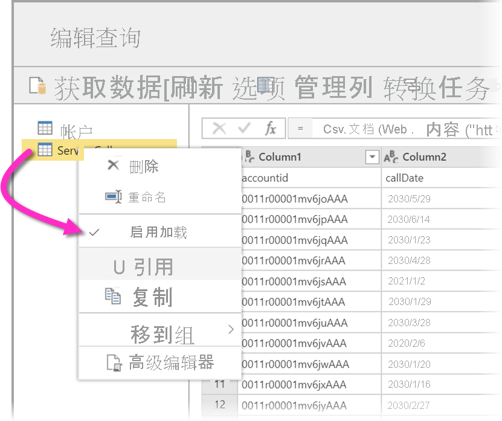
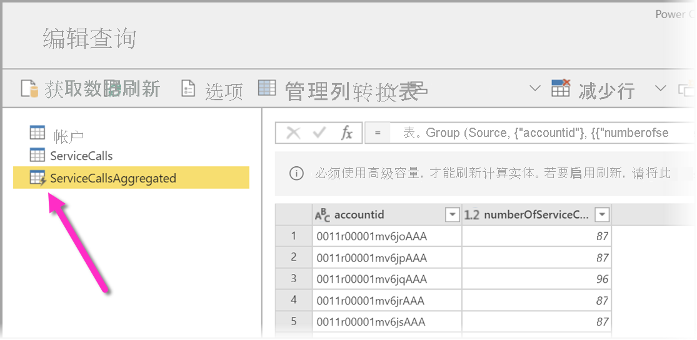
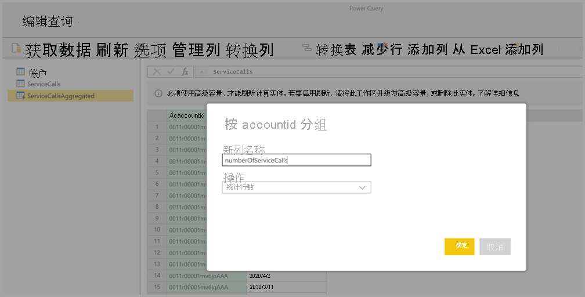
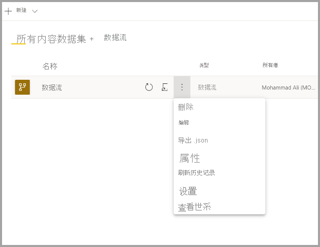

# 创建数据流
数据流是在 Power BI 服务的工作区中创建和管理的实体（实体类似于表）集合****。 实体/表是一组用于存储数据的字段，非常类似于数据库中的表。 可以直接在创建数据流的工作区中添加和编辑数据流中的实体/表，以及管理数据刷新计划。

若要创建数据流，请在浏览器中启动 Power BI 服务，然后从左侧导航窗格选择一个工作区（数据流在 Power BI 服务的“我的工作区”中不可用），如以下屏幕所示******。 也可以新建一个工作区，用于创建新的工作流。

可以通过多种方式新建数据流或在其基础上进行生成：

* [使用“定义新实体”创建数据流](#create-a-dataflow-using-define-new-entities)
* [使用链接实体创建数据流](#create-a-dataflow-using-linked-entities)
* [使用计算实体创建数据流](#create-a-dataflow-using-a-computed-entity)
* [使用导入/导出创建数据流](#create-a-dataflow-using-importexport)

以下各节详细探讨了每种数据流创建方式。

## 使用“定义新实体”创建数据流

使用“定义新实体”选项，可以定义新实体/表并连接到新数据源。

选择数据源时，你会看到提供连接设置的提示，其中包括连接到数据源时要使用的帐户，如下图所示。

连接后，可以选择要用于实体的数据。 选择数据和源时，Power BI 会重新连接到数据源，以按照在后面的设置过程中选择的频率持续刷新数据流中的数据。

选择用于实体的数据后，可以使用数据流编辑器将该数据塑造或转换为用于数据流所需的格式。 

## 使用链接实体创建数据流

通过使用链接实体创建数据流，你能够以只读方式引用在另一个数据流中定义的现有实体。 以下列表描述了可能选择此方法的一些原因：

* 如果要在多个数据流中重复使用某个实体，例如日期实体或静态查找表，则应创建该实体一次，然后在其他数据流中引用它。

* 如果要避免对某个数据源创建多次刷新，最好使用链接实体来存储数据并充当缓存。 这样一来，每个后续使用者都可以利用该实体，从而减少了基础数据源的负载。

* 如果需要在两个实体之间执行合并。

> [!NOTE]
> 链接实体仅在 Power BI Premium 中可用。

## 使用计算实体创建数据流

通过使用计算实体创建数据流，你能够以只写方式引用链接实体并对其执行操作。 这会生成一个新实体，它是数据流的一部分。 若要将链接实体转换为计算实体，可以通过合并操作创建一个新查询，或者如果要编辑或转换该实体，可以创建该实体的引用或副本。

### 如何创建计算实体

一旦具有含有实体列表的数据流后，就可以在这些实体上执行计算。
在 Power BI 服务中的数据流创作工具中，选择“编辑实体”****，然后右键单击想要用作计算实体基础的实体和想要执行计算的实体。 在上下文菜单中，选择“引用”****。
若要使实体符合计算实体的条件，必须选中“启用加载”****，如下图中所示。 右键单击实体以显示此上下文菜单。

选择“启用加载”****，将创建一个新的实体，其源是引用的实体。 图标更改并显示“计算”**** 图标，如下图中所示。

对此新建实体执行的任何转换都将针对 Power BI 数据流存储中已存在的数据运行。 这意味着查询不会在导入数据的外部数据源上运行（例如，拉取数据的 SQL 数据库），相反，它在驻留在数据流存储中的数据上执行。

**示例用例**：可以使用计算实体执行哪些类型的转换？ 在执行存储中计算时，将支持所有通常使用 Power BI 或 M 编辑器中的转换用户界面指定的任何转换。

请考虑以下示例：你具有含有来自 Dynamics 365 订阅的所有客户的原始数据的帐户** 实体。 你还具有来自服务中心的 ServiceCalls** 原始数据，其中包含每年每天从不同的帐户执行的支持调用的数据。

假设你想要使用 ServiceCalls** 中的数据扩充帐户** 实体。
首先，需要聚合来自 ServiceCalls 的数据，以计算去年为每个帐户进行的支持呼叫次数。

接下来，你想要将帐户** 实体与 ServiceCallsAggregated** 实体合并，以计算浓集缩的“帐户”** 表。

然后可以看到结果，在下图中显示为 EnrichedAccount**。

就是这么简单 - 在 Power BI Premium 订阅中驻留的数据流中的数据上执行转换，而不是在源数据上执行转换。

> [!NOTE]
> 计算实体是 Premium 专用功能

## 使用 CDM 文件夹创建数据流

通过从 CDM 文件夹创建数据流，可以引用由另一个应用程序以 Common Data Model (CDM) 格式编写的实体。 系统会提示你提供存储在 ADLS Gen 2 中的 CDM 格式文件的完整路径。

 

下面列出了从 CDM 文件夹创建数据流的几个要求：

* ADLS Gen 2 帐户必须设置适当的权限，PBI 才能访问文件

* 尝试创建数据流的用户必须可以访问 ADLS Gen 2 帐户

* 从 CDM 文件夹创建数据流仅适用于新的工作区体验

* URL 必须是 JSON 文件的直接文件路径，并使用 ADLS Gen 2 终结点；不支持 blob.core

## 使用导入/导出创建数据流

通过使用导入/导出创建数据流，可以从文件导入数据流。 如果要脱机保存数据流副本，或在两个工作区之间移动数据流，此功能很有用。 

若要导出数据流，请选择所创建的数据流，选择“更多”菜单项（省略号）展开选项，然后选择“导出 .json”。 系统会提示你开始下载 CDM 格式的数据流。

若要导入数据流，请选中导入框并上传文件。 Power BI 会为你创建数据流，并允许你按原样保存数据流或执行其他转换。

## 后续步骤

创建数据流后，则可以基于置于 Power BI 数据流的数据使用 Power BI Desktop 和 Power BI 服务创建数据集、报表、仪表板和应用，以此方式来获取关于业务活动的见解。 以下文章详细介绍了数据流的常见使用方案：

* [数据流和自助数据准备简介](dataflows-introduction-self-service.md)
* [配置和使用数据流](dataflows-configure-consume.md)
* [将数据流存储配置为使用 Azure Data Lake Gen 2](dataflows-azure-data-lake-storage-integration.md)
* [数据流的高级功能](dataflows-premium-features.md)
* [使用数据流的 AI](dataflows-machine-learning-integration.md)
* [数据流限制和注意事项](dataflows-features-limitations.md)