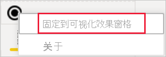

# Power BI 报表中的可视化效果

[!INCLUDE[consumer-appliesto-yyyn](../includes/consumer-appliesto-yyyn.md)]    

可视化效果（简称为“视觉对象”）会显示在数据中发现的见解。 在 Power BI 报表中，既可能一个页面上只有一个视觉对象，也可能页面上有大量视觉对象。 在 Power BI 服务中，可以将视觉对象[从报表固定到仪表板](../create-reports/service-dashboard-pin-tile-from-report.md)。

有必要在报表设计者与报表使用者之间进行区分 。  如果你是生成或修改报表的人员，则你是设计者。  设计者有权编辑报表及其基础数据集。 在 Power BI Desktop 中，这意味着，可以在数据视图中打开数据集，并在报表视图中创建视觉对象。 在 Power BI 服务中，这意味着可使用报表编辑器在[编辑视图](../consumer/end-user-reading-view.md)中打开数据集或报表。 如果有人将某个报表或仪表板[与你共享](../consumer/end-user-shared-with-me.md)，你就是报表的一个使用者。 你可以查看报表及其视觉对象并与之交互，但无法进行设计者所能进行的更改。

Power BI 的“可视化效果”窗格中还有其他许多视觉对象类型，可供直接使用。

可以通过 [Microsoft AppSource 社区网站](https://appsource.microsoft.com)获取更多 Power BI 视觉对象。 在 AppSource 中，你可以浏览和[下载](https://appsource.microsoft.com/marketplace/apps?page=1&product=power-bi-visuals) Microsoft 和社区提供的 [Power BI 视觉对象](../developer/visuals/custom-visual-develop-tutorial.md)。

如果初次接触 Power BI 或需复习，请利用以下链接了解 Power BI 可视化效果的基础知识。  也可使用（本文左侧的）目录查找更多有用信息。

## 在 Power BI 中添加一个可视化效果

在报表页上[创建可视化效果](power-bi-report-add-visualizations-i.md)。 浏览[可用的可视化效果和可用的可视化效果教程的列表。](power-bi-visualization-types-for-reports-and-q-and-a.md) 

## 从文件或从 AppSource 上传可视化效果

添加自己创建或在 [Microsoft AppSource 社区网站](https://appsource.microsoft.com/marketplace/apps?product=power-bi-visuals)中找到的可视化效果。 有创造性的点子？ 深入了解我们的源代码，使用我们的[开发工具](../developer/visuals/custom-visual-develop-tutorial.md)创建新的可视化效果类型，并[将它与社区共享](../developer/visuals/office-store.md)。 若要详细了解如何开发 Power BI 视觉对象，请访问[开发 Power BI 视觉对象](../developer/visuals/custom-visual-develop-tutorial.md)。

## 个性化可视化效果窗格

你可以通过添加和删除 Power BI 视觉对象来个性化可视化效果窗格。 如果从可视化效果窗格中删除了默认视觉对象，则可以将窗格还原为默认值，并恢复所有默认视觉对象。

### 将视觉对象添加到可视化效果窗格

如果你发现自己在许多报表中使用相同的视觉对象，则可将该视觉对象添加到可视化效果窗格。 添加视觉对象适用于 AppSource 视觉对象、组织视觉对象和文件视觉对象。 若要添加视觉对象，请右键单击视觉对象。

视觉对象一经固定，就会向上移动到其他默认视觉对象的位置。 此视觉对象现绑定到你的已登录帐户，因此如果你已登录，则生成的任何新报表都将自动包含此视觉对象。 不再需要将经常使用的特定视觉对象添加到每个报表。

### 从可视化效果窗格中删除视觉对象

如果不再经常使用某个视觉对象，可以右键单击它并将其从可视化效果窗格中删除。 可以从可视化效果窗格中删除任何类型的视觉对象，包括默认、文件、组织和 AppSource 视觉对象。

### 还原可视化效果窗格

还原可视化效果窗格仅适用于默认视觉对象。 添加到可视化效果窗格中的视觉对象不会受到影响，并且将在可视化效果窗格中保持可用。 若要从可视化效果窗格中删除 AppSource 或文件视觉对象，必须手动执行此操作。

若要将可视化效果窗格还原为默认值，请单击“更多选项”，然后选择“还原默认视觉对象”。

## 更改可视化效果类型

请尝试[更改可视化效果的类型](power-bi-report-change-visualization-type.md)以查看哪种类型最适合你的数据。

## 固定可视化效果

在 Power BI 服务中，若有所需的可视化效果，可以将它作为磁贴[固定到仪表板](../create-reports/service-dashboard-pin-tile-from-report.md)。 如果在固定之后在报表中更改正在使用的可视化效果，仪表板上的磁贴不会更改。 如果它是折线图，则将保持折线图形式，即便你已在报表中将其更改为圆环图。

## 限制和注意事项
- 根据数据源和字段数（度量值或列），视觉对象可能加载很慢。  出于可读性和性能原因，建议将视觉对象限制为 10 到 20 个字段。 

- 视觉对象的上限是 100 个字段（度量值或列）。 如果你的视觉对象加载失败，请减少字段数。

## 后续步骤

* [Power BI 中的可视化效果类型](power-bi-visualization-types-for-reports-and-q-and-a.md)
* [Power BI 视觉对象](../developer/visuals/power-bi-custom-visuals.md)
